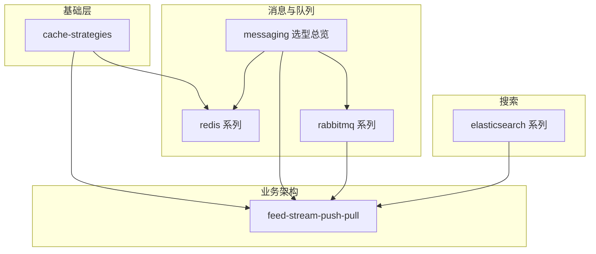

# wiki-note

个人技术笔记仓库。正文以中文撰写，**阅读与分享以 Wiki 为准**；本地 `*.md` 为可版本化的同步副本。书写规范、同步协议与 Agent 约定见 [CLAUDE.md](./CLAUDE.md)。

---

## 如何使用本仓库

| 角色 | 建议 |
| ---- | ---- |
| **读者** | 优先打开下表「原文」链接；本地 Markdown 便于检索与 diff |
| **作者（改）** | 在编辑 → ` docs +fetch` 拉回本地 → 提交 Git |
| **作者（本地改）** | 编辑 `.md` → ` docs +update` 推 → `./scripts/` → 提交 Git |
| **新增一篇** | 见 [CLAUDE.md § 新增笔记](./CLAUDE.md)；并更新 [docs/](./docs/) 与本文目录 |

**冲突原则**（详见 CLAUDE.md）：**同一篇文档同一时刻只改一侧**；若两侧都已改，以你指定的正本为准（默认 **优先**），另一侧用 fetch/overwrite 对齐后再继续编辑。

**状态**：`docs/` 中 `status: synced` 表示本地 blockquote 与 manifest 已对齐；`draft` 表示仅本地或未推。

---

## 主题地图



| 主题域 | 本地入口 | 说明 |
| ------ | -------- | ---- |
| 缓存 | [cache-strategies.md](./cache-strategies.md) | Cache-Aside 等读写策略 |
| 消息 / 队列 / 延迟 | [messaging/README.md](./messaging/README.md) | Redis vs RabbitMQ vs Kafka 选型与学习路径 |
| Redis 队列 | [redis/README.md](./redis/README.md) | ZSET 延迟队列、租约恢复 |
| RabbitMQ | [rabbitmq/README.md](./rabbitmq/README.md) | AMQP 全系列（6 篇） |
| Elasticsearch | [elasticsearch/README.md](./elasticsearch/README.md) | 高亮、多语言搜索 |
| Feed 流 | [feed-stream-push-pull.md](./feed-stream-push-pull.md) | 推拉模式、Fan-out、Inbox/Outbox |

---

## 推荐学习路径

| 路径 | 顺序 |
| ---- | ---- |
| **A · 后端通用** | cache-strategies → redis 系列 → rabbitmq 系列 1→6 |
| **B · Feed / 社交** | feed-stream-push-pull → cache-strategies → rabbitmq/reliable-publishing |
| **C · 搜索** | elasticsearch/es-highlight → es-multilingual-search |

详细说明见 [messaging/README.md](./messaging/README.md)。

---

## 文档目录

### 根目录单篇

| 文件 | 内容 | 原文 |
| ---- | ---- | -------- |
| [cache-strategies.md](./cache-strategies.md) | 缓存策略：Cache-Aside / Read-Through / Write-Through 等 |  |
| [feed-stream-push-pull.md](./feed-stream-push-pull.md) | Feed 流推拉、Fan-out、Inbox/Outbox |  |

### [elasticsearch/](./elasticsearch/) — Elasticsearch 系列

| 文件 | 内容 | 原文 |
| ---- | ---- | -------- |
| [es-highlight.md](./elasticsearch/es-highlight.md) | Highlight 原理与生产实践 |  |
| [es-multilingual-search.md](./elasticsearch/es-multilingual-search.md) | 多语言索引、分层查询、高亮对齐 |  |

### [redis/](./redis/) — Redis 队列系列

| 文件 | 内容 | 原文 |
| ---- | ---- | -------- |
| [redis-zset-delay-queue.md](./redis/redis-zset-delay-queue.md) | ZSET 延迟队列、Reaper、选型 |  |
| [redis-zset-running-recovery.md](./redis/redis-zset-running-recovery.md) | Running 卡死、Lease、Watchdog |  |

### [rabbitmq/](./rabbitmq/) — RabbitMQ 系列

系列索引与阅读顺序见 [rabbitmq/README.md](./rabbitmq/README.md)。

| 文件 | 内容 | 原文 |
| ---- | ---- | -------- |
| [core-concepts.md](./rabbitmq/core-concepts.md) | AMQP 模型、Exchange、Queue |  |
| [exchanges-routing.md](./rabbitmq/exchanges-routing.md) | Exchange 类型与 Routing Key |  |
| [reliable-publishing.md](./rabbitmq/reliable-publishing.md) | Confirm、持久化、Outbox |  |
| [consumer-semantics.md](./rabbitmq/consumer-semantics.md) | ACK、Prefetch、DLX、幂等 |  |
| [delay-and-priority.md](./rabbitmq/delay-and-priority.md) | TTL+DLX 延迟、优先级 |  |
| [cluster-ha.md](./rabbitmq/cluster-ha.md) | 集群、Quorum Queue |  |

### 仓库工具（非正文）

| 路径 | 用途 |
| ---- | ---- |
| [docs/](./docs/) | 路径 ↔  ↔  登记册 |
| [scripts/](./scripts/) | 校验 manifest 与本地 blockquote 一致 |
| [messaging/README.md](./messaging/README.md) | 消息/队列选型与学习路径（本地索引） |

---

## 维护

```bash
./scripts/   # 提交前建议执行
```

登记册字段说明与同步命令见 [CLAUDE.md](./CLAUDE.md)。
