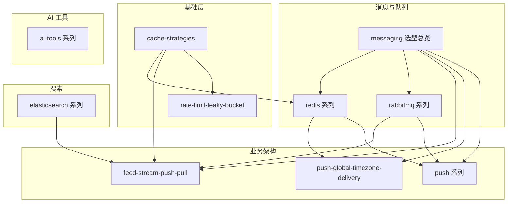

# wiki-note

个人技术笔记仓库。正文以中文撰写，笔记唯一正本为 [content/](./content/) 下的 `*.md`，纳入 Git 版本管理；由 **Quartz** 构建为 GitHub Pages 静态站：**https://caicandong.github.io/wiki-note/**（含全文搜索、关系图谱、反向链接）。书写规范见 [CLAUDE.md](./CLAUDE.md)。

---

## 如何使用本仓库

| 角色 | 建议 |
| ---- | ---- |
| **读者（网页）** | 访问 https://caicandong.github.io/wiki-note/，支持全文搜索、Mermaid 渲染、反向链接与图谱 |
| **读者（源码）** | 浏览 [content/](./content/) 下 `.md`，GitHub 原生渲染 Markdown 与 Mermaid |
| **作者** | 编辑 [content/](./content/) 下 `.md`（需带 `title` front matter）→ 提交推送 → Actions 自动构建部署 |

本地预览与构建：

```bash
npx quartz build --serve   # 本地预览 http://localhost:8080
npx quartz build           # 构建产物到 public/（已 gitignore）
```

---

## 主题地图



| 主题域 | 本地入口 | 说明 |
| ------ | -------- | ---- |
| 缓存 | [content/cache-strategies.md](./content/cache-strategies.md) | Cache-Aside 等读写策略 |
| 限流 | [content/rate-limit-leaky-bucket.md](./content/rate-limit-leaky-bucket.md) | 漏桶 / 令牌桶原理与 Go 实现 |
| 消息 / 队列 / 延迟 | [content/messaging/README.md](./content/messaging/README.md) | Redis vs RabbitMQ vs Kafka 选型与学习路径 |
| Redis 实践 | [content/redis/README.md](./content/redis/README.md) | 分布式锁、ZSET 延迟队列、租约恢复 |
| RabbitMQ | [content/rabbitmq/README.md](./content/rabbitmq/README.md) | AMQP 全系列（6 篇） |
| Elasticsearch | [content/elasticsearch/README.md](./content/elasticsearch/README.md) | 高亮、多语言搜索 |
| Feed 流 | [content/feed-stream-push-pull.md](./content/feed-stream-push-pull.md) | 推拉模式、Fan-out、Inbox/Outbox |
| Push | [content/push/README.md](./content/push/README.md) | 入门系列 7 篇 + [全球化概念](./content/push-global-timezone-delivery.md) |
| AI 工具 | [content/ai-tools/README.md](./content/ai-tools/README.md) | Agent 代码理解、IDE 插件选型 |

---

## 推荐学习路径

| 路径 | 顺序 |
| ---- | ---- |
| **A · 后端通用** | cache-strategies → redis 系列 1→3 → rabbitmq 系列 1→6 |
| **B · Feed / 社交** | feed-stream-push-pull → cache-strategies → rabbitmq/reliable-publishing |
| **D · Push / 触达** | push-global-timezone-delivery → push 系列 0→6 → redis/redis-zset-delay-queue → rabbitmq/reliable-publishing |
| **C · 搜索** | elasticsearch/es-highlight → es-multilingual-search |

详细说明见 [content/messaging/README.md](./content/messaging/README.md)。

---

## 文档目录

### 根目录单篇（content/）

| 文件 | 内容 |
| ---- | ---- |
| [content/cache-strategies.md](./content/cache-strategies.md) | 缓存策略：Cache-Aside / Read-Through / Write-Through 等 |
| [content/feed-stream-push-pull.md](./content/feed-stream-push-pull.md) | Feed 流推拉、Fan-out、Inbox/Outbox |
| [content/push-global-timezone-delivery.md](./content/push-global-timezone-delivery.md) | 全球化 Push 概念介绍 |
| [content/rate-limit-leaky-bucket.md](./content/rate-limit-leaky-bucket.md) | 漏桶 / 令牌桶限流算法与 Go 实现 |
| [content/index.md](./content/index.md) | 站点首页（与本站主题地图一致） |

### [content/push/](./content/push/) — Push 入门系列

系列索引与阅读顺序见 [content/push/README.md](./content/push/README.md)。

| 文件 | 内容 |
| ---- | ---- |
| [content/push/push-fundamentals.md](./content/push/push-fundamentals.md) | 基础概念、Token、V0 最小发送 |
| [content/push/push-campaign-admin.md](./content/push/push-campaign-admin.md) | Campaign 后台、人群包 |
| [content/push/push-active-users-zset.md](./content/push/push-active-users-zset.md) | ZSET 活跃集、离线拆包 |
| [content/push/push-mq-fanout-provider.md](./content/push/push-mq-fanout-provider.md) | MQ 扇出、Provider、深链 |
| [content/push/push-multi-vendor-token.md](./content/push/push-multi-vendor-token.md) | Token 服务、多厂商路由 |
| [content/push/push-ab-monitor.md](./content/push/push-ab-monitor.md) | AB、监控、防打扰 |
| [content/push/push-link-governance.md](./content/push/push-link-governance.md) | 链路治理、优先级、故障转移 |

### [content/elasticsearch/](./content/elasticsearch/) — Elasticsearch 系列

| 文件 | 内容 |
| ---- | ---- |
| [content/elasticsearch/es-highlight.md](./content/elasticsearch/es-highlight.md) | Highlight 原理与生产实践 |
| [content/elasticsearch/es-multilingual-search.md](./content/elasticsearch/es-multilingual-search.md) | 多语言索引、分层查询、高亮对齐 |

### [content/redis/](./content/redis/) — Redis 实践系列

| 文件 | 内容 |
| ---- | ---- |
| [content/redis/redis-distributed-lock.md](./content/redis/redis-distributed-lock.md) | SETNX、单实例锁、Redlock、看门狗 |
| [content/redis/redis-zset-delay-queue.md](./content/redis/redis-zset-delay-queue.md) | ZSET 延迟队列、Reaper、选型 |
| [content/redis/redis-zset-running-recovery.md](./content/redis/redis-zset-running-recovery.md) | Running 卡死、Lease、Watchdog |

### [content/rabbitmq/](./content/rabbitmq/) — RabbitMQ 系列

系列索引与阅读顺序见 [content/rabbitmq/README.md](./content/rabbitmq/README.md)。

| 文件 | 内容 |
| ---- | ---- |
| [content/rabbitmq/core-concepts.md](./content/rabbitmq/core-concepts.md) | AMQP 模型、Exchange、Queue |
| [content/rabbitmq/exchanges-routing.md](./content/rabbitmq/exchanges-routing.md) | Exchange 类型与 Routing Key |
| [content/rabbitmq/reliable-publishing.md](./content/rabbitmq/reliable-publishing.md) | Confirm、持久化、Outbox |
| [content/rabbitmq/consumer-semantics.md](./content/rabbitmq/consumer-semantics.md) | ACK、Prefetch、DLX、幂等 |
| [content/rabbitmq/delay-and-priority.md](./content/rabbitmq/delay-and-priority.md) | TTL+DLX 延迟、优先级 |
| [content/rabbitmq/cluster-ha.md](./content/rabbitmq/cluster-ha.md) | 集群、Quorum Queue |

### [content/ai-tools/](./content/ai-tools/) — AI 工具系列

系列索引与阅读顺序见 [content/ai-tools/README.md](./content/ai-tools/README.md)。

| 文件 | 内容 |
| ---- | ---- |
| [content/ai-tools/agent-code-intelligence-comparison.md](./content/ai-tools/agent-code-intelligence-comparison.md) | Cursor Index / Claude Code / CodeGraph / LSP 对比与集成 |

---

## 维护

- **新增 / 删除 / 移动笔记**：同步更新本文档目录、对应系列 `README.md` 与 [content/index.md](./content/index.md)；书写规范见 [CLAUDE.md](./CLAUDE.md)
- **站点部署**：推送 `main` 后 GitHub Actions 自动构建发布到 https://caicandong.github.io/wiki-note/（首次需在仓库 Settings → Pages → Source 选择 **GitHub Actions**）
