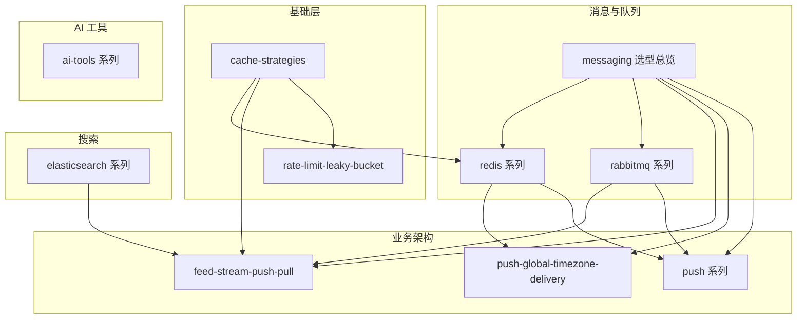

# wiki-note

个人技术笔记仓库。正文以中文撰写，本地 `*.md` 为唯一正本，纳入 Git 版本管理。书写规范、目录组织与编辑约定见 [CLAUDE.md](./CLAUDE.md)。

---

## 如何使用本仓库

| 角色 | 建议 |
| ---- | ---- |
| **读者** | 直接打开下表对应 `.md` 阅读；GitHub 渲染 Markdown 与 Mermaid |
| **作者** | 直接编辑 `.md` 后提交 Git；新增 / 删除 / 移动笔记后同步更新本文档目录与对应系列 `README.md` |

---

## 主题地图

| 主题域 | 本地入口 | 说明 |
| ------ | -------- | ---- |
| 缓存 | [cache-strategies.md](./cache-strategies.md) | Cache-Aside 等读写策略 |
| 限流 | [rate-limit-leaky-bucket.md](./rate-limit-leaky-bucket.md) | 漏桶 / 令牌桶原理与 Go 实现 |
| 消息 / 队列 / 延迟 | [messaging/README.md](./messaging/README.md) | Redis vs RabbitMQ vs Kafka 选型与学习路径 |
| Redis 实践 | [redis/README.md](./redis/README.md) | 分布式锁、ZSET 延迟队列、租约恢复 |
| RabbitMQ | [rabbitmq/README.md](./rabbitmq/README.md) | AMQP 全系列（6 篇） |
| Elasticsearch | [elasticsearch/README.md](./elasticsearch/README.md) | 高亮、多语言搜索 |
| Feed 流 | [feed-stream-push-pull.md](./feed-stream-push-pull.md) | 推拉模式、Fan-out、Inbox/Outbox |
| Push | [push/README.md](./push/README.md) | 入门系列 7 篇 + [全球化概念](./push-global-timezone-delivery.md) |
| AI 工具 | [ai-tools/README.md](./ai-tools/README.md) | Agent 代码理解、IDE 插件选型 |

---

## 推荐学习路径

| 路径 | 顺序 |
| ---- | ---- |
| **A · 后端通用** | cache-strategies → redis 系列 1→3 → rabbitmq 系列 1→6 |
| **B · Feed / 社交** | feed-stream-push-pull → cache-strategies → rabbitmq/reliable-publishing |
| **D · Push / 触达** | push-global-timezone-delivery → push 系列 0→6 → redis/redis-zset-delay-queue → rabbitmq/reliable-publishing |
| **C · 搜索** | elasticsearch/es-highlight → es-multilingual-search |

详细说明见 [messaging/README.md](./messaging/README.md)。

---

## 文档目录

### 根目录单篇

| 文件 | 内容 |
| ---- | ---- |
| [cache-strategies.md](./cache-strategies.md) | 缓存策略：Cache-Aside / Read-Through / Write-Through 等 |
| [feed-stream-push-pull.md](./feed-stream-push-pull.md) | Feed 流推拉、Fan-out、Inbox/Outbox |
| [push-global-timezone-delivery.md](./push-global-timezone-delivery.md) | 全球化 Push 概念介绍 |
| [rate-limit-leaky-bucket.md](./rate-limit-leaky-bucket.md) | 漏桶 / 令牌桶限流算法与 Go 实现 |

### [push/](./push/) — Push 入门系列

系列索引与阅读顺序见 [push/README.md](./push/README.md)。

| 文件 | 内容 |
| ---- | ---- |
| [push-fundamentals.md](./push/push-fundamentals.md) | 基础概念、Token、V0 最小发送 |
| [push-campaign-admin.md](./push/push-campaign-admin.md) | Campaign 后台、人群包 |
| [push-active-users-zset.md](./push/push-active-users-zset.md) | ZSET 活跃集、离线拆包 |
| [push-mq-fanout-provider.md](./push/push-mq-fanout-provider.md) | MQ 扇出、Provider、深链 |
| [push-multi-vendor-token.md](./push/push-multi-vendor-token.md) | Token 服务、多厂商路由 |
| [push-ab-monitor.md](./push/push-ab-monitor.md) | AB、监控、防打扰 |
| [push-link-governance.md](./push/push-link-governance.md) | 链路治理、优先级、故障转移 |

### [elasticsearch/](./elasticsearch/) — Elasticsearch 系列

| 文件 | 内容 |
| ---- | ---- |
| [es-highlight.md](./elasticsearch/es-highlight.md) | Highlight 原理与生产实践 |
| [es-multilingual-search.md](./elasticsearch/es-multilingual-search.md) | 多语言索引、分层查询、高亮对齐 |

### [redis/](./redis/) — Redis 实践系列

| 文件 | 内容 |
| ---- | ---- |
| [redis-distributed-lock.md](./redis/redis-distributed-lock.md) | SETNX、单实例锁、Redlock、看门狗 |
| [redis-zset-delay-queue.md](./redis/redis-zset-delay-queue.md) | ZSET 延迟队列、Reaper、选型 |
| [redis-zset-running-recovery.md](./redis/redis-zset-running-recovery.md) | Running 卡死、Lease、Watchdog |

### [rabbitmq/](./rabbitmq/) — RabbitMQ 系列

系列索引与阅读顺序见 [rabbitmq/README.md](./rabbitmq/README.md)。

| 文件 | 内容 |
| ---- | ---- |
| [core-concepts.md](./rabbitmq/core-concepts.md) | AMQP 模型、Exchange、Queue |
| [exchanges-routing.md](./rabbitmq/exchanges-routing.md) | Exchange 类型与 Routing Key |
| [reliable-publishing.md](./rabbitmq/reliable-publishing.md) | Confirm、持久化、Outbox |
| [consumer-semantics.md](./rabbitmq/consumer-semantics.md) | ACK、Prefetch、DLX、幂等 |
| [delay-and-priority.md](./rabbitmq/delay-and-priority.md) | TTL+DLX 延迟、优先级 |
| [cluster-ha.md](./rabbitmq/cluster-ha.md) | 集群、Quorum Queue |

### [ai-tools/](./ai-tools/) — AI 工具系列

系列索引与阅读顺序见 [ai-tools/README.md](./ai-tools/README.md)。

| 文件 | 内容 |
| ---- | ---- |
| [agent-code-intelligence-comparison.md](./ai-tools/agent-code-intelligence-comparison.md) | Cursor Index / Claude Code / CodeGraph / LSP 对比与集成 |

### 仓库工具（非笔记正文）

| 路径 | 用途 |
| ---- | ---- |
| [messaging/README.md](./messaging/README.md) | 消息/队列选型与学习路径（本地索引） |

---

## 维护

新增 / 删除 / 移动笔记后，同步更新本文档目录与对应系列 `README.md`；书写规范见 [CLAUDE.md](./CLAUDE.md)。
