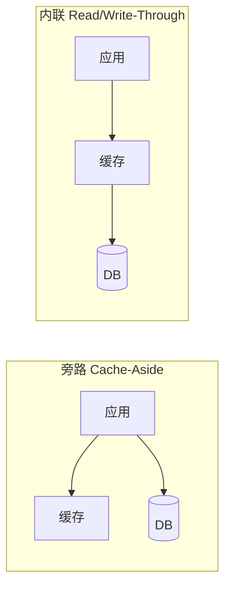
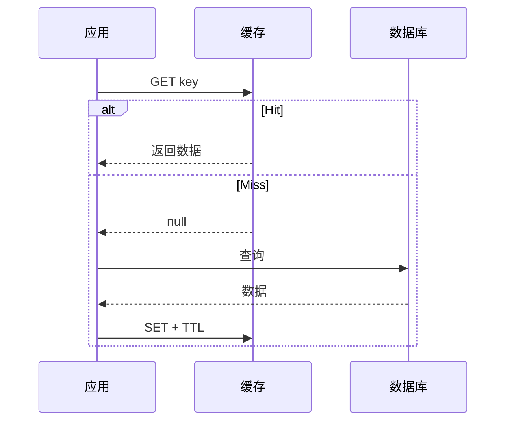
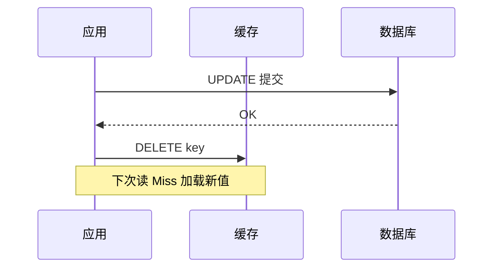
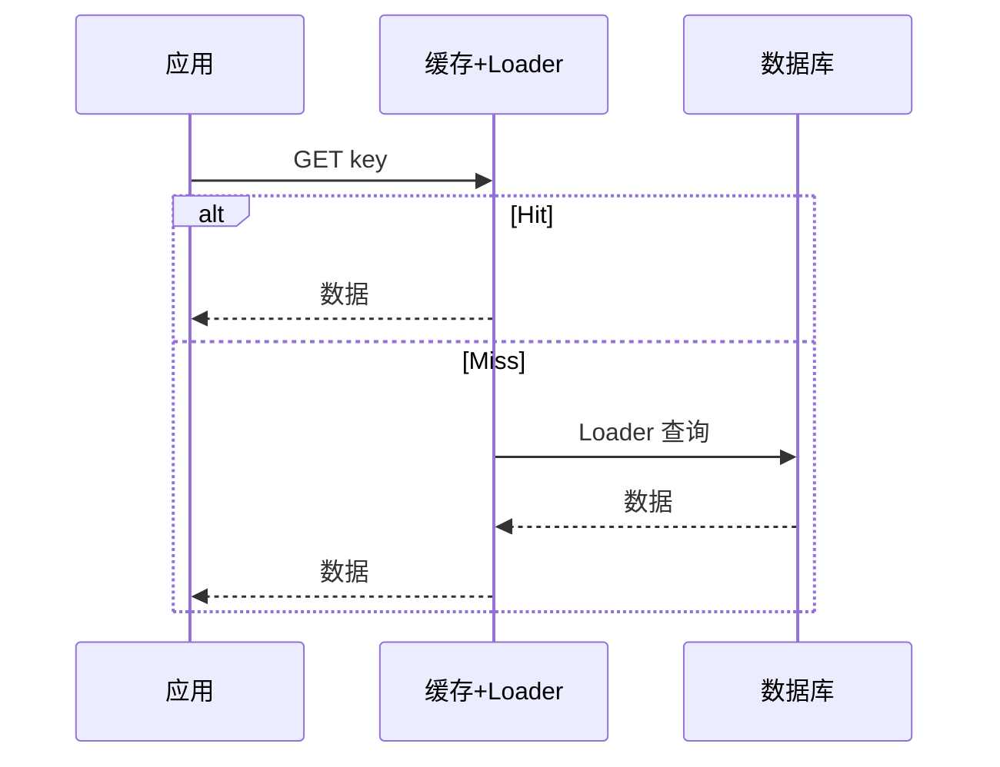
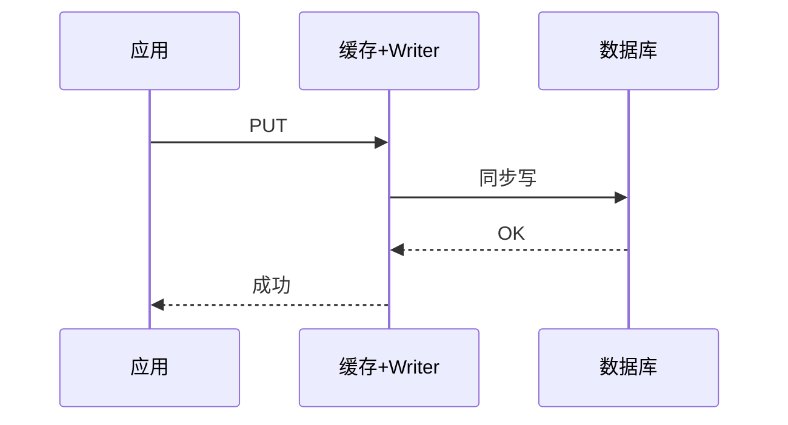
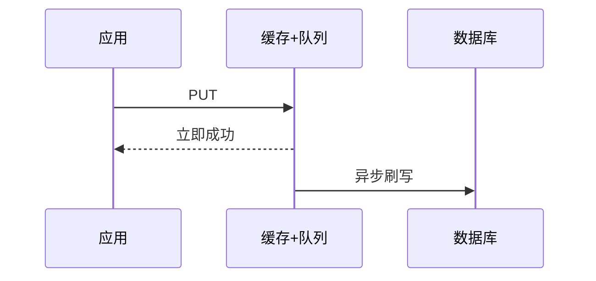

# 缓存策略技术指南

> **版本** 2026-05 · 适用于架构设计、技术评审与实现参考

> 分布式系统缓存读写策略：概念、选型、实现要点与业务落地。

---

## 如何使用本文档

| 你的目标          | 建议阅读        |
| ------------- | ----------- |
| 5 分钟选对策略      | 二、快速选型      |
| 实现某一种模式       | 三、策略详解 对应小节 |
| 上线前 checklist | 四、生产实践      |
| 业务场景对标        | 五、业务场景手册    |
| 术语 / 出处       | 六、附录        |

**核心原则**：缓存是**加速层**，不是正确性层。缓存失效、宕机或过期时，系统仍应能依赖数据库正确运行。

---

## 一、核心概念

### 1.1 三个关键问题

在读多写少的系统中，引入缓存时要先回答：

1. **谁负责** cache miss 时回源？（应用 vs 缓存组件）
2. **写操作**如何同步到缓存与数据库？
3. 能接受多强的**一致性**、多长的**脏读窗口**？

### 1.2 两大族

| 族别                 | 代表模式                                    | 控制权                | 典型组件              |
| ------------------ | --------------------------------------- | ------------------ | ----------------- |
| **旁路族 Look-Aside** | Cache-Aside                             | 应用代码               | Redis、Memcached   |
| **内联族 Inline**     | Read-Through、Write-Through、Write-Behind | 缓存 + Loader/Writer | Coherence、Ehcache |

### 1.3 五种策略一览

| 策略            | 读            | 写           | 一致性  | 写响应    | 默认推荐度    |
| ------------- | ------------ | ----------- | ---- | ------ | -------- |
| Cache-Aside   | 应用管 miss 回填  | 写 DB → 删缓存  | 最终一致 | 中等     | ⭐ 默认首选   |
| Read-Through  | 缓存 Loader 回源 | 视写策略        | 最终一致 | —      | 有框架时     |
| Write-Through | 常配合读策略       | 同步写缓存+DB    | 较强   | 慢      | 写后立刻读    |
| Write-Behind  | 通常快          | 先写缓存，异步刷 DB | 弱    | **最快** | 高 QPS 计数 |
| Refresh-Ahead | 过期前刷新        | —           | 介于之间 | —      | 热点防击穿    |

---

## 二、快速选型

### 2.1 按目标选择

| 目标                             | 推荐策略                                 |
| ------------------------------ | ------------------------------------ |
| 通用 Web / 微服务读多写少               | **Cache-Aside** + TTL + 写后删 key      |
| 已有 Coherence / Ehcache，希望读逻辑集中 | **Read-Through**（+ 按需 Write-Through） |
| 写后必须立即读到新值                     | **Write-Through** 或 Aside + 写后更新缓存   |
| 极高写吞吐、可丢或可重建                   | **Write-Behind** + 对账                |
| 强一致账务、支付                       | **不以缓存为真相**；短 TTL + 明确失效             |
| 热点 key 怕集体过期                   | **Refresh-Ahead** 或逻辑过期 + 单飞         |

### 2.2 不宜使用缓存的场景

- 强一致账务、支付状态机（以 DB / 分布式事务为准）
- 命中率极低的强个性化数据
- 数 MB 级大对象（用 CDN / 拆 key）
- 合规禁止落共享缓存的敏感字段

---

## 三、策略详解

> 每节结构：**定义 → 流程图 → 读写要点 → 优缺点 → 典型业务**

---

### 3.1 Cache-Aside（旁路缓存 / Lazy Loading）

**定义**：应用直接操作缓存；miss 时应用查库并回填；写时应用更新 DB 并失效缓存。  
**别名**：Look-Aside、Lazy Loading（AWS ElastiCache）。

#### 读路径

**要点**：`GET → miss → DB → SET → return`

#### 写路径（推荐）

- ✅ **先写 DB，再删缓存**
- ❌ 先删缓存再写 DB：并发下可能把旧值写回缓存

也可写库后 `SET` 新值，但需处理并发；多数团队用 **delete + 懒加载**。

#### 优缺点

| 优点         | 缺点          |
| ---------- | ----------- |
| 实现简单，适配哑缓存 | 首次 miss 有延迟 |
| 只缓存被读到的数据  | 易漏失效 → 脏读   |
| 缓存挂了可降级 DB | 热点过期 → 击穿   |

#### 典型业务

商品详情、用户资料、文章、配置字典、权限菜单、CMS 配置、地图 POI（按区域 key）。

---

### 3.2 Read-Through（读穿透）

**定义**：应用只访问缓存；miss 时由缓存内置 **Loader** 查库、回填并返回。

| 优点           | 缺点        |
| ------------ | --------- |
| 应用不直连 DB 读路径 | 缓存与 DB 耦合 |
| 部分产品内置单飞防击穿  | 冷启动填充慢    |

**典型业务**：已用 Coherence / Hibernate 二级缓存的企业应用；统一数据访问层。

---

### 3.3 Write-Through（写穿透）

**定义**：写请求经缓存**同步**写入 DB，两者都成功才返回。

| 优点            | 缺点            |
| ------------- | ------------- |
| 写路径上缓存与 DB 一致 | 写延迟 = 缓存 + DB |
| 写后读不易见旧缓存     | 冷数据也会进缓存      |

**典型业务**：改昵称/头像后立刻进「我的」页；购物车合并后展示。

---

### 3.4 Write-Behind / Write-Back（写回）

**定义**：写缓存后立即返回；DB 由缓存**异步批量**刷写。

#### 「写延迟最快」指什么？

| 策略            | 调用方要等           |
| ------------- | --------------- |
| Write-Through | 缓存 + **DB 都写完** |
| Cache-Aside 写 | 至少 **DB 提交**    |
| Write-Behind  | 通常只等 **内存写入**   |

> 快的是**响应时间**，不是**持久化完成时间**。返回成功时数据可能尚未落库；缓存宕机可能丢未刷写。

| 优点         | 缺点              |
| ---------- | --------------- |
| 写吞吐高、响应快   | 可能丢写            |
| 可合并写、减压 DB | 仅适合可重建 / 可容忍不一致 |

**不适用**：金融账务、订单状态（写成功 = 必须已落库）。

**典型业务**：播放量、点赞、埋点、Feed 曝光计数、排行榜增量。

---

### 3.5 Refresh-Ahead（预刷新）

**定义**：在 key 过期前由缓存或后台任务主动刷新，降低过期瞬间击穿。

**典型业务**：首页推荐、热搜榜、接近实时的汇率/行情。  
**注意**：实现复杂，需预测访问与刷新节奏。

---

## 四、生产实践

### 4.1 TTL

- 太短 → 频繁 miss，收益低
- 太长 → 脏读窗口大
- **建议**：配置类长 TTL；价格/权限短 TTL + 写后失效；TTL 加随机抖动防雪崩

### 4.2 三大经典问题

| 问题          | 现象                   | 缓解                          |
| ----------- | -------------------- | --------------------------- |
| **击穿 / 惊群** | 热点 key 过期，并发打 DB     | 单飞 mutex、逻辑过期、Refresh-Ahead |
| **穿透**      | 查不存在的数据，每次都 miss     | 短 TTL 负缓存（空值占位）             |
| **雪崩**      | 大量 key 同时过期 / 缓存集群故障 | TTL 随机、多级缓存、限流降级            |

### 4.3 分布式与多级缓存

- **共享 Redis**：写后 `DELETE key` 或 MQ 广播失效
- **L1 本地 + L2 Redis**：跨实例需广播 L1 失效，否则不一致

### 4.4 推荐组合

| 组合                        | 场景              |
| ------------------------- | --------------- |
| Aside + TTL + 写后删 key     | 大多数 REST 读接口    |
| Aside + MQ 失效             | 支付成功 → 删商品/库存缓存 |
| Write-Behind + 定时对账       | 播放量、点赞数校准 DB    |
| Aside 读 + Write-Through 写 | 改资料后立刻展示        |
| L1 + L2 Redis + Aside     | 超高 QPS 配置类数据    |

---

## 五、业务场景手册

### 5.1 按行业 / 系统

| 业务              | 推荐                         | 说明                |
| --------------- | -------------------------- | ----------------- |
| 电商商品详情          | Aside + TTL                | 大促预热 Top SKU      |
| 电商库存 / 秒杀       | Redis 预扣 + DB；慎用缓存作库存真相    | 分布式锁 / Lua        |
| 社交 Feed         | Aside 读 + Write-Behind 写计数 | 点赞异步聚合            |
| 金融余额            | 不以缓存为写真相                   | 账本 / 事务为准         |
| 广告标签            | Aside + 版本号 key            | 批量更新切换版本          |
| Session / OAuth | 共享 Redis Aside             | 避免多实例本地缓存不一致      |
| CMS 配置          | Aside + 发布 purge           | 事件驱动删缓存           |
| API 限流          | Redis INCR                 | 类 Write-Behind 思想 |
| BI 大屏           | Aside / 物化视图 + 长 TTL       | 容忍分钟级延迟           |

### 5.2 策略 × 场景速查

| 策略            | 场景           | 注意          |
| ------------- | ------------ | ----------- |
| Cache-Aside   | 读多写少、热点明显    | 写后删 key、防击穿 |
| Read-Through  | 统一数据层、已有缓存框架 | 实现 Loader   |
| Write-Through | 写后立刻读        | 写延迟高        |
| Write-Behind  | 高 QPS 计数、可异步 | 对账、防丢写      |
| Refresh-Ahead | 热点、怕过期击穿     | 实现成本高       |

---

## 六、附录

### 6.1 术语对照

| 英文名                       | 中文 / 别名                        |
| ------------------------- | ------------------------------ |
| Cache-Aside               | 旁路缓存、Look-Aside、Lazy Loading   |
| Read-Through              | 读穿透                            |
| Write-Through             | 写穿透                            |
| Write-Behind / Write-Back | 写回                             |
| Cache-as-SoR              | 把缓存当数据源代理（内联族总称）               |
| SoR                       | System of Record，权威数据源（通常指 DB） |

### 6.2 历史脉络（简）

| 时间      | 事件                                                     |
| ------- | ------------------------------------------------------ |
| 硬件时代    | Look-Aside / Look-Through 用于 CPU 多级缓存（软件层类比）           |
| ~2001   | Tangosol Coherence 产品化 Read/Write-Through、Write-Behind |
| ~2003   | Memcached「哑缓存 + 应用管 miss」大规模普及                         |
| 2014-01 | Microsoft《Cloud Design Patterns》正式命名 Cache-Aside       |
| 现今      | Redis、多级缓存、事件驱动失效等组合实践                                 |

> Cache-Aside **无单一发明人**，是工程实践与术语演化的结果。

### 6.3 参考资料

- [Microsoft - Cache-Aside Pattern](https://learn.microsoft.com/en-us/azure/architecture/patterns/cache-aside)
- [Microsoft - Cloud Design Patterns (2014)](https://learn.microsoft.com/en-us/previous-versions/msp-n-p/dn568099(v=pandp.10))
- [AWS ElastiCache - Caching Strategies](https://docs.aws.amazon.com/AmazonElastiCache/latest/mem-ug/Strategies.html)
- [Ehcache - Cache Usage Patterns](https://ehcache.org/documentation/3.1/caching-patterns.html)
- [Oracle Coherence - Read/Write-Through](https://docs.oracle.com/cd/E16459_01/coh.350/e14510/readthrough.htm)
- [VMware Tanzu - Look-Aside vs Inline](https://blogs.vmware.com/tanzu/an-introduction-to-look-aside-vs-inline-caching-patterns/)

---

*— 文档结束 —*