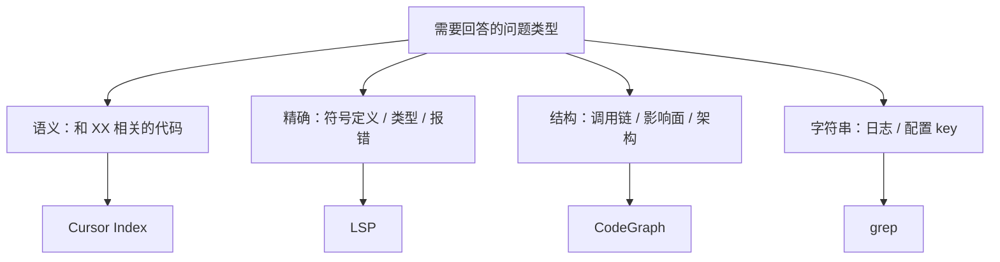

# AI 编码 Agent 代码理解方案对比

> **版本** 2026-05 v2 · **定位**：Cursor + Claude Code 双栈选型与集成

> 对比 Cursor Index、Claude Code 默认搜索、CodeGraph、LSP 及 Serena、Sourcegraph、Aider repo-map、ast-grep MCP 等扩展方案的定位与选型。

---

## 如何使用本文档

| 你的目标 | 建议阅读 |
| -------- | -------- |
| 5 分钟搞清全貌 | 二、技术路线 + 三、核心四类速览 |
| 还有哪些替代方案 | **四、扩展方案一览** + 九、全景对比表 |
| 决定是否上 CodeGraph | 五 § CodeGraph + 十、选型建议 |
| Cursor / Claude Code 集成 | 六、CodeGraph 最小集成 |
| LSP / Serena / SCIP 怎么选 | 七、精确语义层对比 |

**阅读前提**：日常使用 **Cursor**（IDE）与 **Claude Code**（CLI Agent）。本文以 2026 年初主流版本为参考。

---

## 一、背景：Agent 探索代码库在烧什么

AI 编码 Agent 回答「这段代码怎么工作的？」时，预算大多花在 **discovery（发现）** 阶段——先用 grep / glob / Read 找到相关文件，再拼出调用关系。CodeGraph 等项目试图把 discovery **前置索引化**，减少重复扫描。

业界方案可归为 **三条技术路线**（[Sourcegraph 对比文](https://sourcegraph.com/resources/context-compare) 与社区实践共识）：

| 路线 | 代表 | 核心思路 |
| ---- | ---- | -------- |
| **A · 语义索引（RAG）** | Cursor Index、Windsurf、Augment、Greptile | embedding 找「像什么」 |
| **B · Agentic Search** | Claude Code 默认、Windsurf Fast Context | 按需 grep / Read，无预索引 |
| **C · 结构 / 语义精确索引** | CodeGraph、LSP、SCIP、Serena、Aider repo-map | AST / 类型系统 / 编译器级符号图 |

多数产品 **混合** 多条路线（如 Cursor = A+B，Windsurf = A+B 专用子 Agent）。

---

## 二、核心四类方案（Cursor + Claude Code 用户必知）

```text
Cursor Index  ≈ 「这段代码像什么」（语义相似，云端 embedding）
Claude Code   ≈ 「现在去文件系统里翻」（按需、无预索引）
CodeGraph     ≈ 「这段代码连到谁」（本地 AST 结构图）
LSP           ≈ 「这个符号的语言语义是什么」（类型、引用、报错）
```

四者 **不是替代关系**，而是按问题类型叠用。

---

## 三、核心四类总览对比

| 维度 | Cursor Index | Claude Code 默认 | CodeGraph | LSP |
| ---- | ------------ | ---------------- | --------- | --- |
| 预建索引 | ✅ 打开项目自动 | ❌ | ✅ `codegraph init` | ✅ 语言 server 维护 |
| 索引类型 | 语义向量（embedding） | 无 | AST 符号 + 关系图 | 类型系统 + 符号语义 |
| 数据位置 | 本地 chunk + **云端向量** | 不存储 | 纯本地 SQLite | 本地进程 |
| Agent 接入 | Cursor 内置 | 内置 grep 链 | MCP | IDE 内置 / MCP 桥接 |
| 跳定义 / 找引用 | ❌ 弱 | grep（弱） | ✅ 结构级 | ✅ **最强** |
| 类型 / 诊断 | ❌ | ❌ | ❌ | ✅ |
| 架构 / 调用链 / 影响面 | ❌ | 多轮 grep（贵） | ✅ 一次 MCP | 需多轮点查 |
| 语义「找相关代码」 | ✅ **最强** | ❌ | FTS5 按名 | ❌ |
| 零配置 | ✅（Cursor 内） | ✅ | 需 init + MCP | Cursor 内 ✅；Claude Code 需 MCP |

### 按问题类型选型

| 问题 | 优先方案 |
| ---- | -------- |
| 「和支付 / 缓存相关的代码在哪？」 | Cursor Index |
| 「`getUserById` 返回什么类型？」 | LSP |
| 「谁调用了 `AuthService.authenticate`？」 | LSP（索引正常时）或 CodeGraph |
| 「Auth 模块整体怎么实现的？」 | CodeGraph `context` / `trace` |
| 「改这个类会影响哪些模块？」 | CodeGraph `impact` |
| 已知字符串 / 日志 / 配置 key | grep |
| 代码不能上云 | Claude Code + CodeGraph / LSP MCP |

---

## 四、扩展方案一览

以下按 **路线 A / B / C** 归类；与第三节四类有重叠处已标注。

### 4.1 路线 A — IDE / 平台内置语义索引

| 方案 | 机制概要 | 与 Cursor Index 差异 | 典型用户 |
| ---- | -------- | -------------------- | -------- |
| **Windsurf Cascade Index** | 打开项目建语义索引；Cascade Agent 按概念检索 | 同类；另配 **Fast Context** 子 Agent（见 4.2） | Windsurf 用户 |
| **Windsurf Fast Context** | [SWE-grep](https://cognition.ai/blog/swe-grep) 专用检索模型：最多 4 轮 × 8 并行 tool call | **路线 B 的 RL 优化版**，非纯 embedding | 大 repo 快速定位 |
| **Augment Context Engine** | 远端索引，宣称支持 40 万+ 文件、跨 repo 架构感知 | 企业向；ISO 42001；非纯本地 | 超大 Monorepo / 企业 |
| **Continue `@Codebase`** | 已 **deprecated**；改 Agent + 内置搜索 + MCP | Continue 用户需迁移到 MCP 方案 | Continue 插件用户 |

**Windsurf 双轨**：日常靠语义 Index（路线 A），复杂检索触发 Fast Context（路线 B 增强），与 Cursor「Index + Agent grep」类似但检索子 Agent 更专门化。

### 4.2 路线 B — Agentic Search 及变体

| 方案 | 机制概要 | 特点 |
| ---- | -------- | ---- |
| **Claude Code 默认** | Glob / Grep / Read + Explore 子 Agent | 零配置；大 repo 贵 |
| **Aider repo-map** | tree-sitter 抽符号 → 文件依赖图 → **PageRank** 排序 → 按 token 预算（默认 ~1k）裁剪后 **注入每轮 prompt** | 非 MCP 为主；[RepoMapper MCP](https://agentpatterns.ai/context-engineering/repository-map-pattern/) 可复用到任意 Agent |
| **Continue Agent** | 文件探索 + grep + 自定义 MCP | `@Codebase` 已弃用，靠 Agent 工具链 |

Aider repo-map **不做持久查询 API**，而是动态生成「仓库骨架摘要」——适合 **pair-programming CLI**，不适合「Agent 主动查调用链」。

### 4.3 路线 C — 本地 / MCP 结构知识图谱

与 [colbymchenry/codegraph](https://github.com/colbymchenry/codegraph) **同类** 的开源 MCP（注意 **同名不同库**）：

| 项目 | 存储 | 差异化能力 | 备注 |
| ---- | ---- | ---------- | ---- |
| **colbymchenry/codegraph** | SQLite + FTS5 | 框架路由、RN/Swift 跨语言桥、Claude/Cursor 一键装 | 本文主推 |
| **codegraph-ai/CodeGraph** | RocksDB + **embedding** | 45 MCP tools、VS Code 扩展、持久 memory 层 | npm `@memoryx/codegraph-mcp`，功能更重 |
| **sdsrss/code-graph-mcp** | SQLite + sqlite-vec | HTTP route trace、Claude Code **Plugin**（`/understand` `/trace`） | `@sdsrs/code-graph` |
| **SerPeter/code-atlas** | **Memgraph** 图数据库 | 图遍历 + 向量 + BM25 **三合一**；Monorepo 文档+代码 | 需自建 Memgraph |

**选型提示**：要 **零依赖、100% 本地、少配置** → colbymchenry；要 **语义+图混合** → code-atlas 或 codegraph-ai；要 **Claude Code 插件体验** → sdsrss。

### 4.4 路线 C — LSP 系 MCP 工具包

| 项目 | 本质 | 与裸 LSP MCP 差异 |
| ---- | ---- | ----------------- |
| **Serena** | [oraios/serena](https://github.com/oraios/serena) — LSP + **符号级编辑/重构** MCP | 「Agent 的 IDE」：find_symbol、rename、memory；多语言靠各 language server |
| **cclsp** | LSP → MCP 薄桥 | 解决 Agent 行列号不准；goto_definition / find_references |
| **helpline** | Anthropic 大仓库指南引用的参考实现 | Python：`where_is` / `find_references` / `outline` |

Serena ≈ **LSP + 编辑能力 + Agent 工作流**；CodeGraph ≈ **预建图 + 批量 context**。改代码要强类型 → Serena/LSP；答架构题 → CodeGraph。

### 4.5 路线 C — 编译器级精确索引（SCIP）

| 项目 | 说明 |
| ---- | ---- |
| **SCIP** | [Sourcegraph 开源协议](https://scip-code.org/)：编译器插件产出 `index.scip`，**Go to definition / Find references 精确到类型流** |
| **Sourcegraph + Cody** | 组织级代码图 + 搜索 + [MCP Server](https://sourcegraph.com/changelog/releases/6.8)；支持 self-hosted、零保留 |
| **Greptile** | 云端语义层 + 多 repo 自然语言问答；偏「资深同事」式检索 |

SCIP **准确度最高**（compiler-backed），但 setup 重：需跑 scip-typescript / scip-java 等 indexer，通常配合 Sourcegraph 实例。适合 **企业多 repo**；个人本地 Claude Code **过重**。

对比 [VirtusLab 分析](https://virtuslab.com/blog/ai/code-munch-mcp-your-agent-starts-navigating/)：tree-sitter 知「有 authenticate 函数」；SCIP 知「参数类型 UserCredentials、14 处调用、子类 override」。

### 4.6 轻量 MCP：ctags / ast-grep / jCodeMunch

| 项目 | 机制 | 擅长 | 短板 |
| ---- | ---- | ---- | ---- |
| **mcp-ctags** | Universal Ctags 索引 + ripgrep 找引用 | 极轻、多语言、`find_symbol` 即时 | 无调用图 / impact；引用靠 live grep |
| **code-search-mcp** | ctags + ripgrep + **ast-grep** | 符号 + AST 模式 + 依赖分析 | 需装 ctags；比 CodeGraph 工具面窄 |
| **ast-grep MCP** | YAML/模式 **结构化搜索** + 可选 rewrite | 「找所有 console.log($ARG)」类 codemod | 非导航图；偏模式审计/批量改 |
| **jCodeMunch MCP** | 轻量符号索引 + stable ID | pip install 即用；VirtusLab 称 SCIP 的「80% 方案 @ 5% 成本」 | 无「谁调用了 X」级图查询 |

适合：**已有 ctags 习惯**、或 **批量 AST 重构/安全审计**，而非替代 CodeGraph 做 architecture trace。

### 4.7 相邻能力（非本地代码库索引）

| 项目 | 用途 | 与本文关系 |
| ---- | ---- | ---------- |
| **DeepWiki MCP** | 公共 GitHub repo 文档/结构 | Continue 推荐；**不适用私有代码** |
| **Context7 MCP** | 公共库官方文档检索 | 补 **API 文档**，非项目源码 |
| **PageIndex** | 长文档层次树索引（**无向量**） | 文档 RAG，非代码；思路可类比「结构索引」 |

---

## 五、各方案详解（核心四类）

### 5.1 Cursor 内置 Index

**机制**：Merkle tree 增量检测变更 → 本地 AST 切块 → **云端生成 embedding** → 向量存 Turbopuffer → 查询时向量近邻搜索 → 回本地读原文。

**优点**

- 零配置，与 Cursor UI 深度集成（`@Codebase`）
- 自然语言语义搜索强
- 与 grep 混合使用效果好

**缺点**

- 偏「相似片段检索」，无完整调用链 / 影响面分析
- embedding 计算依赖云端（官方称不长期存明文源码）
- 大 repo 索引有等待期
- Agent 做架构题时仍可能大量 grep / Read

### 5.2 Claude Code 默认（Agentic Search）

**机制**：Glob 找文件 → Grep 搜内容 → Read 读文件；复杂任务 spawn **Explore 子 Agent**（Haiku，隔离上下文）。

Anthropic 早期试过 RAG，后改为 Agentic Search，原因包括：零 setup、永远读最新文件、隐私简单、精确 grep 不受 embedding 噪声影响。

**优点**

- 进任意目录立即可用
- 数据默认不出本机
- 精确字符串 / 符号名搜索可靠

**缺点**

- 架构 / 调用链类问题 tool call 多、token 贵
- 大 repo 探索慢，常 spawn Explore
- 无内置 impact / trace

### 5.3 CodeGraph（colbymchenry）

**项目**：[colbymchenry/codegraph](https://github.com/colbymchenry/codegraph)（MIT，`@colbymchenry/codegraph`）

**机制**：tree-sitter 解析 → 本地 SQLite（FTS5）→ MCP 暴露图查询工具。

**图里有什么**

- **Symbols**：函数、类、方法、类型、路由、组件
- **Edges**：调用、导入、继承、引用、框架路由
- **Files**：目录结构 + 全文搜索

提取是 **确定性的**（来自 AST，非 LLM 摘要）。

**官方 Benchmark**（7 个开源 repo，Claude Code headless，中位数）：平均 **35% 更便宜 · 57% 更少 token · 46% 更快 · 71% 更少 tool calls**。大 repo 收益更明显。

**主要 MCP 工具**

| 工具 | 用途 |
| ---- | ---- |
| `codegraph_context` | 一次返回任务相关入口、符号、代码片段（**核心**） |
| `codegraph_trace` | 「A 怎么调用到 B」全链路 |
| `codegraph_impact` | 变更影响半径 |
| `codegraph_search` | 按名搜符号 |
| `codegraph_callers` / `codegraph_callees` | 单跳调用关系 |
| `codegraph_node` | 单符号详情（可选源码） |
| `codegraph_status` | 索引健康状态 |

**优点**

- 100% 本地，Agent 优先设计
- 跨语言启发式（Swift↔ObjC、React Native bridge 等）
- 框架路由识别（Django / Express / NestJS 等 14 种）
- Claude Code、Cursor 共用同一 MCP

**缺点**

- 无类型系统、无 Diagnostics
- 需每项目 `init`
- tree-sitter 深度不如专用 language server
- 纯 Markdown / 笔记仓几乎无收益

### 5.4 LSP（Language Server Protocol）

**机制**：每种语言独立 server（tsserver、rust-analyzer、gopls、pyright…）维护项目索引；Cursor 编辑器已内置。Claude Code 需通过 **MCP 桥接**（如 [cclsp](https://github.com/ktnyt/cclsp)）暴露 `goto_definition`、`find_references`、`outline` 等。

**优点**

- 语义最准：区分变量 / 函数 / 类，非 grep 误匹配
- 类型、JSDoc、Diagnostics
- Find References 质量高（索引完整时）
- 安全 Rename

**缺点**

- Claude Code 默认碰不到，需配 MCP
- 多语言 Monorepo 需配多套 server
- 依赖项目环境（`node_modules`、tsconfig 等）
- 超大 repo 可能索引失败或返回部分引用
- 擅长点查询，架构题需 Agent 多轮调用
- 跨语言边界弱（Swift 调 ObjC、JS 调 Native Module）

---

## 六、CodeGraph 最小集成（Cursor + Claude Code）

### 6.1 一次性全局安装

```bash
npx @colbymchenry/codegraph
# 或非交互：
npm i -g @colbymchenry/codegraph
codegraph install --target=cursor,claude --yes
```

### 6.2 每个代码项目建索引

```bash
cd your-project
codegraph init -i
```

生成 `.codegraph/`（建议加入 `.gitignore`）及 Cursor 规则 `.cursor/rules/codegraph.mdc`。

### 6.3 重启 Agent

- **Claude Code**：退出 session 后重新启动
- **Cursor**：完全退出再打开，或 Settings → MCP 确认 `codegraph` 已连接

### 6.4 关键配置（手动对照）

**Claude Code** — `~/.claude.json`：

```json
{
  "mcpServers": {
    "codegraph": {
      "type": "stdio",
      "command": "codegraph",
      "args": ["serve", "--mcp"]
    }
  }
}
```

**Cursor** — `~/.cursor/mcp.json`（**必须**加 `--path ${workspaceFolder}`）：

```json
{
  "mcpServers": {
    "codegraph": {
      "type": "stdio",
      "command": "codegraph",
      "args": ["serve", "--mcp", "--path", "${workspaceFolder}"]
    }
  }
}
```

### 6.5 验证

```bash
codegraph status
```

或在 Agent 内：「用 codegraph_status 看索引状态」。

---

## 七、精确语义层对比（LSP / Serena / SCIP / CodeGraph）

| 维度 | LSP / cclsp | Serena | SCIP + Sourcegraph | CodeGraph |
| ---- | ----------- | ------ | -------------------- | --------- |
| 精确度 | 高（单语言） | 高（LSP 封装） | **最高**（编译器级） | 中（AST + 启发式） |
| 类型 / 诊断 | ✅ | ✅ | ✅ | ❌ |
| 调用链 / impact | 多轮点查 | 多轮 + 编辑 | 跨 repo 精确引用 | **一次 MCP** |
| 本地 / 隐私 | ✅ | ✅ | 可 self-host；默认企业云 | ✅ 纯本地 |
| Setup | 每语言 server | 项目 YAML + LSP | indexer + SG 实例 | `npx` + `init` |
| 适合 | 改代码、类型正确 | Agent 重构工作流 | 企业多 repo | 个人/团队架构探索 |

**推荐组合（Claude Code + Cursor）**

| 环境 | 建议 |
| ---- | ---- |
| Cursor 日常编码 | 内置 LSP + Index 已够；复杂架构题加 CodeGraph |
| Claude Code 小项目 | 默认 grep 即可 |
| Claude Code 大 repo / 架构题多 | CodeGraph **或** LSP MCP；要强类型 + 重构 → **Serena** |
| 企业多 repo / 合规 | Sourcegraph SCIP + MCP；非 colbymchenry CodeGraph |
| 两者都要 | LSP/Serena 管类型；CodeGraph 管 trace/impact |

**CLAUDE.md 路由示例**

```markdown
- 符号级查询（定义、引用、类型）→ LSP MCP 或 Serena
- 架构 / 调用链 / 影响面 → CodeGraph MCP
- 批量 AST 模式 / codemod → ast-grep MCP
- 日志文案、配置 key → grep
- 模糊概念搜索（Cursor 内）→ @Codebase
- 公共库 API 文档 → Context7 MCP
```

---

## 八、选型建议（速查）



| 你的栈 | 最小配置 | 进阶配置 |
| ------ | -------- | -------- |
| 仅 Cursor | 内置 Index + LSP（已有） | + CodeGraph；或 ast-grep MCP 做模式搜索 |
| 仅 Claude Code | 默认 grep | + CodeGraph；或 Serena（LSP+编辑） |
| Cursor + Claude Code | 各自默认 | CodeGraph 两端共用；Serena/LSP 补类型 |
| Aider CLI | repo-map 内置 | 不需 CodeGraph，除非换用 Claude/Cursor Agent |
| 企业 Monorepo | Sourcegraph SCIP | Cody + MCP；Greptile 作补充问答 |

**不必四选一**：Cursor 里 Index 找语义、LSP 保类型、CodeGraph 答架构——职责不冲突。

---

## 九、全景对比表（含扩展方案）

| 方案 | 路线 | 预索引 | 本地优先 | MCP | 调用链/impact | 语义搜索 | 类型/诊断 | 典型成本 |
| ---- | ---- | ------ | -------- | --- | ------------- | -------- | --------- | -------- |
| Cursor Index | A | ✅ | 部分（向量云端） | ❌ | ❌ | ✅ 强 | ❌ | IDE 订阅 |
| Claude Code 默认 | B | ❌ | ✅ | ❌ | ❌ | ❌ | ❌ | 按 token |
| Windsurf Index | A | ✅ | 部分 | ❌ | ❌ | ✅ | ❌ | IDE 订阅 |
| SWE-grep / Fast Context | B+ | ❌ | ✅ | ❌ | ❌ | 混合 | ❌ | IDE 内 |
| Augment Engine | A | ✅ | ❌ | ❌ | 部分 | ✅ | ❌ | 企业定价 |
| Aider repo-map | C 轻 | ✅ 缓存 | ✅ | 可选 | 弱 | ❌ | ❌ | 开源 |
| colbymchenry CodeGraph | C | ✅ | ✅ | ✅ | ✅ 强 | FTS5 | ❌ | 开源 |
| codegraph-ai | C+ | ✅ | ✅ | ✅ | ✅ | embedding | ❌ | 开源 |
| sdsrss code-graph | C+ | ✅ | ✅ | ✅ | ✅ | 向量 | ❌ | 开源 |
| Code Atlas | C+ | ✅ | 自托管 | ✅ | ✅ | 三合一 | ❌ | 开源 |
| Serena | C | ✅ LSP | ✅ | ✅ | 多轮 | ❌ | ✅ | 开源 |
| LSP / cclsp | C | ✅ | ✅ | ✅ | 多轮 | ❌ | ✅ | 开源 |
| SCIP + Sourcegraph | C 精 | ✅ | 可 self-host | ✅ | ✅ 跨 repo | 混合 | ✅ | 企业 |
| Greptile | A | ✅ 云 | ❌ | 部分 | 部分 | ✅ | ❌ | SaaS |
| mcp-ctags | C 轻 | ✅ | ✅ | ✅ | ❌ | ❌ | ❌ | 开源 |
| ast-grep MCP | C 模式 | 按需 | ✅ | ✅ | ❌ | 结构模式 | ❌ | 开源 |
| DeepWiki / Context7 | — | 外部 | — | ✅ | — | 文档 | — | 免费/限 |

---

## 十、参考链接

| 资源 | URL |
| ---- | --- |
| CodeGraph（colbymchenry） | https://github.com/colbymchenry/codegraph |
| CodeGraph 文档 | https://colbymchenry.github.io/codegraph/ |
| codegraph-ai（同名异库） | https://github.com/codegraph-ai/CodeGraph |
| sdsrss code-graph-mcp | https://github.com/sdsrss/code-graph-mcp |
| Code Atlas | https://github.com/SerPeter/code-atlas |
| Serena | https://github.com/oraios/serena |
| Aider repo-map | https://aider.chat/docs/repomap.html |
| SCIP 协议 | https://scip-code.org/ |
| Sourcegraph 上下文对比 | https://sourcegraph.com/resources/context-compare |
| ast-grep MCP | https://github.com/ast-grep/ast-grep-mcp |
| mcp-ctags | https://www.npmjs.com/package/mcp-ctags |
| code-search-mcp | https://github.com/LLMTooling/code-search-mcp |
| Cursor 大仓库索引 | https://cursor.com/blog/secure-codebase-indexing |
| Windsurf Fast Context | https://docs.windsurf.com/context-awareness/fast-context |
| SWE-grep | https://cognition.ai/blog/swe-grep |
| cclsp | https://github.com/ktnyt/cclsp |
| MCP 规范 | https://modelcontextprotocol.io |

---

## 相关笔记

- 系列索引：[ai-tools/README.md](./README.md)
