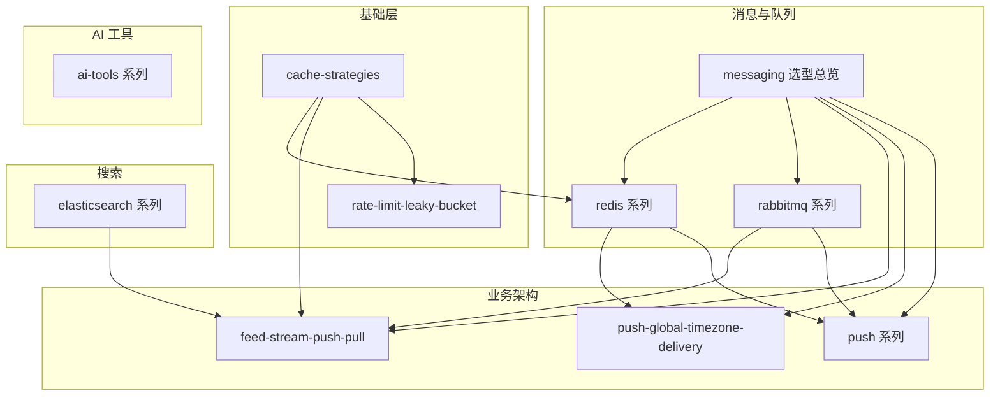

个人技术笔记仓库。正文以中文撰写，覆盖缓存策略、消息队列、Redis 实践、Elasticsearch、Feed 流、Push 系统与限流算法等主题。

## 主题地图

## 主题域

| 主题域 | 入口 | 说明 |
| ------ | ---- | ---- |
| 缓存 | [cache-strategies.md](./cache-strategies.md) | Cache-Aside 等读写策略 |
| 限流 | [rate-limit-leaky-bucket.md](./rate-limit-leaky-bucket.md) | 漏桶 / 令牌桶原理与 Go 实现 |
| 消息 / 队列 / 延迟 | [messaging/README.md](./messaging/README.md) | Redis vs RabbitMQ vs Kafka 选型与学习路径 |
| Redis 实践 | [redis/README.md](./redis/README.md) | 分布式锁、ZSET 延迟队列、租约恢复 |
| RabbitMQ | [rabbitmq/README.md](./rabbitmq/README.md) | AMQP 全系列（6 篇） |
| Elasticsearch | [elasticsearch/README.md](./elasticsearch/README.md) | 高亮、多语言搜索 |
| Feed 流 | [feed-stream-push-pull.md](./feed-stream-push-pull.md) | 推拉模式、Fan-out、Inbox/Outbox |
| Push | [push/README.md](./push/README.md) | 全球化概念篇 + 入门系列 0→6（共 8 篇） |
| AI 工具 | [ai-tools/README.md](./ai-tools/README.md) | Agent 代码理解、IDE 插件选型 |

## 推荐学习路径

### 路径 A：从缓存到队列（后端通用）

1. [cache-strategies.md](./cache-strategies.md)
2. [redis/redis-zset-delay-queue.md](./redis/redis-zset-delay-queue.md)
3. [rabbitmq/core-concepts.md](./rabbitmq/core-concepts.md) → 系列 2～6

### 路径 B：社交 / Feed 向

1. [feed-stream-push-pull.md](./feed-stream-push-pull.md)
2. [cache-strategies.md](./cache-strategies.md)（Timeline 缓存）
3. [rabbitmq/reliable-publishing.md](./rabbitmq/reliable-publishing.md)（扇出 + Outbox）

### 路径 C：搜索向

1. [elasticsearch/es-highlight.md](./elasticsearch/es-highlight.md)
2. [elasticsearch/es-multilingual-search.md](./elasticsearch/es-multilingual-search.md)

### 路径 D：Push / 全球触达

1. [push/push-global-timezone-delivery.md](./push/push-global-timezone-delivery.md)（全球概念）
2. [push/push-fundamentals.md](./push/push-fundamentals.md) → [push/README.md](./push/README.md) 系列 1～6
3. [redis/redis-zset-delay-queue.md](./redis/redis-zset-delay-queue.md)（活跃集 / 调度）
4. [rabbitmq/reliable-publishing.md](./rabbitmq/reliable-publishing.md)（Campaign Outbox）
