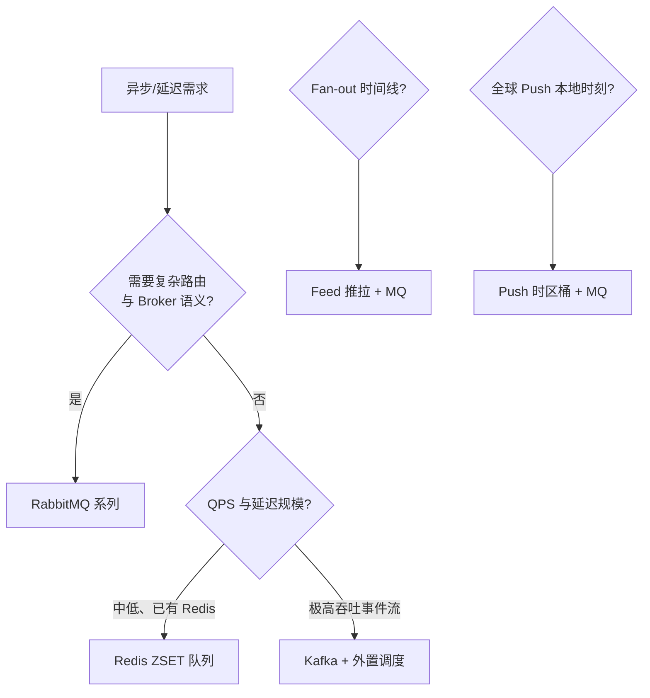

# 消息、队列与异步任务 — 选型总览

> **仓库本地索引**。各专题正文见 `redis/`、`rabbitmq/` 系列及根目录单篇。

---

## 快速选型

| 场景 | 优先方案 | 详见 |
| ---- | -------- | ---- |
| 轻量延迟任务、调度点少、团队已有 Redis | Redis ZSET 延迟队列 | [redis/redis-zset-delay-queue.md](../redis/redis-zset-delay-queue.md) |
| Worker 宕机后任务卡在 running | ZSET + Lease + Watchdog | [redis/redis-zset-running-recovery.md](../redis/redis-zset-running-recovery.md) |
| 微服务解耦、路由复杂、要 Confirm/ACK/DLX | RabbitMQ | [rabbitmq/README.md](../rabbitmq/README.md) |
| 超高吞吐事件流、日志、回放、分区消费 | Kafka（本库暂无专篇） | 本文「延迟队列方案要点」 |
| 发帖扇出、Timeline 投递 | MQ 异步扇出 + 推拉混合 | [feed-stream-push-pull.md](../feed-stream-push-pull.md) |
| 全球 Push、按用户本地时刻送达 | 概念：cohort × 时区触发；实现见 push 系列 | [push/push-global-timezone-delivery.md](../push/push-global-timezone-delivery.md) |
| Push 平台从 0 到规模化 | push 入门系列 0→6 | [push/README.md](../push/README.md) |
| 业务写 DB 与发 MQ 的一致性 | Outbox 模式 | [rabbitmq/reliable-publishing.md](../rabbitmq/reliable-publishing.md) §7.3 |

## 延迟队列方案要点

**Redis ZSET** — 轻、快、任意延迟；需自研可靠性，内存随积压涨。实现见 [redis/redis-zset-delay-queue.md](../redis/redis-zset-delay-queue.md)。

**RabbitMQ** — `x-delayed-message` 适合天级内延迟；海量在途需压测。TTL+DLX 更偏传统可靠延迟。

**Kafka** — 无一等公民延迟消息，常用分桶/外部调度。

**RocketMQ** — 4.x 固定 18 档延迟；5.x 时间轮支持任意秒级。

**数据库（PostgreSQL 等）** — 与业务同事务；轮询有 DB 压力，适合量不大且要强一致。

**内存时间轮** — 刻度内精度、单进程嵌入；可靠性低（内存态）。

ASCII：`复杂路由 → RabbitMQ`；`轻量延迟 → Redis ZSET`；`事件流 → Kafka`；`Timeline → Feed 笔记 + MQ`

---

## 推荐学习路径

完整学习路径（A 后端通用 / B Feed / C 搜索 / D Push）见 [index.md](../index.md)。

---

## Outbox 模式（横切要点）

**问题**：业务事务已提交，但 MQ 发送失败（或相反），导致 DB 与消息不一致。

**做法**（与 [rabbitmq/reliable-publishing.md](../rabbitmq/reliable-publishing.md) 一致）：

1. 同一 DB 事务内写入业务表 + **Outbox 表**（待发送消息）。
2. 定时任务或 CDC 扫描 Outbox，调用 Broker 发送。
3. **Publisher Confirm** 成功后删除或标记 Outbox 行；失败重试。
4. 消费侧 **幂等** + 去重，避免至少一次投递产生重复副作用。

---

## 系列入口

| 系列 | 目录 |
| ---- | ---- |
| Push 入门 | [push/README.md](../push/README.md) |
| Redis 队列 | [redis/README.md](../redis/README.md) |
| RabbitMQ | [rabbitmq/README.md](../rabbitmq/README.md) |
| Elasticsearch | [elasticsearch/README.md](../elasticsearch/README.md) |
