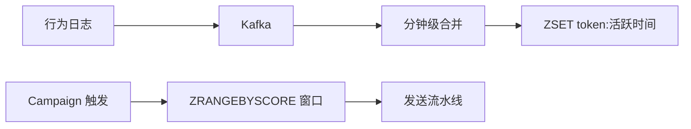

# Redis ZSET 活跃用户集与离线拆包

> **版本** 2026-05 · **定位**：Push 入门系列 · 实现篇 B（阶段 2）

> 月活/全量实时 Push：Kafka 准实时活跃、Redis ZSET 存储、Campaign 预览/暂停；以及按品牌/系统离线拆包避免在线过滤。前置：[push-campaign-admin.md](./push-campaign-admin.md)。

---

## 如何使用本文档

| 你的目标 | 建议阅读 |
| -------- | -------- |
| 理解「12 分钟推 2000w 月活」 | 一、二 |
| ZSET 数据模型与扫描 | 三 |
| 离线拆包 | 四 |
| 与延迟队列笔记对照 | 五 |

---

## 一、业务目标

运营需求：

- 重大节日推**月活/全量**，文案可变、不必每次跑大数据
- **1 亿**用户约 1 小时内推完；**2000w 月活**约 12 分钟内
- 支持预览、暂停、实时进度

**性能粗算**（转转）：

- 2000w / QPS 2000 ≈ 1h20m
- 目标 12min → QPS ~**2.7w**（约 13.5 倍）→ 引出 MQ 扇出（[push-mq-fanout-provider.md](./push-mq-fanout-provider.md)）

---

## 二、准实时活跃数据

1. 客户端行为日志 → **Kafka**
2. 每分钟合并：更新「业务 token + 最后活跃时间戳」
3. 不存 deviceToken 本身在 ZSET（token 映射走 Token 服务）

**存储选型**：Redis **ZSET**

| 字段 | 约定 |
| ---- | ---- |
| Key | `push:active_tokens` 或分片 `push:active:{shard}` |
| Member | 业务 token（设备/用户维度按产品定） |
| Score | 最后活跃 Unix **毫秒** |

---

## 三、Campaign 触发时扫描

**查询**：近 90 天活跃 → `ZRANGEBYSCORE key (now-90d) now`

**与全球 Push 交集**：触发时刻做 `cohort ∩ timezone ∩ sent_log 去重`（[push-global-timezone-delivery.md](./push-global-timezone-delivery.md) §6～§7）。

### 3.1 预览 / 暂停 / 进度

| 能力 | 实现要点 |
| ---- | -------- |
| **预览** | 从 ZSET 或包内抽 100 条 → 仅调 Provider 发送 |
| **暂停** | Campaign 状态 `paused`；Producer 停止入 MQ |
| **进度** | Redis `INCR campaign:{id}:sent` 或 DB 汇总 |

### 3.2 算力放置

原则：**重计算跟数据更新频率走，轻读取跟发送 Tick 走**（完整说明见 [push-global-timezone-delivery.md](./push-global-timezone-delivery.md) §7.1 与 [redis/redis-zset-delay-queue.md](../redis/redis-zset-delay-queue.md)，ZSET score 语义一致：绝对时间戳）。

---

## 四、离线预处理：按品牌/系统拆包

**老架构**：人群包全量进链路 → 在线按画像过滤品牌/系统 → 慢。

**新架构**（腾讯新闻）：离线拆分子包。

例：「社会」兴趣包 → android/ios × huawei/oppo/vivo/honor/xiaomi → **13 个子包**

运营勾选筛选项 → 直接拉对应子包 → **零在线过滤**。

与 Campaign **存规则不存死名单**同一原则：过滤跟数据更新走，发送跟 Tick 走。

---

## 五、与 Redis 延迟队列系列的关系

| 场景 | ZSET 用法 |
| ---- | --------- |
| 延迟队列 | score = **到期时刻**，到点消费 |
| 活跃集 | score = **最后活跃时刻**，按窗口扫描 |
| 共同点 | 有序、O(log N)、分片扩展 |

Running/Lease 恢复见 [redis/redis-zset-running-recovery.md](../redis/redis-zset-running-recovery.md)（若发送任务需租约防重复）。

---

## 六、相关笔记

- [push-mq-fanout-provider.md](./push-mq-fanout-provider.md) — QPS 提升
- [push-multi-vendor-token.md](./push-multi-vendor-token.md) — token 映射
- [messaging/README.md](../messaging/README.md) — 路径 D

---

*— 文档结束 —*
