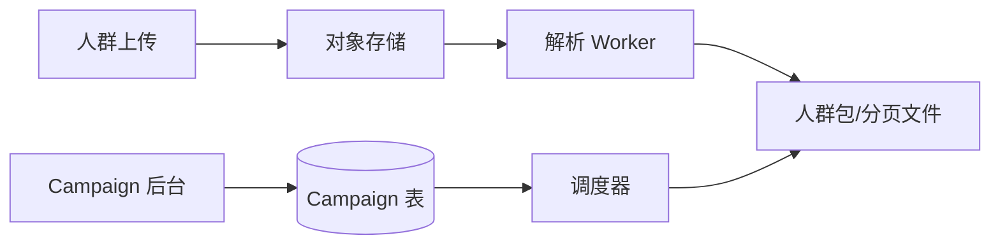

# Campaign 后台与人群包

> **版本** 2026-05 · **定位**：Push 入门系列 · 实现篇 A（阶段 1）

> 从「RD 写脚本调 Push 接口」到运营可用的 Campaign 后台：定时发送、文案模板、异步人群上传，以及号码包分页拉取优化。前置阅读：[push-fundamentals.md](./push-fundamentals.md)。

---

## 如何使用本文档

| 你的目标 | 建议阅读 |
| -------- | -------- |
| 理解 PM 推活动痛点 | 一 |
| 设计 Campaign 数据模型 | 二、三 |
| 大文件 / 号码包优化 | 四、五 |
| 上线 checklist | 六 |

**读完本文应能回答**：Campaign 该存规则还是存死名单？上传慢和拉取慢分别怎么解？

---

## 一、问题：PM 想推运营活动

**改造前**：PM 从大数据导出 userId → RD 写程序调 Push 接口。

**痛点**：

- 多个 PM 并行需求，RD 成为瓶颈
- 突发活动（8 点秒杀、9 点补推）无法自助
- 周末周期性活动重复劳动

**V1 目标**：

- 运营后台：上传人群、配置文案、定时发送
- 分端：Android / iOS 独立配置
- **Campaign 存规则**，不预计算千万级「用户 × 时区」名单（见 [push-global-timezone-delivery.md](../push-global-timezone-delivery.md) §6）

---

## 二、Campaign 数据模型（概念）

| 字段域 | 示例 | 说明 |
| ------ | ---- | ---- |
| 身份 | `campaign_id`, `name` | 一次推送任务 |
| 人群 | `audience_type`, `audience_ref` | 文件 ID / 标签 ID / DMP 包 ID / 规则 |
| 内容 | `title_tpl`, `body_tpl`, `deeplink_tpl` | 支持变量 `{{name}}` |
| 时间 | `schedule_at`, `timezone_mode` | 立即 / 定时 / 按用户本地时刻 |
| 平台 | `platforms` | ios, android |
| 状态 | draft / scheduled / running / paused / done | 支持预览、暂停 |
| 优先级 | hot / normal / low | 热点任务优先（见 [push-link-governance.md](./push-link-governance.md)） |



ASCII：`运营配置 → Campaign 规则 → 触发时拉人群 → 发送流水线`

---

## 三、关键能力

| 能力 | 做法 |
| ---- | ---- |
| 定时发送 | Cron 或延迟队列触发；到点将任务置为 running |
| 文案可配 | 模板 + 变量；AB 多模板见 [push-ab-monitor.md](./push-ab-monitor.md) |
| 预览 | 指定 100 个 userId 或运营自己的设备先发送 |
| 暂停 | running 状态停止消费 MQ；已发出不可撤回 |
| 进度 | `sent_count / total_estimate` 实时更新 |

---

## 四、大文件上传（转转实践）

场景：1000w userId、~300MB CSV，同步上传超时。

| 问题 | 解法 |
| ---- | ---- |
| Nginx/网关超时 | 异步上传 + 进度条；或调大 `proxy_read_timeout`（不推荐作唯一手段） |
| 边上传边解析慢 | **上传与解析分离**：先落对象存储，Worker 异步解析 |
| 内存爆 | 流式解析 CSV，按 batch 写入分页文件 |

**流程**：

```text
PM 上传 → 对象存储（multipart）
       → 返回 upload_id
       → Worker：CSV → 按页切分（如每页 5w userId）→ 写入存储
       → Campaign.audience_ref = package_id
```

---

## 五、号码包拉取（腾讯新闻实践）

**现象**：扩容下发机器后 QPS 仍不升——瓶颈在**分页拉人群包**（中台 API 过重）。

**自建号码包服务**（需求极简：按页读）：

1. 画像圈选 → 按页切小文件 → 上传 COS（带版本号）
2. 包管理服务：本地缓存 + 定期 check COS 新版本
3. 哨兵：集群节点版本不一致时强制同步
4. 发送链路：`GET /package/{id}/page/{n}` 只拉当前页


**原则**：人群包**写入**（上传/圈选）与**读取**（发送时分页）分开优化。

---

## 六、生产 checklist

- [ ] Campaign 不存固定全量名单（滚动人群用规则 + 触发时 JOIN）
- [ ] 上传异步化，有进度与失败重试
- [ ] 发送按页拉包，不一次加载全量到内存
- [ ] 鉴权：仅运营角色可创建 Campaign
- [ ] 审计：谁、何时、对哪些人群发起了推送

---

## 七、相关笔记

- [push-fundamentals.md](./push-fundamentals.md) — 最小 Push 链路
- [push-active-users-zset.md](./push-active-users-zset.md) — 月活/全量实时推
- [push-global-timezone-delivery.md](../push-global-timezone-delivery.md) — 全球 Campaign 规则
- [rabbitmq/reliable-publishing.md](../rabbitmq/reliable-publishing.md) — Campaign 触发 + Outbox

---

*— 文档结束 —*
