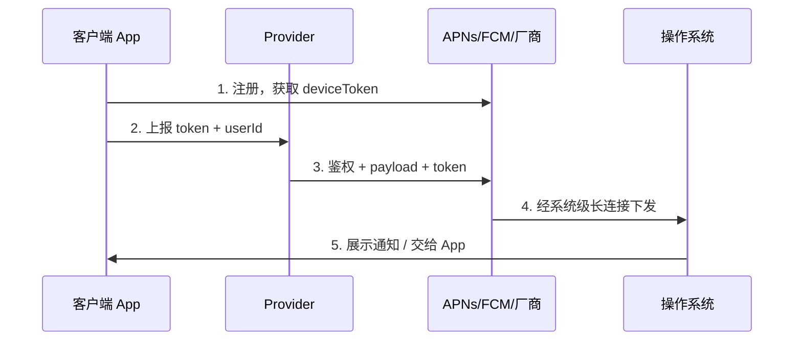
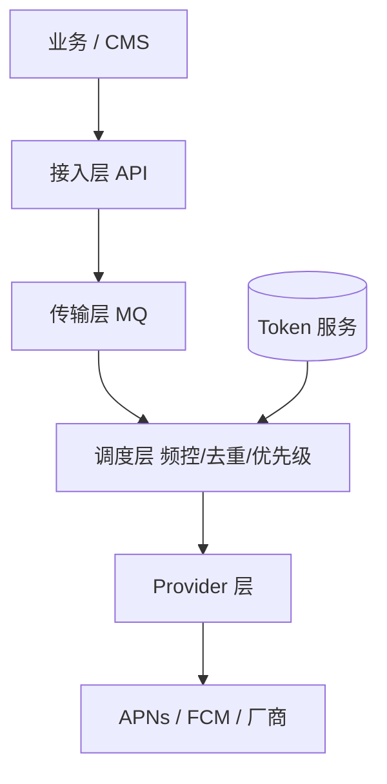

# Push 基础概念与最小发送链路

> **版本** 2026-05 · **定位**：Push 入门系列 · 基础篇（阶段 0）

> 移动端 Push 的三方模型、在线/离线触达、消息类型与 Token 体系；以及从 Token 注册到 APNs/FCM 最小发送的工程路径。全球时区与 Campaign 规则见 [push-global-timezone-delivery.md](./push-global-timezone-delivery.md)。

---

## 如何使用本文档

| 你的目标 | 建议阅读 |
| -------- | -------- |
| 5 分钟建立心智模型 | 一、推送的本质：三方模型；二、Push 与 IM |
| 搞清通知 vs 透传 | 三、在线 vs 离线；通知 vs 透传 |
| Token 与通道选型 | 四、Token 体系；五、典型系统分层 |
| 画 V0 架构 / Demo | 六、最小可用 Push（V0）；七、Push 与 Feed Fan-out 的区别 |
| 自检是否掌握 | 八、自检清单 |

**读完本文应能回答**：Push 与 IM 长连接的分工？deviceToken 何时失效？最小 Push 系统需要哪三个组件？

---

## 一、推送的本质：三方模型

Push 是 **App ↔ Provider（你的服务端）↔ Push Service（APNs / FCM / 厂商）** 的协作：



ASCII：`注册 Token → 上报服务端 → Provider 调厂商 API → OS 展示`

| 角色 | 职责 |
| ---- | ---- |
| **客户端** | 申请权限、注册 Token、上报、处理点击/透传 |
| **Provider** | Token 映射、组 payload、调厂商 API、限流重试 |
| **Push Service** | 维持与设备的系统级连接 |

**平台约束**：iOS **只能** APNs；国内 Android 离线触达依赖**厂商通道**；海外 Android 以 **FCM** 为主。

---

## 二、Push 与 IM：业务不同、技术相通

| 维度 | 运营 Push | IM / 实时消息 |
| ---- | --------- | ------------- |
| 典型场景 | 秒杀、活动、订单通知 | 聊天、弹幕 |
| 延迟 | 秒～分钟级 | 通常 &lt;200ms |
| 通道 | **厂商离线**为主 | **自建长连接** + 厂商兜底 |
| 规模 | 千万～亿级广播 | 连接数、房间路由 |

**链路两段式**（触发 → 调度 → 触达）：

- **触发**：人工 / 自动化 / 功能性（评论、关注）
- **下发**：避让、打散、频控 + 厂商或自建通道

**及时性 vs 体验**：热点要「全网首推」则少计算、快下发；要良好体验则需频控与个性化——两者常冲突。实验数据：下发延迟降 50% 时，点击量约 +10%（腾讯新闻 Push 重构实践）。

---

## 三、在线 vs 离线；通知 vs 透传

### 3.1 两种触达路径

| 维度 | 在线（自建长连接） | 离线（厂商通道） |
| ---- | ------------------ | ---------------- |
| 条件 | App 进程存活 | 后台 / 被杀 |
| 延迟 | 毫秒级 | 秒～分钟级 |
| 典型 | IM 在线、应用内提醒 | 营销、热点、订单 |

```text
App 在线  → 优先 socket（低延迟、可透传）
App 离线  → 降级厂商通道（高到达率）
```

第三方 SDK（极光/个推/uni-push）价值：**统一 API + 自动路由 + 多厂商适配**。

### 3.2 消息类型

| 类型 | 谁展示 | 典型用途 |
| ---- | ------ | -------- |
| **通知消息** | 系统通知栏 | 营销、活动 |
| **透传/数据消息** | App 代码处理 | 静默同步、自定义 UI |
| **静默推送** | 无 UI，唤醒 App | badge、预加载（iOS `content-available`） |

营销 Push 常用 **Notification + Data**：通知保证展示，data 携带 deep link 与追踪参数。

---

## 四、Token 体系

| 概念 | 说明 |
| ---- | ---- |
| **deviceToken / FCM Token** | 厂商侧 ID，**按 App 唯一** |
| **业务 token** | App 内设备 ID（如活跃集 ZSET member） |
| **PushID / ClientId** | 第三方平台对外标识 |

**Token 何时变**：重装、清数据、恢复出厂、系统大版本（偶发）。**每次启动应重新获取并上报**。

**服务端映射**：`userId` 1:N `deviceToken`；`deviceToken` → `vendor`（华为/小米/APNs…）。

**失效清理**：APNs 410、FCM 错误码、厂商回调与归档策略，详见 [push-multi-vendor-token.md](./push-multi-vendor-token.md) §四。

**APNs 连接**：保持 HTTP/2 **长连接池**（约 5～10 条）；单连接约 2000 QPS；勿每条消息新建连接。

---

## 五、典型系统分层



入门期保持 **三层**即可：API / Scheduler / Provider。避免 filter、policy、channel 各拆微服务导致 RPC 内耗（腾讯新闻：18 模块 → 3 模块）。

---

## 六、最小可用 Push（V0）

### 6.1 架构

```text
业务服务 --HTTP--> Push API（单服务）
                      |
                      +--> APNs / 一家 Android 通道
```

### 6.2 客户端

1. 申请通知权限（iOS 必须；Android 13+ 必须）
2. 向 APNs/FCM 注册，获取 deviceToken
3. `POST /devices/register`：`userId`, `deviceToken`, `platform`, `appVersion`

### 6.3 服务端

1. 持久化 `user_id, device_token, platform, updated_at`
2. `POST /push/send`：`userId` 或 `deviceToken`, `title`, `body`, `data`（可选）
3. Provider 调厂商 API，记录 `message_id`, `status`, `error`

### 6.4 iOS payload 示例

```json
{
  "aps": {
    "alert": { "title": "标题", "body": "正文" },
    "sound": "default",
    "badge": 1
  },
  "custom": { "deeplink": "myapp://activity/123" }
}
```

### 6.5 FCM HTTP v1 要点

- 认证：OAuth 2.0 服务账号 JSON（Server Key 已废弃）
- `message.token` = deviceToken
- 营销：`notification` + `data` 组合

---

## 七、Push 与 Feed Fan-out 的区别

| | Feed 扇出 | Push 扇出 |
| -- | --------- | --------- |
| 复制对象 | content_id → 粉丝 Inbox | 一条通知 → 设备 Token |
| 读写在 | 读多写少 Timeline | 写放大 + 厂商 QPS 限额 |
| 详见 | [feed-stream-push-pull.md](../feed-stream-push-pull.md) | 本系列后续篇 |

---

## 八、自检清单

- [ ] 能画出注册 → 发送 → 送达时序
- [ ] 能解释在线与离线 Push 何时用哪个
- [ ] 能区分通知与透传
- [ ] 能说明 Token 变化与清理策略
- [ ] 能列出五层架构与各层职责

---

## 九、延伸阅读

| 主题 | 链接 |
| ---- | ---- |
| 转转 Push 从 0 演进 | https://developer.aliyun.com/article/1673182 |
| APNs 详解 | https://cloud.tencent.com/developer/article/1198303 |
| FCM 架构 | https://firebase.google.com/docs/cloud-messaging/fcm-architecture?hl=zh-cn |
| 50M 设备 Push 架构 | https://designgurus.substack.com/p/push-notification-architecture-apns |
| 全球化 Push 概念 | [push-global-timezone-delivery.md](./push-global-timezone-delivery.md) |

---

## 十、系列导航

| 下一篇 | 内容 |
| ------ | ---- |
| [push-campaign-admin.md](./push-campaign-admin.md) | Campaign 后台与人群包 |
| [push/README.md](./README.md) | 全系列阅读顺序 |

---

*— 文档结束 —*
