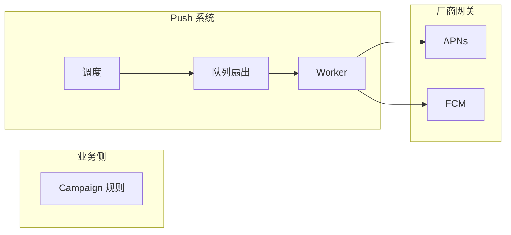
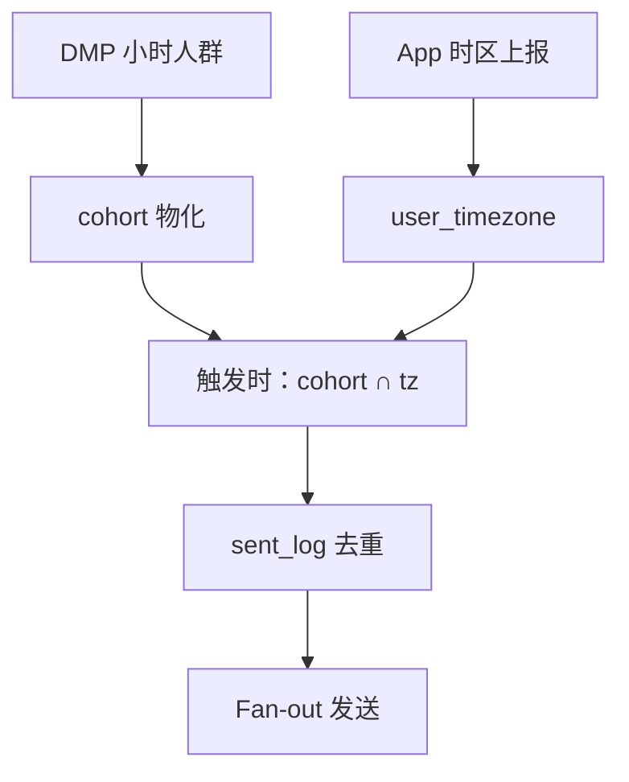

# 全球化 Push 概念介绍

> **版本** 2026-05 · **定位**：全球 Push 入门 · 概念与心智模型

> 面向全球用户的移动端 Push（APNs / FCM 等）：要解决什么问题、核心概念是什么、常见架构思路如何选。本文是系列**基础篇**，不展开具体实现细节。

---

## 如何使用本文档

| 你的目标 | 建议阅读 |
| -------- | -------- |
| 5 分钟建立心智模型 | 一、什么是全球化 Push；二、两个正交的问题 |
| 选立即发还是本地时刻发 | 三、送达策略 |
| 画第一张架构图 | 四、系统分层；五、按时区送达 |
| 理解 DMP / 时区 / 调度分工 | 六、三类会变的数据；七、调度思路 |
| 术语查阅 | 十、术语 |

**读完本文应能回答**：全球 Push 和「同一时刻全员弹出」有何不同？Campaign 里该存规则还是存名单？人群、时区、Token 分别由谁提供？

---

## 一、什么是全球化 Push

**Push** 指 App 在后台或未打开时，由服务端经 **APNs**（iOS）、**FCM**（海外 Android）或**厂商通道**（国内 Android），把一条短消息推到用户设备。

**全球化** 意味着：

- 用户分布在不同时区，**「早上 9 点」对每个人不是同一个 UTC 时刻**；
- 设备平台、厂商通道、语言（locale）各不相同；
- 发送规模从几千到**百万级**，不能靠单机同步 HTTP 打完。

这与 [Feed 流 Fan-out](../feed-stream-push-pull.md) 不同（完整对比见 [push-fundamentals.md](./push-fundamentals.md) §七）：Feed 解决「内容复制到时间线」；Push 解决「**何时**、**经哪条通道**、把**一条通知**送到设备」。



ASCII：`运营规则 → 调度 → 队列 → Worker → APNs/FCM → 用户设备`

---

## 二、两个正交的问题

设计全球 Push 时，几乎总是在同时处理两件事：

| 维度 | 问什么 | 典型手段 |
| ---- | ------ | -------- |
| **时间语义** | 每个用户**当地几点**收到？ | 按 IANA 时区、本地固定时刻、智能活跃时段 |
| **吞吐语义** | 百万 token **如何平稳**打出？ | MQ 扇出、批量发送、限流、削峰 |

两者会相互影响：若要求「每人本地 9:00 收到」，发送会**自然摊在约 24 小时**内逐时区滚动，峰值远低于「全球同一秒 blast」——对 FCM/APNs 配额更友好。

---

## 三、送达策略

| 策略 | 含义 | 适用 |
| ---- | ---- | ---- |
| **立即发送** | 全球同一 UTC 时刻（或尽快）发出 | 安全告警、交易到账、突发新闻 |
| **按用户本地固定时刻** | 每人都在自己时区的 9:00（等）收到 | 日报、活动提醒、非紧急营销 |
| **智能送达** | 按用户历史活跃时段个性化 | 内容推荐、促活 |

非紧急 Push **不应**默认全球同一秒发出。第三方平台公开数据：智能送达的打开率通常高于立即发送和固定本地时刻。

**发送窗口**（概念）：

- **立即发送**：秒～分钟级；
- **本地固定时刻**：单次 Campaign 的发送期约 **24～26 小时**（随地球自转逐时区触发）；
- **智能送达**：取决于画像粒度，每人触发时刻可能不同。

---

## 四、系统分层（概念）

典型 Push 系统可粗分为五层：

| 层级 | 职责 |
| ---- | ---- |
| **Campaign** | 存**规则**：文案模板、人群包 ID、本地时刻、周期、优先级 |
| **受众** | 回答「谁在包里」—— 常来自 **DMP** 或标签系统 |
| **调度** | 回答「此刻该发谁」—— 结合时区、周期、去重 |
| **扇出 / 队列** | 把一次任务拆成大量 batch，削峰 |
| **Worker / 网关** | 调 APNs、FCM、厂商 SDK；限流、重试、清理无效 Token |

Campaign **通常存规则，不存固定 user 名单**——尤其在人群滚动、时区变化的场景下（见 §六）。

---

## 五、按时区送达：核心概念

### 5.1 不是「同一时刻」，而是「同一本地钟点」

运营说「每天 9:00 推送」，在全球场景下应理解为：

> 每个用户在自己当地的 9:00 左右收到，而不是北京时间 9:00 全球齐发。

因此系统按 **IANA 时区**（如 `Asia/Shanghai`、`America/New_York`）把用户分组；各组在对应的 **UTC 时刻** 触发发送。全球约 24 个「钟点带」在 24 小时内依次经过。

| 用户时区（示例） | 本地 9:00 大致对应 UTC |
| ---------------- | ---------------------- |
| GMT+8 | 01:00 同日 |
| GMT+0 | 09:00 同日 |
| GMT-5 | 14:00 同日 |

### 5.2 时区从哪来

**时区通常不在 DMP 人群包里**，而由 App / 设备侧维护：

- 登录、进前台、系统时区变更、Push Token 注册时上报；
- 存 **IANA 名称**，不要只存 UTC offset（夏令时 DST 会错）；
- IP 地理、注册国仅作兜底。

**时区会随时变化**（出差、换机、系统设置），不能假设一次写入永久有效。

### 5.3 与文案语言（locale）的关系

**时区**决定「几点发」；**locale** 决定「发什么语言」——两者正交，在 Campaign 层分别配置。

---

## 六、三类「会变」的数据

全球 + 周期 Push 的难点，往往来自三份**独立变化**的数据：

| 数据 | 谁提供 | 变化频率 | 回答的问题 |
| ---- | ------ | -------- | ---------- |
| **人群** | DMP / 标签平台 | 常 **小时级** 滚动产出 | 这个 user **在不在** 营销包里 |
| **时区** | App / 用户服务 | 随时可能变 | 这个 user **当地几点** |
| **Token** | 设备注册 | 换机、卸载、失效 | 这个 user **往哪台设备** 推 |

**设计 implication**：

1. **不要在 Campaign 创建时**把「用户 × 时区」算死成一份名单；
2. **在发送触发时**（或触发前不久）做 `人群 ∩ 时区 ∩ 未发去重`；
3. 用 **`sent_log(campaign, user, cycle_date)`** 保证同一周期每人最多一条，与从哪个时区桶发出无关。



---

## 七、调度：常见思路（概念）

「什么时候算该发谁」是架构分歧点，常见两类：

| 思路 | 做法（概念） | 特点 |
| ---- | ------------ | ---- |
| **按时区触发** | 每个 IANA 时区在对应 UTC 时刻触发一次 | 本地时刻准；Cron / 触发点较多 |
| **定时 Tick** | 每 N 分钟（如 15 min）扫任务，算「当前哪些时区的本地钟点落在发送窗口内」 | 调度简单；本地时刻有 ±N 分钟误差 |

两种思路在数据条件相同时，本质都是 **触发时刻做 cohort × timezone 切片**，不是创建 Campaign 时预分桶。

### 7.1 算力放哪里

若每次 Tick 都对 **DMP 全量人群** 做筛选 + 时区 JOIN，计算量会很大。常见优化方向（概念）：

| 时机 | 做什么 |
| ---- | ------ |
| **DMP 入库时** | 物化 cohort；按 `(人群包, timezone)` **预分区** |
| **时区变更时** | 用户在 tz 桶之间迁移 |
| **Tick / 触发时** | 只读**已物化**的小桶 + 去重，不再扫全量 |

原则：**重计算跟数据更新频率走（hourly DMP、时区事件），轻读取跟发送 Tick 走。**

更细的队列、ZSET、限流实现，见 [messaging/README.md](../messaging/README.md) 与 [redis/redis-zset-delay-queue.md](../redis/redis-zset-delay-queue.md)。

---

## 八、大规模发送（概念）

百万级 Push 在系统内通常不是一次 HTTP 打出去，而是：

```text
触发发送
  → 查 Token、组 batch
  → 写入 MQ
  → 多 Worker 并行
  → 调 APNs / FCM（限流、重试）
```

要点（概念级）：

- **Fan-out**：一次 Campaign 拆成大量小 batch；
- **分平台**：iOS / Android / Web 分通道，限流策略不同；
- **削峰**：按本地时刻发送本身会摊平 24h；立即全球 blast 则需主动 ramp-up；
- **FCM** 等有每分钟配额（Quota Token），忌瞬时打满；
- **无效 Token** 要及时清理，避免浪费配额。

---

## 九、常见坑（简表）

| 问题 | 概念上怎么处理 |
| ---- | -------------- |
| 缺 timezone | skip / 国家默认 / UTC 兜底（Campaign 配置明示） |
| DST 夏令时 | 必须用 IANA，不能手写 offset |
| DMP 延迟 | 发送窗口留 buffer；明确用哪一版 hourly 导出 |
| 同一周期双发 | `sent_log` 幂等，与 Tick 频率无关 |
| 用户时区变了 | 触发时 JOIN 新时区；本周期已发则 dedup |
| 多设备 | user 级还是 device 级 dedup，需产品定规则 |
| 国内 Android | 多厂商通道，路由与限额各自独立 |

---

## 十、术语

| 英文名 | 说明 |
| ------ | ---- |
| APNs | Apple Push Notification service |
| FCM | Firebase Cloud Messaging |
| Campaign | 一次推送任务或其**规则**（人群、时刻、文案） |
| IANA Timezone | 如 `Asia/Shanghai`，含 DST 规则 |
| Fan-out | 一次任务扇出为大量 per-user / per-batch 发送 |
| DMP | Data Management Platform，人群 / 标签平台 |
| DND | Do Not Disturb，勿扰时段（按用户本地解释） |

---

## 十一、延伸阅读

- [FCM: Best practices when sending at scale](https://firebase.google.com/docs/cloud-messaging/scale-fcm)
- [OneSignal: Scheduling by User Time Zone](https://onesignal.com/blog/deliver-by-timezone-push-notification/)
- [CleverTap: Notification Delivery Options](https://docs.clevertap.com/docs/notification-delivery-options)

---

## 十二、相关笔记

- [README.md](./README.md) — Push 入门系列（基础 → Campaign → MQ → 治理）
- [push-fundamentals.md](./push-fundamentals.md) — 三方模型与最小发送
- [feed-stream-push-pull.md](../feed-stream-push-pull.md) — Fan-out 与 MQ 异步扇出心智模型
- [redis/redis-zset-delay-queue.md](../redis/redis-zset-delay-queue.md) — 逐用户 / 定时任务延迟队列
- [rabbitmq/reliable-publishing.md](../rabbitmq/reliable-publishing.md) — 可靠投递与 Outbox
- [messaging/README.md](../messaging/README.md) — 队列与异步任务选型总览

---

*— 文档结束 —*
