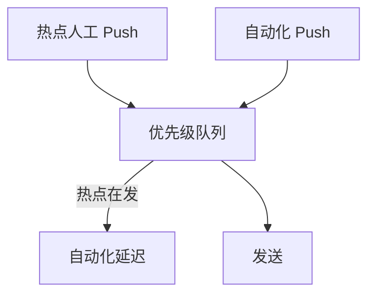

# Push 链路治理与规模化优化

> **版本** 2026-05 · **定位**：Push 入门系列 · 实现篇 E（阶段 5+）

> 模块整合、优先级调度、一致性哈希故障转移、自动化测试；腾讯新闻 Push 重构主线。前置：全系列 0～5 篇跑通后再读，避免过早优化。

---

## 如何使用本文档

| 你的目标 | 建议阅读 |
| -------- | -------- |
| 何时做链路重构 | 一 |
| 优先级调度 | 二 |
| 故障转移 | 三 |
| 自动化测试 | 四 |

**参考原文**：[腾讯新闻 Push 架构重构](https://cloud.tencent.com/developer/article/2598882)

---

## 一、何时需要治理

**信号**：

- S 级热点 Push 延迟 P90 达**分钟级**，竞品明显更快
- 一个需求改 **5+ 模块**，case 排查 **天级**
- 扩容下发机无效，瓶颈在**号码包/ RPC / IO**

**成果参考**（腾讯新闻）：内部链路 P90 降 **90%**；成本降 **70%**；热点点击 **+10%**；模块 18→3。

---

## 二、链路整合原则

| 原则 | 说明 |
| ---- | ---- |
| 一个需求尽量只改一个模块 | 减少联调与上线风险 |
| 能本地调用不 RPC | 过滤/策略内聚在调度模块 |
| 过滤前置离线 | 见 [push-active-users-zset.md](./push-active-users-zset.md) §4 |
| IO 能 batch 不单条 | 见 [push-mq-fanout-provider.md](./push-mq-fanout-provider.md) §5 |

---

## 三、优先级调度

### 3.1 任务级

热点突发 **> 自动化推荐**；链路吞吐固定时，先保障高价值任务。

### 3.2 用户级（同任务内）

发送顺序：活跃度高 → 历史点击率高 → 预估价值高 → 对延迟敏感。

---

## 四、故障转移

**老问题**：一致性哈希 + 节点本地 LRU → 节点**慢而不死**时仍打满 → 队列满**丢消息**。

**新方案**：

- 每节点固定 **4 个 backup**（一致性哈希环上）
- 失败率或 P99 超阈值 → 流量均匀切到 backup
- 避免「为保缓存」硬打 dead node

---

## 五、自动化测试

### 5.1 回归

- 覆盖：频控、去重、路由、payload 组装
- 合并 main 自动跑

### 5.2 Diff 回放

- 录制线上请求 + **依赖数据快照**（下发历史、画像）
- 测试环境回放；同请求结果应一致
- 避免「线上刚写入下发历史导致回放 diff」误报

---

## 六、设计口诀（回顾）

| 出处 | 口诀要点 | 详见 |
| ---- | -------- | ---- |
| 转转 | 提速：预加载 + 缓存 + 批量 + 深链；稳态：异步上传 + 限流 + 降级；不预算死名单、不单通道 | [push-campaign-admin.md](./push-campaign-admin.md)、[push-multi-vendor-token.md](./push-multi-vendor-token.md) |
| 腾讯新闻 | 少 RPC、离线拆包、batch IO、热点与高价值用户优先、backup 故障转移、注册接口合并 | [push-active-users-zset.md](./push-active-users-zset.md)、[push-mq-fanout-provider.md](./push-mq-fanout-provider.md) |
| 度量 | 内部 vs 全链路；延迟 -50% → 点击 +10% | [push-ab-monitor.md](./push-ab-monitor.md) §2.1 |

---

## 七、相关笔记

- [push-ab-monitor.md](./push-ab-monitor.md) — 监控与 AB
- [push-mq-fanout-provider.md](./push-mq-fanout-provider.md) — MQ 扇出
- [messaging/README.md](../messaging/README.md) — 路径 D 完整顺序

---

*— 文档结束 —*
