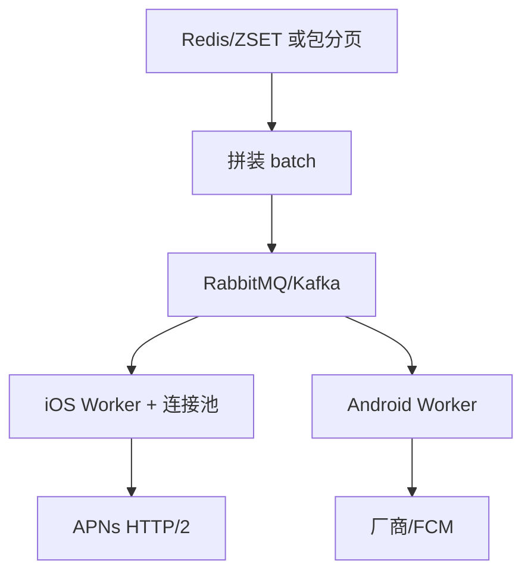

# MQ 扇出与 Provider 层

> **版本** 2026-05 · **定位**：Push 入门系列 · 实现篇 C（阶段 3）

> 从单线程发送到 MQ 多 Worker 扇出、分端 Provider、深链与业务限流；以及 Entry → Transfer → Provider 分层与批量 IO 聚合。前置：[push-active-users-zset.md](./push-active-users-zset.md)。

---

## 如何使用本文档

| 你的目标 | 建议阅读 |
| -------- | -------- |
| QPS 从 2k 到 3w+ | 一、二 |
| Push 打挂业务服务器 | 三 |
| 三层架构与反模式 | 四、五 |

---

## 一、瓶颈：单线程 + 厂商 RTT

转转改造前：

- 单线程从 Redis 取 token → 拼装 → 调 APNs（单请求 100ms+）
- 平均 QPS ~2000

**改造**：

1. Redis 只负责**取数 + 快速拼装**
2. 消息写入 **MQ**（RabbitMQ / Kafka）
3. **N 个 Consumer** 并行调厂商 API
4. **iOS / Android 分队列**，限流策略分离



**效果**：QPS 2k → **3w+**（转转）。iOS Pushy 连接需**定时重建**；遇异常重建通道。

---

## 二、58 同城三层模型（对照）

| 层 | 职责 |
| -- | ---- |
| **Push Entry** | 业务入口，异步入 MQ，缓冲洪峰 |
| **Push Transfer** | 校验、格式转换、分平台转发 |
| **Provider** | APNs/厂商协议、重试、连接管理 |

入门期可合并为：**API（Entry）→ Scheduler → Provider**。

---

## 三、Push 引发的业务流量反噬

Push 提速后，用户**同时点击** → App 接口超时、白屏（转转 §5.3）。

| 解法 | 说明 |
| ---- | ---- |
| 业务限流 | 活动页 API rate limit |
| 核心页缓存 | 防白屏 |
| **深链直达** | Push 携带 `deeplink`，跳过首页直达活动页，减少中间请求 |
| 加机器 | 兜底，非首选 |

```text
差：点击 Push → 首页 → 活动页（2 次冷启动请求）
优：点击 Push → 活动页（1 次）
```

---

## 四、过度微服务反模式

腾讯新闻老链路：**18 模块、17 次 RPC**（scheduler → filter → policy → channel → worker）。

重构后：**3 模块、2 次 RPC**。

**入门期不要**：本可函数调用的过滤拆成三个微服务；热点时 RPC 拆包 CPU 放大。

---

## 五、批量 IO 聚合

链路耗时多在 IO：用户画像、下发历史、文章正排。

**模式**（对上层零侵入）：

```text
业务调「单条 IO 接口」
  → 请求入异步队列
  → 协程 batch 拉取
  → 按序回填结果
```

压测对比：单条查 Token vs `WHERE token IN (...)` batch。

---

## 六、可靠投递

- Producer：**Outbox** 与业务同事务（[rabbitmq/reliable-publishing.md](../rabbitmq/reliable-publishing.md)）
- Consumer：**幂等**（`message_id` / campaign+user 去重）
- 厂商 429：退避重试；无效 Token 不重试

Fan-out 心智与 [feed-stream-push-pull.md](../feed-stream-push-pull.md) 相同：一次任务 → 大量 batch。

---

## 七、压测记录模板

| 指标 | 记录 |
| ---- | ---- |
| 出口 QPS | Worker 调厂商 TPS |
| P99 延迟 | 单条 Provider RTT |
| 429/5xx 率 | 限流与重试 |
| MQ 积压 | Consumer 是否跟得上 |

---

## 八、相关笔记

- [push-multi-vendor-token.md](./push-multi-vendor-token.md) — 多厂商 Provider
- [push-link-governance.md](./push-link-governance.md) — 优先级与故障转移
- [rabbitmq/reliable-publishing.md](../rabbitmq/reliable-publishing.md)

---

*— 文档结束 —*
