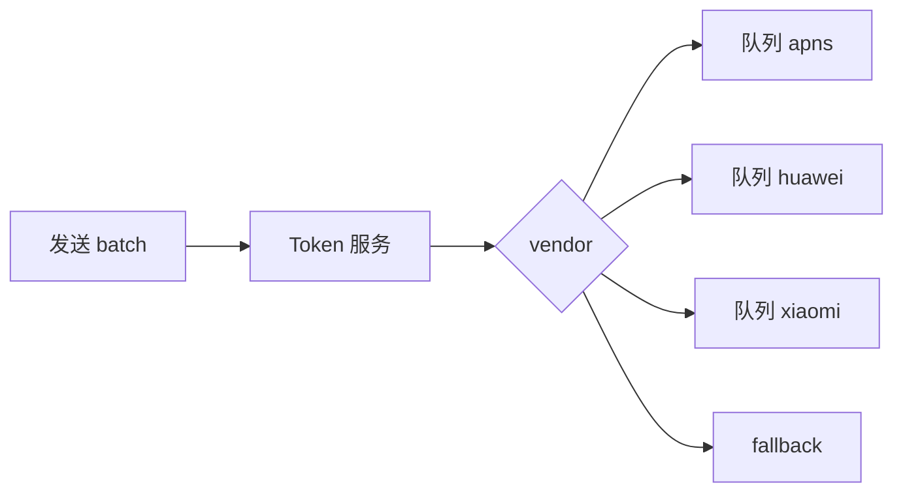

# 多厂商 Token 服务与路由

> **版本** 2026-05 · **定位**：Push 入门系列 · 实现篇 C+（阶段 4）

> deviceToken 注册、分库分表、按厂商路由、失效清理与 Provider 抽象；通道自建与注册接口合并。前置：[push-mq-fanout-provider.md](./push-mq-fanout-provider.md)。

---

## 如何使用本文档

| 你的目标 | 建议阅读 |
| -------- | -------- |
| 为何不能只走小米通道 | 一 |
| Token 表与路由 | 二、三 |
| 失效与回调 | 四 |
| Provider 抽象 / 通道自建 | 五 |

---

## 一、问题：单通道到达率低

转转早期：Android 仅小米 + 个推托底 → **华为用户**经小米难以到达。

整合多厂商后到达率约 **+10%**。

**原则**：按用户**最后登录/注册**的厂商选通道；无厂商通道时 fallback 第三方（个推/FCM）。

---

## 二、Token 表设计

| 列 | 说明 |
| -- | ---- |
| `user_id` | 业务用户 |
| `device_id` | App 内设备 ID |
| `device_token` | 厂商推送 ID |
| `platform` | ios / android |
| `vendor` | apns / huawei / xiaomi / oppo / vivo / fcm / … |
| `updated_at` | 最后上报时间 |
| `status` | active / invalid |

**关系**：`user_id` 1:N `device_token`（手机+平板）。

**规模**：亿级设备 → **分库分表**（按 `device_id` 或 `user_id` hash）；热数据 **Redis 缓存** batch 查 vendor。

---

## 三、路由与 Worker 队列



- 客户端上报：`vendor` + `device_token`（登录、Token 刷新、进前台）
- Router：按 vendor 投递到**不同 MQ 队列**，Consumer 独立限流

### 3.1 多通道串行（58 同城）

先推通道 A，ACK 不佳再推 B → **客户端按 messageId 去重**。

---

## 四、失效清理

| 来源 | 动作 |
| ---- | ---- |
| APNs **410** | 标记 invalid，不再发送 |
| FCM 错误码 | 同上 |
| 厂商 HTTP 回调 | 卸载/Token 轮换 |
| 长期未活跃 | 可选归档（如 30 天未连接 IM） |

**不要缓存 Token 在客户端本地当作永久有效**（Apple 要求每次向系统获取）。

---

## 五、Provider 抽象与通道自建

**接口**（概念）：

```text
PushProvider.send(SendRequest) → SendResult
  - platform, vendor, deviceToken, payload, priority
```

实现：`ApnsProvider`, `HuaweiProvider`, `FcmProvider`, …

**腾讯新闻通道自建**：

- 15 模块 → 6 模块；直接对接厂商 + 可选自建长连接
- **注册三合一**：注册+绑定+上报一个接口 → 成功率 90% → **99.9%**
- 统一 Golang 高 IO 技术栈

全球化：海外 FCM Quota 见 [push-global-timezone-delivery.md](./push-global-timezone-delivery.md) §8。

---

## 六、相关笔记

- [push-fundamentals.md](./push-fundamentals.md) — Token 基础
- [push-ab-monitor.md](./push-ab-monitor.md) — 到达率监控
- [push-link-governance.md](./push-link-governance.md) — 通道层优化

---

*— 文档结束 —*
