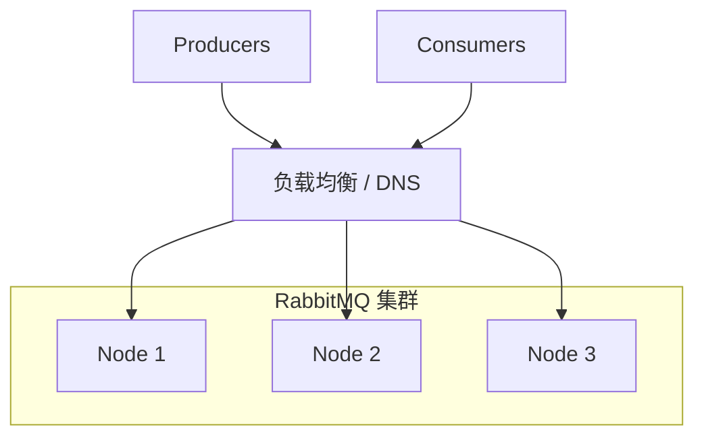

# RabbitMQ 集群与高可用

> **版本** 2026-05 · **定位**：集群、Quorum Queue、Classic 镜像、选型

> 多节点部署、队列 HA 类型、网络分区与生产容量规划。

---

## 如何使用本文档

| 你的目标 | 建议阅读 |
| -------- | -------- |
| 新项目队列类型选型 | 二、快速选型 |
| Quorum vs Classic | 三、队列类型详解 |
| 集群部署要点 | 四、集群基础 |
| 分区与容灾 | 五、网络分区与镜像 |
| 上线 checklist | 六、生产实践 |

---

## 一、高可用要回答的问题

| 问题 | 选项 |
| ---- | ---- |
| 节点挂了消息还在吗？ | 持久化 + 队列副本 |
| 消费者连哪？ | 负载均衡 / K8s Service / 客户端多地址 |
| 脑裂怎么办？ | 分区处理策略 `pause_minority` 等 |
| 吞吐 vs 一致性？ | Quorum（强一致）vs Classic（已弃用镜像） |

---

## 二、快速选型（2024+ 推荐）

| 场景 | 推荐队列类型 | 说明 |
| ---- | ------------ | ---- |
| 新业务默认 | **Quorum Queue** | Raft 复制，官方主推 |
| 极高吞吐、可丢 | Classic 非持久 | 临时队列 |
| 旧系统 Classic 镜像 | 计划迁移 Quorum | 镜像队列已弃用（3.13+） |
| 流式大数据 | **Stream** | 不同模型，类 Kafka 日志 |

**不要**在新项目使用 **Classic mirrored queues**（政策镜像队列）。

---

## 三、队列类型详解

### 3.1 Quorum Queue

**定义**：基于 **Raft** 的复制日志队列，多数派（quorum）确认后提交。

| 读写要点 | |
| -------- | -- |
| 复制因子 | 默认集群内多数节点，`quorum-initial-group-size` 等 |
| 性能 | 比 Classic 镜像延迟略高，一致性更强 |
| 长度限制 | 支持 `max-length`、`DLX` 等（部分参数与 Classic 不同，查官方矩阵） |
| 适用 | 订单、支付、任务等不容丢消息 |

| 优点 | 缺点 |
| ---- | ---- |
| 数据安全、官方长期支持 | 节点数建议奇数（3/5） |
| 避免镜像队列脑裂问题 | 极端低延迟场景需压测 |

**典型业务**：核心任务队列 `task.billing` 声明为 `x-queue-type: quorum`。

---

### 3.2 Classic Queue

**定义**：传统队列，单节点主副本；曾支持 **镜像策略**（policy mirror），现已弃用。

| 状态 | 说明 |
| ---- | ---- |
| 单机 Classic | 节点挂则队列不可用（即使消息持久化需等恢复） |
| 镜像 Classic | 维护模式，迁移到 Quorum |

**典型业务**：仅临时、`auto-delete` 的回调队列。

---

### 3.3 Stream（了解）

**定义**：持久化日志流，偏移量消费，适合大量事件留存与重放。

与 AMQP Queue 不同，按需查阅 Stream 文档；事件溯源可与 Kafka 对比选型。

---

## 四、集群基础

### 4.1 定义

多个 Erlang 节点共享 **元数据**（Exchange、Queue 定义、绑定、用户），组成**逻辑集群**。队列数据位置取决于队列类型与 Leader 选举。

### 4.2 部署要点

| 项 | 建议 |
| ---- | ---- |
| 节点数 | 生产至少 3 节点（奇数） |
| 主机名 | 使用稳定 hostname，cookie 一致 |
| 磁盘 | 持久化队列需 SSD，监控磁盘告警 |
| 内存 | `vm_memory_high_watermark`，防止 OOM 阻塞 |
| 负载均衡 | TCP 5672 前端 LB；管理 UI 15672 可内网 |
| K8s | RabbitMQ Cluster Operator |

### 4.3 连接

客户端可连接任意节点；声明拓扑会在集群同步。Quorum 队列 Leader 可能集中在某节点，**消费会从 Leader 拉取**（Follower 转发），注意热点。

---

## 五、网络分区与策略

### 5.1 分区（Split-brain）

集群节点间网络隔离形成多个子集，可能导致元数据不一致。

| 策略 | 行为 |
| ---- | ---- |
| `ignore` | 自动恢复，可能数据不一致（不推荐生产） |
| `pause_minority` | 少数派节点暂停，推荐 |
| `autoheal` | 恢复后自动修复 |

### 5.2 Federation / Shovel

跨机房、跨集群复制： **Federation**（Exchange/Queue 上游下游）、**Shovel**（主动搬运）。用于异地灾备或多活（需业务层幂等与冲突处理）。

---

## 六、生产实践

### 6.1 checklist

- [ ] 队列类型显式 `x-queue-type: quorum`（核心队列）
- [ ] 3 节点+、监控告警（内存、磁盘、文件描述符）
- [ ] 分区策略 `pause_minority`
- [ ] 定义备份与恢复演练（定义导出、消息是否可丢）
- [ ] 限制队列数、绑定数；定期清理无用 vhost
- [ ] 升级路径：先读 Release Notes 与 feature flags

### 6.2 容量粗估

| 因素 | 说明 |
| ---- | ---- |
| 消息大小 | 大 body 占内存与磁盘 |
| 堆积 | 消费慢时 ready 暴涨，触发 paging |
| 连接数 | 每连接心跳，过多连接占资源 |
| Quorum | 写路径需多数派，跨 AZ 延迟增加 |

### 6.3 迁移镜像 → Quorum

1. 新建 Quorum 队列 + 新 Exchange 绑定
2. 双写或短暂停写迁移
3. 消费者切到新队列
4. 下线旧 Classic 镜像队列

---

## 七、附录

| 主题 | 文档 |
| ---- | ---- |
| 持久化与 Confirm | [reliable-publishing.md](./reliable-publishing.md) |
| DLX | [consumer-semantics.md](./consumer-semantics.md) |
| [Quorum Queues](https://www.rabbitmq.com/docs/quorum-queues) |
| [Clustering](https://www.rabbitmq.com/docs/clustering) |
| [Production Checklist](https://www.rabbitmq.com/docs/production-checklist) |
