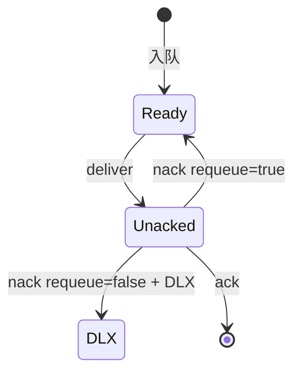
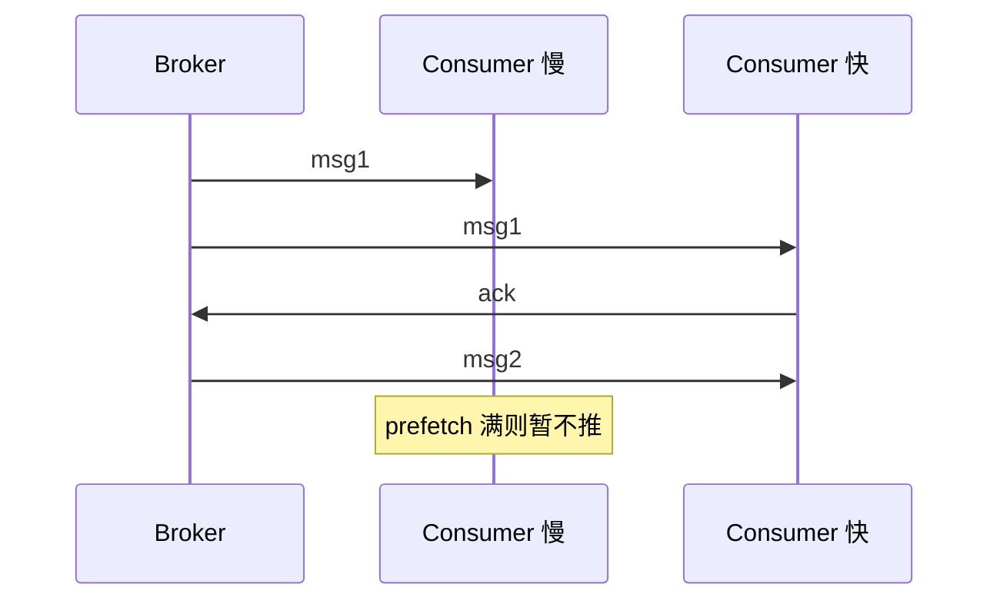

# RabbitMQ 消费端语义：ACK、Prefetch 与死信

> **版本** 2026-05 · 投递、确认、重试、DLX

> 消费者如何从 Queue 拿消息、何时 ACK/NACK、Prefetch 限流，以及死信交换机（DLX）处理失败与过期消息。

---

## 如何使用本文档

| 你的目标 | 建议阅读 |
| -------- | -------- |
| 避免重复/丢消息 | 二、投递语义 |
| 调并发与公平 | 三、Prefetch |
| 失败重试与 DLQ | 四、NACK 与 DLX |
| 上线 checklist | 六、生产实践 |

---

## 一、消费模型

### 1.1 Push vs Pull

| 模式 | API | 说明 |
| ---- | --- | ---- |
| Push（常用） | `basicConsume` | Broker 主动推，需流控 Prefetch |
| Pull | `basicGet` | 单条拉取，适合低频轮询 |

### 1.2 定义：ACK

**ACK（Acknowledgement）**：消费者处理成功后通知 Broker **删除**该投递（或从 unacked 移除）。未 ACK 前消息处于 **unacked**，连接断则**重新入队**（默认行为）。

| 类型 | 行为 |
| ---- | ---- |
| `basicAck` | 确认成功，multiple 可批量 |
| `basicNack` | 拒绝，requeue=true 重回队列，false 进入 DLX 或丢弃 |
| `basicReject` | 单条 nack（旧 API） |



---

## 二、自动 ACK 与手动 ACK

### 2.1 autoAck=true（不推荐生产）

Broker 投递即视为已确认，消费者崩溃可能**丢消息**。

### 2.2 manual ACK（推荐）

处理完业务再 `ack`；异常时 `nack(requeue=false)` 进死信。

| 优点 | 缺点 |
| ---- | ---- |
| 至少一次投递 | 需幂等 |
| 可控制重试 | 忘记 ack 导致 unacked 堆积 |

**典型业务**：扣库存成功后再 ack；失败 nack 到 DLQ 人工介入。

---

## 三、Prefetch（QoS）

### 3.1 定义

`basicQos(prefetchCount=n)`：该 Channel 上**未 ACK 消息数**上限。达到上限前 Broker 不再推送新消息。

### 3.2 全局 vs 每消费者

| 参数 | 说明 |
| ---- | ---- |
| `prefetchCount=10` | 常见起点，按处理耗时调 |
| `global=false` | 按 consumer 计数（默认） |
| `global=true` | 整 Channel 共享计数 |

### 3.3 流程（多消费者公平）



| 优点 | 缺点 |
| ---- | ---- |
| 防止慢消费者被压垮 | prefetch 过大仍可能内存压力 |
| 快消费者多拿任务 | 需与并发线程数协调 |

**典型业务**：图片处理 Worker prefetch=1；轻量 JSON 任务 prefetch=50。

---

## 四、NACK、重试与 DLX

### 4.1 定义 DLX

**Dead Letter Exchange（DLX）**：消息因 **rejected**、**TTL 过期**、**队列满** 被「死信」转发到指定 Exchange，再路由到 **死信队列（DLQ）**。

队列参数示例：

```
x-dead-letter-exchange: order.dlx
x-dead-letter-routing-key: order.failed
```

### 4.2 重试策略对比

| 策略 | 做法 | 适用 |
| ---- | ---- | ---- |
| requeue=true | 立即回队列 | 短暂故障（慎用，易热循环） |
| 延迟重试 | TTL + DLX 回主队列 | 退避重试 |
| 进 DLQ | nack requeue=false | 永久失败、需人工 |
| 应用内重试 | catch 后本地重试 N 次再 nack | 可控指数退避 |

### 4.3 死信原因

| x-death 原因 | 含义 |
| ------------ | ---- |
| rejected | basicNack/reject 且 requeue=false |
| expired | per-message 或 queue TTL |
| maxlen | 队列长度超限 |

### 4.4 优缺点

| 优点 | 缺点 |
| ---- | ---- |
| 主队列与失败隔离 | DLQ 需监控与回放流程 |
| 统一审计失败消息 | 错误重试可能重复（要幂等） |

**典型业务**：支付回调消费失败 → DLQ → 运营后台重放。

---

## 五、幂等与重复消费

### 5.1 至少一次（At-least-once）

手动 ACK + 崩溃重投 ⇒ 同一条消息可能处理两次。

| 手段 | 说明 |
| ---- | ---- |
| 业务幂等键 | `message_id` / 订单号去重表 |
| 幂等 Token | Redis `SETNX` 或 DB 唯一约束 |
| 外部系统 | 调用下游带 Idempotency-Key |

### 5.2 恰好一次（Exactly-once）

RabbitMQ **不原生提供**端到端 exactly-once；需 Outbox + 幂等 + 去重组合。

---

## 六、生产实践

### 6.1 checklist

- [ ] `autoAck=false`
- [ ] 成功 ack / 不可恢复 nack(false) / 可恢复策略明确
- [ ] prefetch 与线程池大小匹配
- [ ] DLX + DLQ 已声明，DLQ 深度告警
- [ ] 消费耗时 > ack 超时？注意无默认「处理超时」，靠心跳保连接
- [ ] 优雅停机：停止 consume → 处理完在飞 → ack → 关 Channel

### 6.2 优雅关闭顺序

```
cancel consumer → drain in-flight → ack → close channel → close connection
```

### 6.3 监控指标

| 指标 | 含义 |
| ---- | ---- |
| `messages_unacknowledged` | 处理中堆积 |
| `messages_ready` | 待消费堆积 |
| `consumer_utilisation` | 消费者忙碌程度 |
| DLQ 速率 | 失败趋势 |

---

## 七、附录

- 延迟重试：[delay-and-priority.md](./delay-and-priority.md)
- 生产者 Confirm：[reliable-publishing.md](./reliable-publishing.md)
- [RabbitMQ — Consumer Acknowledgements](https://www.rabbitmq.com/docs/confirms#consumer-acks)
- [RabbitMQ — Dead Lettering](https://www.rabbitmq.com/docs/dlx)
