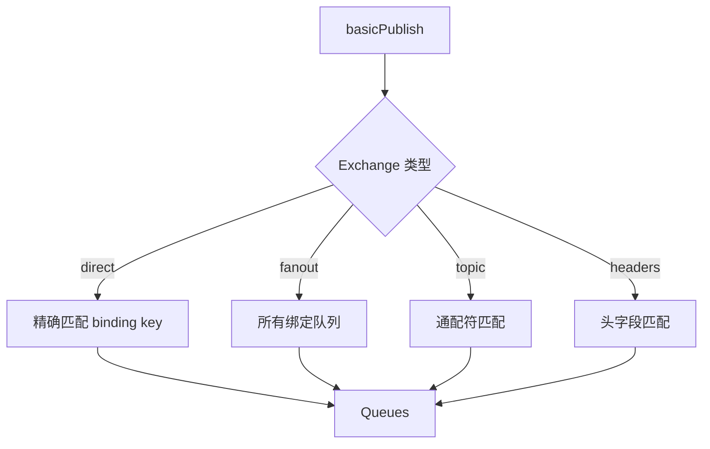
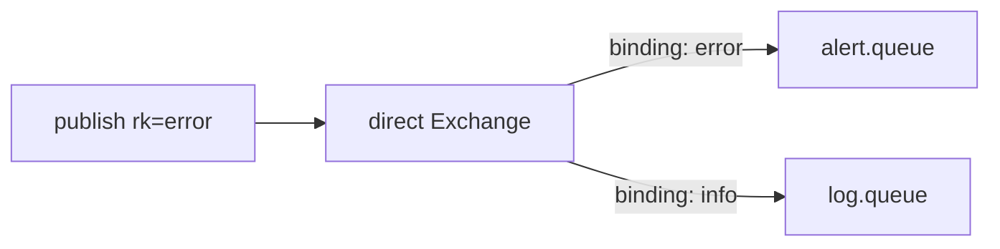
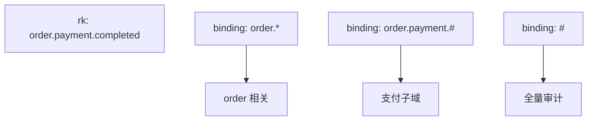

# RabbitMQ Exchange 类型与路由

> **版本** 2026-05 · **定位**：路由设计、多订阅者与事件命名

> direct、fanout、topic、headers 四种 Exchange 的定义、匹配规则、选型与典型拓扑。

---

## 如何使用本文档

| 你的目标 | 建议阅读 |
| -------- | -------- |
| 快速选型 | 二、快速选型 |
| 实现某一种路由 | 三、类型详解 |
| 设计 Routing Key 规范 | 四、Routing Key 设计 |
| 排障消息未到达 | 五、排障 |

---

## 一、路由在模型中的位置

生产者发布：`exchange` + `routingKey` + `body`。Broker 在 Exchange 上查找所有 Binding，按 Exchange **类型** 决定哪些 Queue 收到副本。



---

## 二、快速选型

| 场景 | 推荐类型 | Routing Key |
| ---- | -------- | ----------- |
| 点对点任务队列 | direct | 与 binding key 相同，如 `invoice.generate` |
| 广播通知所有订阅者 | fanout | 常为空字符串 `""` |
| 按层级事件订阅 | topic | `order.created`、`order.*`、`#.error` |
| 按头属性路由（少用） | headers | 在 binding 的 `arguments` 里配 `x-match` |
| 默认交换机 | direct（内置） | routing key = 队列名 |

**默认 Exchange**：名称为 `""` 的 direct exchange；routing key 等于队列名时消息直达该队列（快捷方式，生产环境更推荐显式声明业务 Exchange）。

---

## 三、类型详解

> 结构：**定义 → 流程图 → 要点 → 优缺点 → 典型业务**

### 3.1 direct

**定义**：Routing Key **完全相等**于 Binding Key 时，消息进入该 Queue。



| 要点 | 说明 |
| ---- | ---- |
| 一对一 | 一个 rk 可绑多个队列（扇出副本） |
| 大小写 | 区分大小写 |
| 空 rk | 仅匹配 binding key 也为空的绑定 |

| 优点 | 缺点 |
| ---- | ---- |
| 简单、可预测 | 扩展新事件要新 binding |
| 延迟低 | 大量 key 时 binding 管理繁琐 |

**典型业务**：支付结果回调队列 `payment.success` / `payment.failed` 各一队列。

---

### 3.2 fanout

**定义**：忽略 Routing Key，复制到**所有**绑定的 Queue。

| 要点 | 说明 |
| ---- | ---- |
| 广播 | 每个订阅者一份完整副本 |
| rk | 通常传 `""` |

| 优点 | 缺点 |
| ---- | ---- |
| 新增订阅者只加 binding | 无法按 key 过滤 |
| 适合事件通知 | 消息量 × 订阅者数 |

**典型业务**：用户注册后同时写审计日志、发欢迎邮件、更新搜索索引。

---

### 3.3 topic

**定义**：Routing Key 与 Binding Key 按 **单词**（`.` 分隔）匹配；`*` 匹配恰好一词，`#` 匹配零个或多个词。

| 符号 | 含义 |
| ---- | ---- |
| `*` | 一个词，如 `*.created` 匹配 `order.created` |
| `#` | 零或多个词，如 `order.#` 匹配 `order.created`、`order.item.updated` |



| 要点 | 说明 |
| ---- | ---- |
| 单词 | 仅由 `.` 分隔，不用 `*` 跨多段（除非用 `#`） |
| 性能 | 绑定过多时路由表变大，注意监控 |

| 优点 | 缺点 |
| ---- | ---- |
| 灵活订阅层级 | 命名不规范会导致误收/漏收 |
| 适合领域事件 | 设计不当难以治理 |

**典型业务**：`logistics.shipment.delivered` 供物流域；`logistics.#` 供运营大盘。

---

### 3.4 headers

**定义**：忽略 Routing Key，比较消息 **headers** 与 binding 的 `arguments`；`x-match: all` 全匹配，`any` 任一匹配。

| 优点 | 缺点 |
| ---- | ---- |
| 按任意头路由 | 性能低于 topic/direct |
| 适合非字符串维度 | 运维与排障不直观 |

**典型业务**：按 `content-type` + `region` 路由（更常见做法是把 region 编进 topic rk）。

---

## 四、Routing Key 设计规范

### 4.1 推荐模式

```
{domain}.{entity}.{action}
order.payment.completed
user.profile.updated
```

### 4.2 反模式

| 反模式 | 问题 |
| ------ | ---- |
| 把 DB 主键当唯一 rk | 无法按类型订阅 |
| 过长、含特殊字符 | topic 匹配困难 |
| 同一语义多种拼写 | 消费者漏绑 |

### 4.3 Alternate Exchange

主 Exchange 无法路由时，可配置 **alternate-exchange** 把消息转到兜底 Exchange（审计「无人认领」消息）。

---

## 五、排障

| 现象 | 检查项 |
| ---- | ------ |
| 消息未进队列 | Exchange 名、vhost、binding key、Exchange 类型 |
| 只进部分队列 | topic 模式是否过窄；direct 是否 key 不一致 |
| 重复收到 | 多个 binding 匹配同一 rk；fanout 预期行为 |
| 消息被丢弃 | `mandatory` 未开且无 alternate；无匹配 binding |

管理台：**Exchanges → Bindings**、**Queues → Get messages**（仅调试）。

---

## 六、生产实践

| 项 | 建议 |
| ---- | ---- |
| 事件总线 | topic + 统一命名规范 |
| 任务队列 | direct + 专用队列 |
| 广播 | fanout + 每消费者独立队列 |
| 变更 | 新增队列/绑定而非改已有队列语义 |

---

## 七、附录

- 前置阅读：[core-concepts.md](./core-concepts.md)
- 可靠投递：[reliable-publishing.md](./reliable-publishing.md)
- [RabbitMQ — Exchanges](https://www.rabbitmq.com/docs/exchanges)
