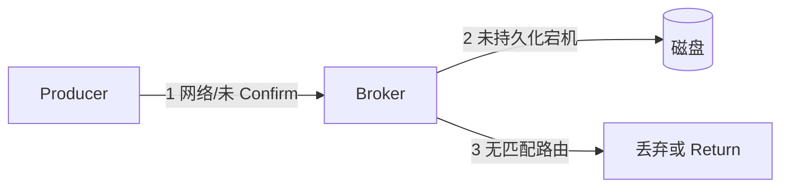
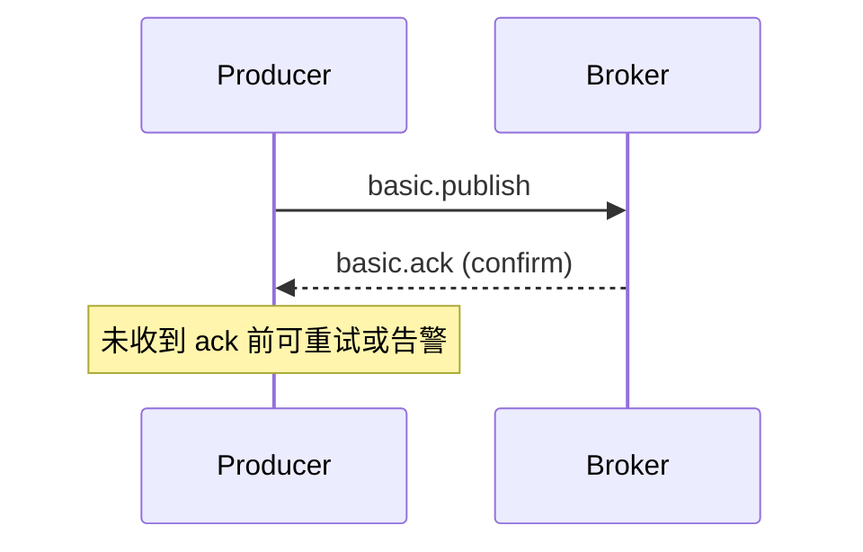
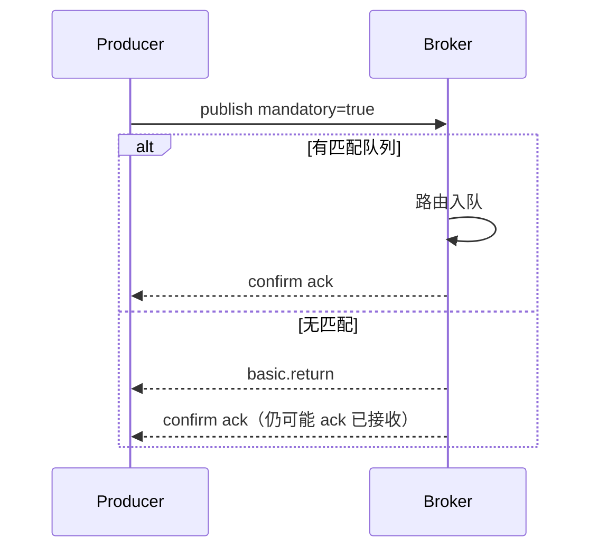

# RabbitMQ 消息可靠投递（生产者）

> **版本** 2026-05 · **定位**：Publisher Confirm、事务、Mandatory、持久化

> 保证消息从生产者发出后，在 Broker 侧可观测地「接住」或明确失败，避免静默丢失。

---

## 如何使用本文档

| 你的目标 | 建议阅读 |
| -------- | -------- |
| 选型 Confirm vs 事务 | 二、快速选型 |
| 实现 Confirm 回调 | 三、Publisher Confirm |
| 持久化三件套 | 五、持久化三件套 |
| 无法路由时处理 | 六、Mandatory 与 Return |
| 上线 checklist | 七、生产实践 |

**核心原则**：**持久化**解决 Broker 重启丢消息；**Confirm** 解决「Broker 是否已接收」；**Mandatory + Return** 解决「是否成功路由到队列」。

---

## 一、丢失发生在哪



| 阶段 | 风险 | 手段 |
| ---- | ---- | ---- |
| 1 发到 Broker | 连接断、Channel 异常 | Publisher Confirm |
| 2 Broker 内存 | 节点崩溃 | durable queue + delivery_mode=2 |
| 3 路由 | 无 binding | mandatory + return callback |

---

## 二、快速选型

| 目标 | 推荐 | 避免 |
| ---- | ---- | ---- |
| 生产默认 | **Publisher Confirm**（异步） | 同步事务（吞吐低） |
| 强一致少量写 | 事务 `tx.*` | 高 QPS 路径 |
| 必须进队列 | mandatory=true + return 处理 | 默认 false 静默丢 |
| 磁盘持久 | persistent 消息 + durable 队列 | 只 durable 队列但消息 transient |

---

## 三、Publisher Confirm

### 3.1 定义

**Publisher Confirm**（轻量级 ACK）：Broker 对每条（或一批）publish 返回 `ack`（已处理）或 `nack`（失败/拒绝）。

开启：`channel.confirmSelect()`（Java）或 `confirm_select`（Python pika）。

### 3.2 流程



### 3.3 读写要点

| 模式 | 说明 |
| ---- | ---- |
| 同步 confirm | 发一条等一条 ack，简单、慢 |
| 异步 confirm | 批量发，回调/Future 处理 ack，生产常用 |
| 批量 ack | `multiple=true` 表示 ≤ deliveryTag 均已确认 |
| 与事务互斥 | 同一 Channel 不要混用 tx 与 confirm |

| 优点 | 缺点 |
| ---- | ---- |
| 高吞吐 | 需维护未确认序号与超时 |
| 标准推荐 | 只表示到 Exchange，不保证进队列 |

**典型业务**：订单创建消息写入后，未 ack 则不入库「已发送」状态，或写入 Outbox 重试。

### 3.4 实现要点

1. **内存中的未 confirm 映射**：`deliveryTag → 业务 id`
2. **超时**：长时间无 ack 触发重连或重发（注意幂等）
3. **nack 处理**：记录死信、告警，不要盲目无限重发
4. **连接断开**：未 confirm 的消息状态未知，配合 **Outbox 表** 或业务幂等

---

## 四、事务（Transactions）

### 4.1 定义

`tx.select` → 若干 publish → `tx.commit` 或 `tx.rollback`。提交前 Broker 不对外可见。

### 4.2 优缺点

| 优点 | 缺点 |
| ---- | ---- |
| 语义直观 | **吞吐量显著低于 Confirm** |
| 批量原子（同 Channel） | 已不推荐为默认方案 |

**典型业务**：极低频、强一致的管理类操作；新业务优先 Confirm。

---

## 五、持久化三件套

| 层级 | 配置 |
| ---- | ---- |
| Exchange | `durable=true`（类型默认 durable 除临时场景） |
| Queue | `durable=true` |
| Message | `delivery_mode=2`（persistent） |

注意：持久化消息会写盘（可配置 lazy queue），延迟略高于纯内存。

---

## 六、Mandatory 与 Return

### 6.1 定义

`mandatory=true`：若消息**无法路由**到任何 Queue，Broker 通过 `basic.return` 退回生产者（reply code 312 NO_ROUTE）。

需注册 **Return Listener**。

### 6.2 流程



### 6.3 要点

| 项 | 说明 |
| ---- | ---- |
| Confirm vs Return | Confirm 表示 Broker 收到；Return 表示路由失败 |
| alternate-exchange | 可接住无 binding 消息，减少 return |
| 默认 mandatory=false | 无路由时**静默丢弃** |

**典型业务**：关键计费事件必须进队列，否则 return 回调写告警 + 人工队列。

---

## 七、生产实践

### 7.1 推荐组合

```
durable exchange + durable queue
+ persistent message
+ publisher confirm (async)
+ mandatory (关键路径)
+ alternate-exchange (兜底)
```

### 7.2 checklist

- [ ] Confirm 回调/监听器已注册且打 metrics
- [ ] 未 confirm 超时与重试策略（幂等 key）
- [ ] 关键 Exchange 已绑齐，CI 校验拓扑
- [ ] 磁盘、内存告警与队列 max-length
- [ ] 禁止生产环境依赖默认 Exchange 隐式路由

### 7.3 与 Outbox 模式

| 方案 | 说明 |
| ---- | ---- |
| 本地消息表 | DB 事务写业务 + Outbox，定时扫表发 MQ，Confirm 后删 Outbox |
| 优点 | 业务写库与「待发 MQ」原子 |
| 适用 | 支付、订单等不允许「库成功消息丢」 |

---

## 八、附录

- 消费侧可靠性：[consumer-semantics.md](./consumer-semantics.md)
- 消息选型与 Outbox 横切：[messaging/README.md](../messaging/README.md)
- [RabbitMQ — Publisher Confirms](https://www.rabbitmq.com/docs/confirms)
- [RabbitMQ — Mandatory Flag](https://www.rabbitmq.com/docs/publishers#mandatory)
