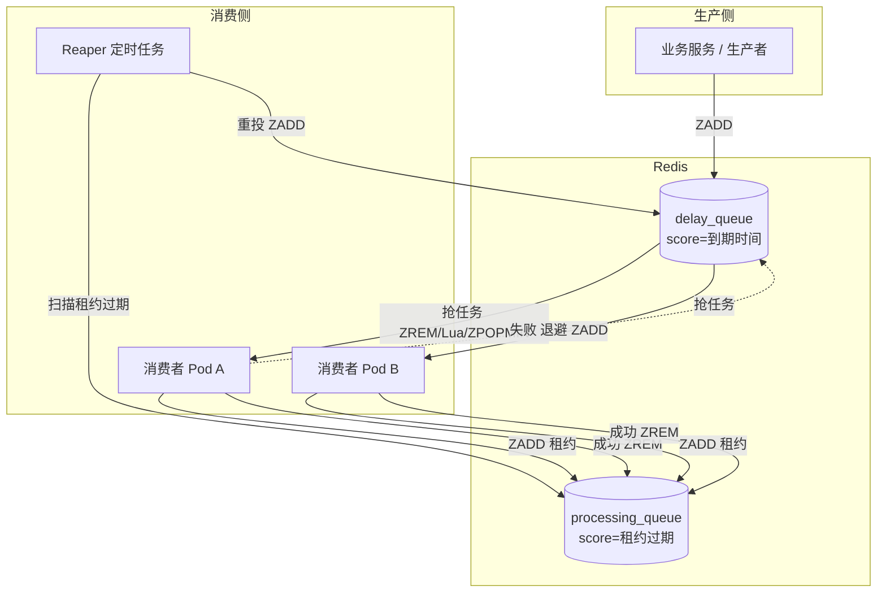
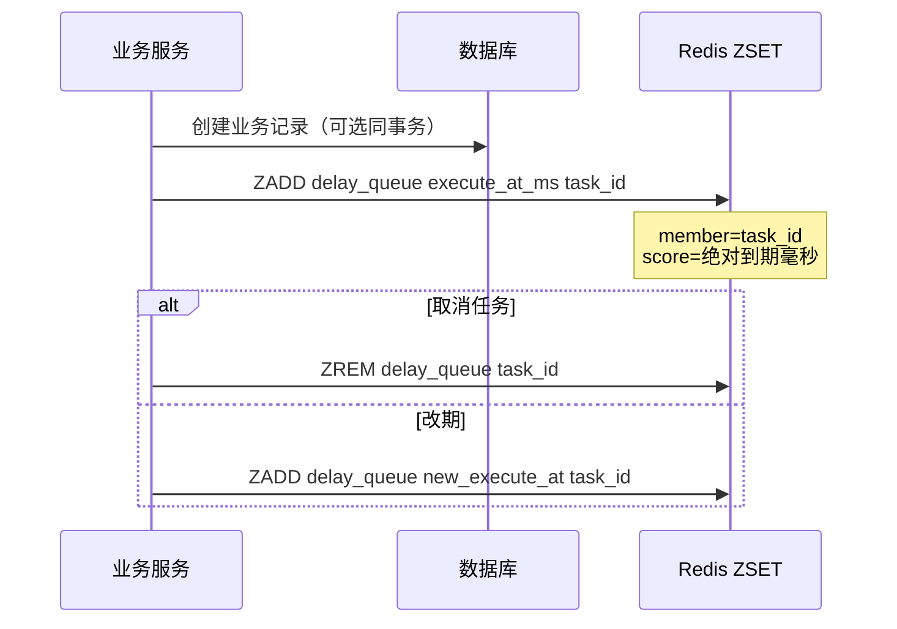
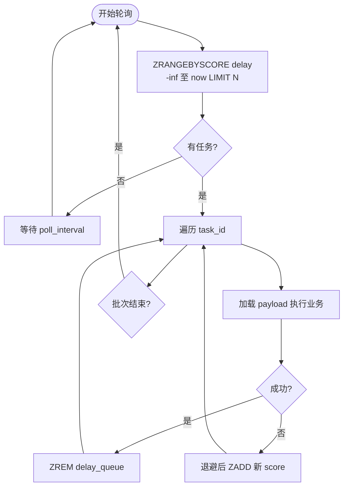
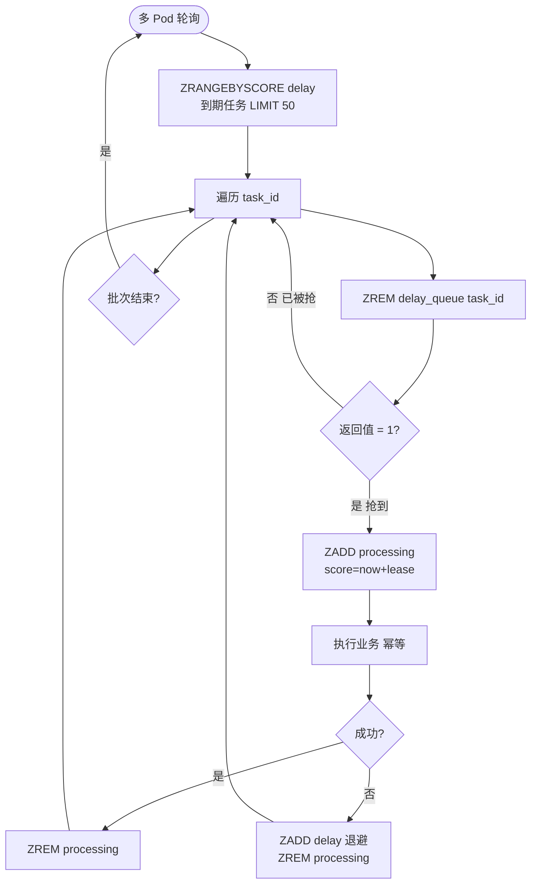
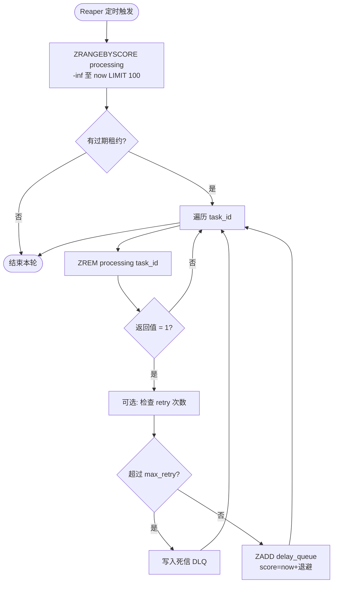
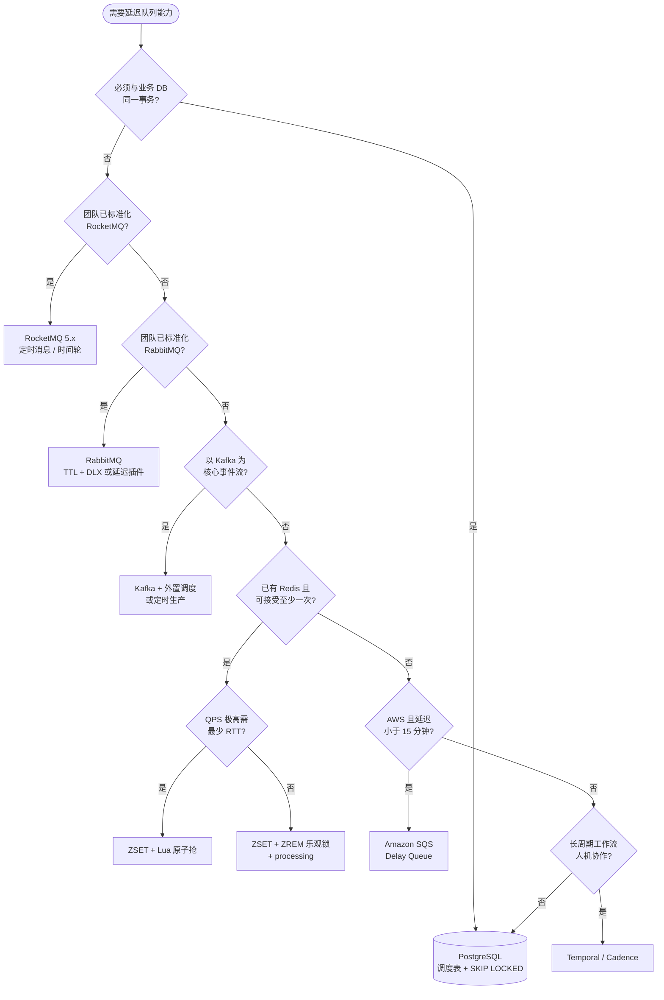

# 使用 Redis ZSET 实现延迟队列

> **版本** 2026-05 · **定位**：后端 / 架构 · 技术方案

---

## 目录

1. 背景与目标
2. 核心概念
3. 架构总览
4. 生产者
5. 消费者实现
6. 可靠性检查清单
7. 踩坑与注意事项
8. 方案选型
9. 参考链接
10. 相关笔记

---

## 1. 背景与目标

### 1.1 什么是延迟队列

在**指定时间点之后**才投递、处理的任务队列。典型场景：

- 订单超时未支付自动关单
- 定时提醒、签到、活动开始
- 失败重试（指数退避）
- 异步解耦后的「稍后再做」

### 1.2 为什么用 Redis ZSET


| 特性  | 说明                                      |
| --- | --------------------------------------- |
| 有序  | `score` 排序，天然按时间调度                      |
| 性能  | `ZADD` / `ZRANGEBYSCORE` 均为 O(log N) 量级 |
| 灵活  | 任意毫秒级到期时间，易取消、改期                        |
| 成本  | 团队已有 Redis 时无新中间件                       |


**本文范围：** ZSET 方案的设计、多 Pod 消费、与 MQ/DB 的选型。不包含具体语言客户端代码。

---

## 2. 核心概念

### 2.1 数据模型


| 字段         | 约定                                      |
| ---------- | --------------------------------------- |
| **Key**    | `delay_queue` 或分片 `delay_queue:{shard}` |
| **Score**  | 任务**绝对到期时间**（Unix **毫秒**）               |
| **Member** | 任务唯一 ID（**不要**把大 payload 放进 member）     |


```
ZADD delay_queue <execute_at_ms> <task_id>
execute_at_ms = Date.now() + delayMs
```

### 2.2 两个队列分工


| 队列                   | 作用                      |
| -------------------- | ----------------------- |
| **delay_queue**      | 未到期的调度表                 |
| **processing_queue** | 已抢到、处理中（score = 租约过期时间） |


> 仅操作 `delay_queue` 而不做 processing，Pod 宕机易**丢任务**。

### 2.3 设计铁律

1. **Score 只用时间戳**，不要把业务 ID 编进 score（双精度 ±2^53 精度问题）。
2. **Member 用确定性 ID**（如 `cancel_order:5001`），重复 `ZADD` 只会改期，不会重复入队。
3. **Payload 外置**：Hash / String / DB，ZSET 只存调度元数据。
4. **业务幂等**：语义多为 at-least-once。

---

## 3. 架构总览




```text
生产者 ──ZADD──► delay_queue ──抢任务──► 消费者 Pod
                      ▲                      │
                      │                      ▼
                 Reaper 重投 ◄── processing_queue
```

**链路说明：**

1. 生产者 `ZADD` 写入到期时间。
2. 消费者从 `delay_queue` **原子抢**任务，进入 `processing` 并设置租约。
3. 成功则 `ZREM processing`；失败则退避后 `ZADD` 回 delay。
4. Reaper 扫描 processing 中租约已过期的任务，重投 delay。

---

## 4. 生产者




| 操作  | 命令                                           |
| --- | -------------------------------------------- |
| 投递  | `ZADD delay_queue <execute_at_ms> <task_id>` |
| 取消  | `ZREM delay_queue <task_id>`                 |
| 改期  | 同 member 再次 `ZADD` 新 score                   |


**注意：** 投递与业务写库建议在同一事务或 outbox 模式，避免「库里有单、队列里没有任务」。

---

## 5. 消费者实现

### 5.1 单 Pod 轮询（仅低 QPS / 单实例）




```text
loop:
  tasks = ZRANGEBYSCORE delay -inf now LIMIT 0 N
  for id in tasks:
    处理...
    ZREM delay id
```

轮询间隔决定触发精度（如 500ms～1s）。**多实例不可直接使用此模式**（会重复消费）。

---

### 5.2 多 Pod：ZREM 乐观锁（推荐简化方案）




**原理：** `ZREM` 原子，返回值 `1` 表示抢到任务，`0` 表示已被其他 Pod 删除。

```text
tasks = ZRANGEBYSCORE delay -inf now LIMIT 0 50
for id in tasks:
  if ZREM(delay, id) == 1:
    ZADD processing (now + lease_ms) id
    执行业务 → 成功 ZREM processing / 失败退避 ZADD delay
```


| 对比维度 | Lua 批量抢 | ZREM 乐观锁 |
| -------- | ---------- | --------- |
| 实现     | 需维护脚本   | 原生命令组合 |
| 去重     | ✅（原子）   | ✅（ZREM 返回 1 判定） |
| RTT     | 1 次       | 2 次（range + rem） |
| 空转     | 低         | 中（多轮轮询） |


**结论：** 只为互斥、QPS 可接受时，**ZREM 足够**；极高 QPS 或要一条命令完成 delay→processing 再用 Lua。

---

### 5.3 多 Pod：Lua 原子抢（高 QPS）

```lua
-- KEYS[1]=delay, KEYS[2]=processing
-- ARGV[1]=now, ARGV[2]=limit, ARGV[3]=lease_expire_ms
local tasks = redis.call('ZRANGEBYSCORE', KEYS[1], '-inf', ARGV[1], 'LIMIT', 0, ARGV[2])
local moved = {}
for _, m in ipairs(tasks) do
  redis.call('ZREM', KEYS[1], m)
  redis.call('ZADD', KEYS[2], ARGV[3], m)
  table.insert(moved, m)
end
return moved
```

或使用 `**ZPOPMIN**`（Redis 6.2+）：原子弹出最小 score；若 `score > now` 须 **ZADD 放回**。

---

### 5.4 Processing + 租约 + Reaper




| 参数            | 建议                                                           |
| ------------- | ------------------------------------------------------------ |
| **lease_ttl** | > P99 处理时间 + 余量                                              |
| **Reaper 周期** | 租约的 1/3～1/2                                                  |
| **重投**        | `ZREM processing` 成功后再 `ZADD delay`（processing 也可用 ZREM 乐观锁） |


**反模式：**

- ❌ `ZRANGEBYSCORE` + 应用层 `ZREM` 且无互斥 → 重复消费
- ❌ 先 `ZREM delay` 再处理、无 processing → 宕机丢任务
- ❌ 用 Key `EXPIRE` + 过期事件 → 不准时、易丢

---

## 6. 可靠性检查清单

- 投递：`ZADD`，score = 绝对到期毫秒
- 消费：Lua / `ZPOPMIN` / **ZREM 乐观锁**（禁止裸 range + 异步 rem）
- 处理中：`processing` ZSET + lease + Reaper
- 业务：幂等 + 退避重试 + 死信（retry > max）
- 运维：AOF、`maxmemory` 策略、热 Key 分片、Cluster hash tag
- 监控：`ZCARD` delay/processing、消费 lag、Reaper 重投次数
- 对账：关键任务 DB 扫描兜底

---

## 7. 踩坑与注意事项

### 7.1 命令与调度


| 问题            | 说明                               |
| ------------- | -------------------------------- |
| ZPOPMIN 不校验到期 | 弹出后若 `score > now` 须放回           |
| 空轮询           | 考虑 `BZPOPMIN`（Redis 7+）降低空转      |
| 禁用过期监听        | `keyspace notifications` 不适合延迟队列 |


### 7.2 容量与运维


| 问题      | 说明                                                 |
| ------- | -------------------------------------------------- |
| 积压内存    | 监控 `ZCARD`；避免 `allkeys-lru` 静默逐出队列 key             |
| 热 Key   | `delay_queue:{hash(task_id) % N}`                  |
| Cluster | delay / processing / payload 用 **hash tag** 同 slot |
| 持久化     | 内存型 + AOF；关键任务配合 DB 对账                             |


### 7.3 Redis 内其他实现


| 方案                        | 说明                        |
| ------------------------- | ------------------------- |
| **Stream + 消费组**          | ACK 更好，延迟调度常仍靠 ZSET 到点再投递 |
| **Redisson DelayedQueue** | 封装 ZSET，本质相同              |


---

## 8. 方案选型

### 8.1 总览对比


| 方案            | 延迟灵活性      | 可靠性       | 吞吐  | 复杂度 | 典型场景         |
| ------------- | ---------- | --------- | --- | --- | ------------ |
| Redis ZSET 自研 | 任意 ms～天    | 中（自研 ACK） | 极高  | 中   | 已有 Redis、可幂等 |
| RabbitMQ      | 插件/TTL+DLX | 高         | 中   | 中～高 | AMQP 生态      |
| Kafka         | 无原生        | 极高        | 极高  | 高   | 事件流 + 外置调度   |
| RocketMQ 5.x  | 秒级任意       | 高         | 高   | 中   | 已用 RocketMQ  |
| PostgreSQL    | 任意         | 最高        | 中   | 低   | 强一致、量不大      |
| SQS Delay     | ≤15 分钟     | 高（托管）     | 中   | 低   | AWS 短延迟      |
| 内存时间轮         | 刻度内        | 低         | 极高  | 低   | 单进程嵌入        |


### 8.2 选型流程




**快速结论：**


| 场景                  | 倾向                           |
| ------------------- | ---------------------------- |
| 已有 Redis，百万级/日内，可幂等 | ZSET + processing + ZREM/Lua |
| 要 Broker 持久化与 ACK   | RabbitMQ TTL+DLX 或 RocketMQ  |
| 强一致、万级/秒以下          | PostgreSQL `SKIP LOCKED`     |
| 以 Kafka 为主          | 外置调度器，勿硬做延迟 topic            |
| 长周期工作流              | Temporal 等                   |


### 8.3 分项要点

各方案分项说明（Redis ZSET / RabbitMQ / Kafka / RocketMQ / 数据库）已归口 [messaging/README.md](../messaging/README.md)「延迟队列方案要点」，本文只保留摘要对比与决策树。

---

## 9. 参考链接

### Redis 官方

- [ZADD](https://redis.io/docs/latest/commands/zadd/)
- [ZRANGEBYSCORE](https://redis.io/docs/latest/commands/zrangebyscore/)
- [ZREM](https://redis.io/docs/latest/commands/zrem/)
- [ZPOPMIN](https://redis.io/docs/latest/commands/zpopmin/)
- [BZPOPMIN](https://redis.io/docs/latest/commands/bzpopmin/)
- [Antirez: Delayed queue pattern](https://redis.antirez.com/fundamental/delayed-queue.html)

### 实践文章

- [Svix: Scheduled queue in Redis](https://www.svix.com/resources/redis/scheduled-queue/)
- [Redis delayed queue (ZSET + timestamp)](https://kveditor.com/blog/redis-delayed-queue)
- [Delay Queues: Do It Later, Reliably](https://therahulbhati.github.io/posts/delay_queue/)
- [Scheduling and delaying tasks with Redis](https://reintech.io/blog/scheduling-delaying-tasks-redis)

### 方案对比

- [Redis vs Kafka vs RabbitMQ (2026)](https://www.techplained.com/redis-vs-kafka-vs-rabbitmq)
- [RabbitMQ delayed messages (2026)](https://www.forasoft.com/blog/article/how-to-implement-rabbitmq-delayed-messages-with-code-examples-1214)
- [Redis delayed queue explained](https://leapcell.medium.com/redis-delayed-queue-explained-once-and-for-all-720223770cc6)
- [RocketMQ 定时消息与时间轮](https://cloud.tencent.com/developer/article/2196167)
- [常见延时队列方案对比](https://cloud.tencent.com/developer/article/2472243)

---

## 10. 相关笔记

- [redis-distributed-lock.md](./redis-distributed-lock.md) — 分布式锁与看门狗（与队列 Lease Watchdog 对比）
- [redis-zset-running-recovery.md](./redis-zset-running-recovery.md) — processing 租约与 Watchdog
- [push/push-global-timezone-delivery.md](../push/push-global-timezone-delivery.md) — 全球化 Push 概念（调度与延迟队列场景）
- [rabbitmq/delay-and-priority.md](../rabbitmq/delay-and-priority.md) — TTL+DLX 延迟拓扑对比
- [messaging/README.md](../messaging/README.md) — Redis / RabbitMQ / Kafka 选型总览

---

*本文档由团队技术库维护；实现细节以所用 Redis / 中间件版本官方文档为准。*