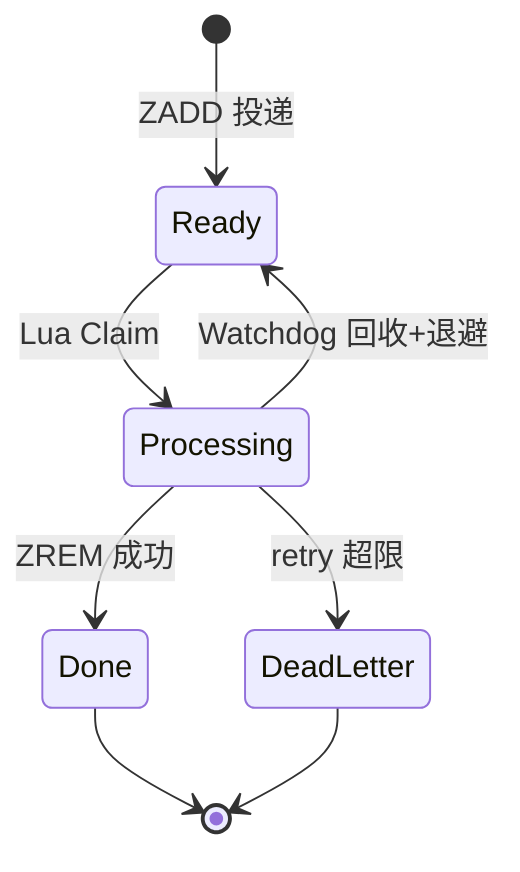
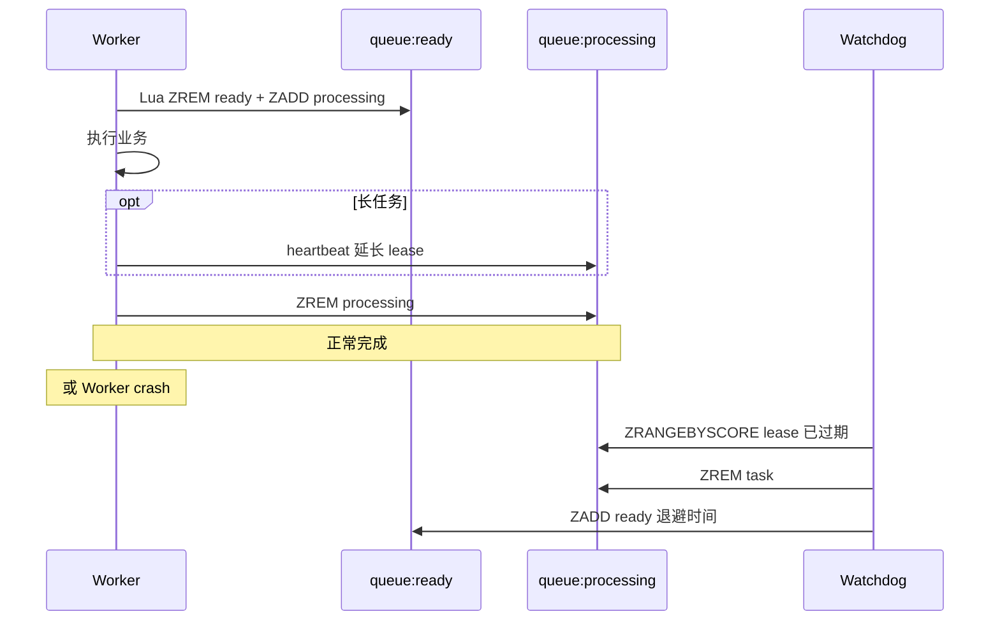
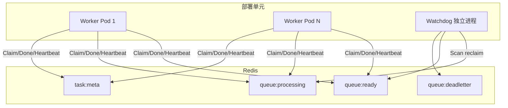

# Redis ZSET 消费队列：如何最简化解决 Running 卡死

> **版本** 2026-05 · **定位**：后端 / 架构 · 问题驱动篇（Running 卡死恢复）

> 任务进入 running 后 worker 异常退出 → **永久卡死**。本文从问题出发给出最简解法：**ZSET + Lease + Watchdog**（processing 租约 + 超时回收），并给出两段关键 Lua。双队列完整模型与生产化细节见 [redis-zset-delay-queue.md](./redis-zset-delay-queue.md)。

## 如何使用本文档

| 你的目标 | 建议阅读 |
| -------- | -------- |
| 3 分钟理解问题与解法 | 一、问题；二、最简方案 |
| 领取 / 回收的原子实现 | 三、关键实现：两段 Lua |
| 与全貌篇的分工 | 四 |
| 队列模型选型 | 五、ZSET vs Streams；附录 |
| 上线前自检 | 六、上线检查清单 |

**适用前提**：中小规模异步任务、延迟/定时、可重试可幂等。强 exactly-once、复杂 DAG 长编排请用 Temporal / Airflow 等工作流引擎。

---

## 一、问题：消费者已死，系统不知道

典型消费流程（**无租约、无回收**）：

```text
1. ZPOP / ZRANGEBYSCORE 取任务
2. HSET status=running
3. 执行业务
4. HSET status=success
```

这是所有分布式任务系统的共性问题（Celery、Airflow、Kafka Consumer、SQS、RocketMQ、Temporal 本质相同）：**消费者已经死亡，但系统不知道**。`status=running` 没有自动恢复机制，worker crash 后永久存在 → 僵尸任务、无法重试、吞吐下降。

### 反模式 vs 租约方案

| 维度 | 反模式（ready ZSET + status Hash） | 推荐（ready + processing lease） |
| ---- | --------------------------------- | --------------------------------- |
| Running 含义 | Hash 字段，无 TTL | processing 的 score = lease 到期时间 |
| Worker crash 后 | 永久 running | Watchdog 按 score 回收 |
| 领取原子性 | 多步易丢/重复 | Lua 一次 ready → processing |
| 是否依赖正常退出 | 是 | 否 |

---

## 二、最简方案：ZSET + Lease + Watchdog

**两个 ZSET + 租约 + 超时回收** 就足够稳定，不必一上来就上状态机、分布式事务或工作流引擎：

```text
queue:ready         # 待消费，score = 可执行时间戳，member = task_id
queue:processing    # 执行中，score = lease_expire_time，member = task_id
queue:deadletter    # 可选，超过重试阈值
task:meta:{id}      # 可选 Hash，存 payload、retry_count 等
```

为什么必须双队列（仅操作 ready 而无 processing，Pod 宕机会**丢任务**）、以及完整数据模型，见 [redis-zset-delay-queue.md](./redis-zset-delay-queue.md) §2.2。

状态机：



时序（含 heartbeat 与回收）：



---

## 三、关键实现：两段 Lua

### 3.1 Claim（领取，必须原子）

```lua
-- KEYS[1]=queue:ready  KEYS[2]=queue:processing
-- ARGV[1]=now  ARGV[2]=lease_expire_time

local tasks = redis.call(
  'ZRANGEBYSCORE', KEYS[1], '-inf', ARGV[1], 'LIMIT', 0, 1
)
if #tasks == 0 then
  return nil
end

local task = tasks[1]
redis.call('ZREM', KEYS[1], task)
redis.call('ZADD', KEYS[2], ARGV[2], task)
return task
```

`ready → processing` 必须在同一段 Lua 内完成，否则可能丢任务或重复领取。

### 3.2 Reclaim（Watchdog 回收）

```lua
-- KEYS[1]=queue:processing  KEYS[2]=queue:ready
-- ARGV[1]=now  ARGV[2]=retry_at（含退避后的可执行时间）
-- ARGV[3]=batch_limit

local expired = redis.call(
  'ZRANGEBYSCORE', KEYS[1], '-inf', ARGV[1], 'LIMIT', 0, tonumber(ARGV[3])
)
local reclaimed = {}
for _, task in ipairs(expired) do
  if redis.call('ZREM', KEYS[1], task) == 1 then
    redis.call('ZADD', KEYS[2], ARGV[2], task)
    table.insert(reclaimed, task)
  end
end
return reclaimed
```

**为何先 ZREM 再 ZADD**：若 worker 刚好完成并 `ZREM processing`，Watchdog 的 `ZREM` 返回 0，不会重复入队。

**为什么有效**：processing ZSET 本质是**租约表（lease table）**——score = lease_expire_time，不续约则到期回收。与 Kafka `session.timeout.ms`、SQS Visibility Timeout、Temporal Activity Heartbeat 同类机制。

### 3.3 Heartbeat 与参数

长任务执行可能超过 lease，周期性续约：`ZADD queue:processing <new_lease_expire> <task_id>`。建议 **lease ≈ 3 × heartbeat_interval**（例：heartbeat 10s → lease 30s）；短任务（秒级）可省略 heartbeat。lease / Watchdog 周期 / 重投与 DLQ 参数建议见 [redis-zset-delay-queue.md](./redis-zset-delay-queue.md) §5.4。

### 3.4 最小生产架构



```text
Worker:  claim → heartbeat → ZREM
Watchdog: 扫描 lease 过期 → reclaim 或 deadletter（独立部署，周期 ≤ lease/3）
```

---

## 四、本文与《ZSET 延迟队列全貌》的分工

- 双队列模型、生产者/消费者完整链路、可靠性检查清单、方案选型 → [redis-zset-delay-queue.md](./redis-zset-delay-queue.md)
- 本文只聚焦 **running 卡死**：问题 → 租约回收 → 两段 Lua
- **至少一次投递是硬约束**：业务必须幂等（唯一键 / CAS / 幂等 token 表，详见 delay-queue §2.3 铁律 4），否则会出现重复扣款、重复发消息、重复创建资源

---

## 五、为何很多团队仍用 ZSET 而非 Streams

Redis Streams 已内建 pending list、`XPENDING`、`XCLAIM`、`XAUTOCLAIM`，语义类似 visibility timeout。许多团队仍选 ZSET，因为学习成本低、Lua 透明、延迟队列与租约表可统一模型。Streams 更适合 Consumer Group 与消息审计场景。

---

## 六、上线检查清单

- [ ] Claim 使用 Lua，ready→processing 原子
- [ ] 成功路径 `ZREM processing`
- [ ] Watchdog 独立部署，周期 ≤ lease/3
- [ ] 长任务配置 heartbeat，lease ≥ 3×heartbeat
- [ ] 业务幂等（唯一键 / CAS / 幂等表）
- [ ] retry_count + 指数退避 + deadletter（参数见 delay-queue §5.4）
- [ ] 监控 processing 大小与 reclaim 速率
- [ ] 压测：kill -9 worker 后任务可恢复

---

## 七、总结

若 Redis ZSET 队列出现 **running 永久卡死**，正确做法是 **processing lease + timeout reclaim**：Claim 原子（Lua）、完成 ZREM、Watchdog 独立回收、业务幂等。

### 延伸阅读（同类机制）

- **Kafka**：`session.timeout.ms` / `max.poll.interval.ms`
- **AWS SQS**：Visibility Timeout
- **Temporal**：Activity Heartbeat

---

## 八、相关笔记

- [redis-distributed-lock.md](./redis-distributed-lock.md) — 分布式锁与 Redisson 看门狗（对比本文任务 Lease Watchdog）
- [redis-zset-delay-queue.md](./redis-zset-delay-queue.md) — ZSET 延迟队列全貌
- [messaging/README.md](../messaging/README.md) — 租约语义与 MQ 可见性超时对照

---

## 附录：与 List 队列的对比

部分项目使用 **Redis List + BRPOP**（无 running 状态）：取到即消费，不存在「Hash 里 running 卡死」问题，但也缺少延迟调度、租约可见性。若从 List 演进到 ZSET 延迟/重试队列，可直接采用本文的 **ready + processing + Watchdog** 架构。

---

*— 文档结束 —*
