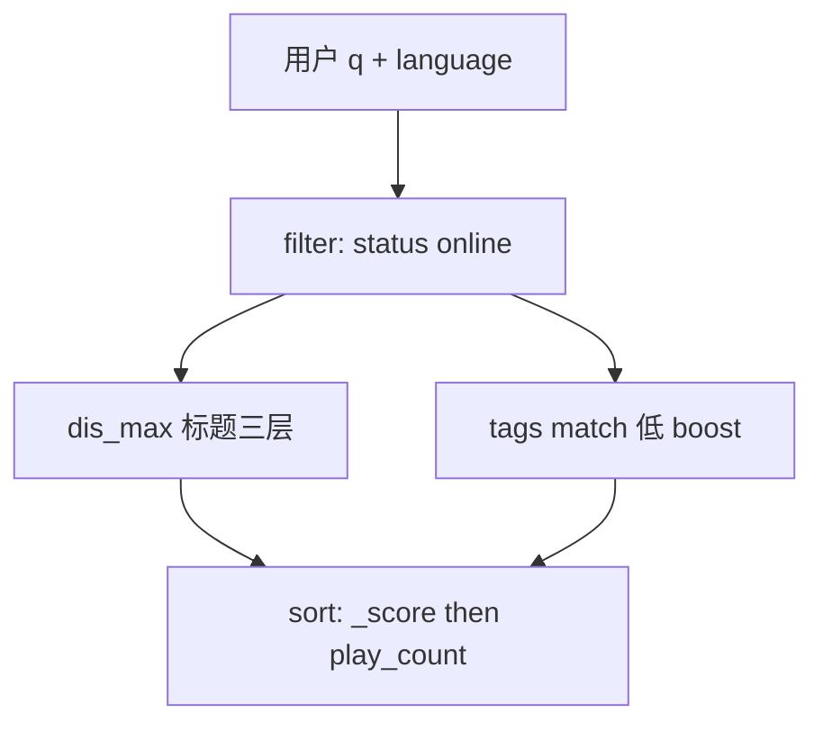

# Elasticsearch 多语言搜索技术指南

> **版本** 2026-05 · 适用于架构设计、技术评审与 ES 实现参考

> 指定语言下的 Elasticsearch 数据模型、索引拆分、查询分层与高亮对齐；以短剧「标题 + 标签」搜索为业务锚点。

---

## 如何使用本文档


| 你的目标 | 建议阅读 |
| -------- | -------- |
| 5 分钟定索引策略 | 二、工业界三种模型 + 三、方案选型 |
| 写 Mapping / 分索引 | 四、数据模型与 Mapping |
| 写查询与排序 | 五、查询与排序 |
| 对齐高亮 | 六、高亮对齐（详见 [es-highlight.md](./es-highlight.md)） |
| 短剧端到端 | 七、业务示例 |
| 上线前检查 | 八、踩坑与 Checklist |


**核心原则**：`language` 用 **filter** 硬隔离检索平面；标题用 **dis_max（取最高层）** 做「完整 > 前缀 > 词项」；高亮用独立的 `highlight_query`，与排序共用同一套语义。

---

## 一、问题与约束

### 1.1 典型业务场景（短剧）

- 只搜索 **标题（title）** 与 **标签（tags）**
- 用户搜索时 **指定 language**（如 `zh`、`en`、`th`）
- 每条短剧记录带 **单一语言** 的标题与标签
- 支持多种语言（如 12 种），但 **单次查询不跨语言**

### 1.2 标题匹配优先级（名称型检索）

对短字段标题，适合分层排序（非通用搜索的默认行为）：


| 层级 | 含义 | 典型 query |
| ---- | ---- | ---------- |
| 完整匹配 | 整标题与查询串一致（规范化后） | `term` on `title.keyword` |
| 前缀匹配 | 标题以查询串开头 | `match_phrase_prefix` on `title` |
| 词项匹配 | 查询中每个词都作为词项出现 | `match` + `operator: and` on `title` |


**标签**：用较低 `boost` 的 `match` 即可，一般 **不必** 单独做前缀层。

### 1.3 Elasticsearch 硬约束

同一 `text` 字段的 **analyzer 在 mapping 层写死**，不能按文档上的 `language` 字段在同一条 `title` 上动态切换分词器。混用语言进入同一倒排索引会导致词干错误、IDF 失真等问题。参见 Elastic 官方：[Pitfalls of Mixing Languages](https://www.elastic.co/guide/en/elasticsearch/guide/current/language-pitfalls.html)。

**目标**：让每种语言在索引层面分开（分索引，或等价隔离），而不是依赖「一个索引 + 错误的全局 analyzer」。

---

## 二、工业界三种多语言模型

Elastic 《Definitive Guide》与 Algolia 文档均将多语内容分为三类，落地方式不同：


| 模型 | 数据形态 | 常见 ES / 搜索落地 | 典型场景 |
| ---- | -------- | ------------------ | -------- |
| **One language per document** | 一条 doc 只含一种语言的 `title` | **按语言分索引**（`dramas_zh`）+ 统一 mapping | 方案 A；用户指定语言 |
| **One language per field** | 一条 doc 含 `title_en`、`title_fr`… | **单索引多列**，每列固定 analyzer | 商品一行多翻译；可跨语言字段查询 |
| **Mixed in one field** | 同一字段混多种语言 | 语言识别 + 特殊 pipeline | 不推荐作主路径 |


**工业界结论（与方案 A 对齐）**：

- 文档已是「一部剧 × 一种语言」→ 对齐 **One language per document**
- 用户 **指定语言、不跨语言搜** → **优先按语言拆索引**（或按语言 alias 路由）
- **一般不需要** 在 mapping 里为 12 种语言建 `title.zh`、`title.en`… 子字段（那是 **One language per field** 模型，适合「一条记录塞满各语言翻译」）

参考：

- Elastic：[One Language per Document](https://www.elastic.co/guide/en/elasticsearch/guide/current/one-lang-docs.html)、[One Language per Field](https://www.elastic.co/guide/en/elasticsearch/guide/current/one-lang-fields.html)
- Algolia：[Multilingual search](https://www.algolia.com/doc/guides/managing-results/optimize-search-results/handling-natural-languages-nlp/how-to/multilingual-search/)

```text
用户 lang=zh  →  POST dramas_zh/_search  →  仅 IK 分词 + 仅中文文档
用户 lang=en  →  POST dramas_en/_search  →  仅 english analyzer + 仅英文文档
```

---

## 三、方案选型：是否需要 multi-field analyzer？

### 3.1 决策表


| 部署方式 | 是否需要按语言的 `title.xx` 子字段 |
| -------- | ---------------------------------- |
| **每语言独立索引** + 单一 `title` | **否** |
| **单索引** 混放 12 语、方案 A 文档 | **要**（每 doc 只填对应子字段），否则全索引共用错误 analyzer |
| 可选（与语言无关） | `title.keyword`（完整匹配）、`title` 的 `search_as_you_type`（联想） |


### 3.2 方案 A：一条文档 = 一部剧 × 一种语言（推荐）

```json
{
  "drama_id": "d123",
  "language": "zh",
  "title": "重生之霸总",
  "tags": ["甜宠", "霸总"],
  "status": "online",
  "play_count": 120000
}
```


| 字段 | 说明 |
| ---- | ---- |
| `drama_id` | 跨语言同一部剧的业务 ID |
| `language` | 与搜索入参一致，如 `zh`、`en` |
| `_id` | 建议 `{drama_id}_{language}`，便于更新与删除 |

同一部剧 3 种语言上线 → **3 条文档**，不是 1 条里嵌 3 个 `title`。

### 3.3 何时用「单索引 + title_en / title_fr」

- 主数据 **一行** 包含所有语言翻译，后台一次更新
- 产品需要 **一次查询跨语言** 或混排（如 UI 语言与内容语言不一致时的混搜）

短剧「指定 language 只搜该语言」→ **不必** 采用此模型。

---

## 四、数据模型与 Mapping

### 4.1 索引命名

- 推荐：`dramas_{lang}`（如 `dramas_zh`、`dramas_en`）
- 读 alias：`dramas_read_zh` → 指向当前写索引，便于 reindex

每种语言索引的 `settings.analysis` 配置该语言 analyzer（示例）：


| language | analyzer 示例 |
| -------- | ------------- |
| zh | `ik_smart` / `ik_max_word`（需 IK 插件） |
| en | `english` |
| ja | `kuromoji` |
| ko | `nori` |
| th | `thai` |
| ar | `arabic` |


### 4.2 Mapping 示例（单索引内字段）

```json
PUT /dramas_zh
{
  "settings": {
    "analysis": {
      "normalizer": {
        "folding": {
          "type": "custom",
          "filter": ["lowercase", "asciifolding"]
        }
      }
    }
  },
  "mappings": {
    "properties": {
      "drama_id": { "type": "keyword" },
      "language": { "type": "keyword" },
      "status": { "type": "keyword" },
      "published_at": { "type": "date" },
      "play_count": { "type": "long" },
      "title": {
        "type": "text",
        "analyzer": "ik_smart",
        "fields": {
          "keyword": {
            "type": "keyword",
            "ignore_above": 256,
            "normalizer": "folding"
          }
        }
      },
      "tags": {
        "type": "text",
        "analyzer": "ik_smart",
        "fields": {
          "keyword": { "type": "keyword" }
        }
      }
    }
  }
}
```

说明：

- 已按语言分索引时，`language` 字段仍建议保留，便于校验、双写迁移与后台检索
- `title.keyword` + `normalizer: folding`：拉丁语完整匹配时忽略大小写
- 标签为运营固定词表时，筛选用 `tags.keyword`

### 4.3 高亮性能（可选）

对会大量 prefix 查询的 `title`，可增加：

```json
"index_options": "offsets"
```

便于 **unified** highlighter 走 postings，见 [Highlighting](https://www.elastic.co/guide/en/elasticsearch/reference/current/highlighting.html)。

---

## 五、查询与排序

### 5.1 结构概览



### 5.2 为何用 dis_max

`bool.should` 会把多层分数 **相加**，低层可能干扰排序。`dis_max` + `tie_breaker: 0` 只取 **最高分的一层**，符合「完整 > 前缀 > 词项」。

### 5.3 完整查询示例

以下在 **已按语言路由到 `dramas_zh`** 的前提下编写；若未分索引，增加 `filter: { "term": { "language": "zh" } }`。

```json
POST /dramas_zh/_search
{
  "query": {
    "bool": {
      "filter": [
        { "term": { "status": "online" } }
      ],
      "should": [
        {
          "dis_max": {
            "tie_breaker": 0,
            "queries": [
              {
                "constant_score": {
                  "filter": {
                    "term": {
                      "title.keyword": {
                        "value": "重生之霸总",
                        "_name": "title_exact"
                      }
                    }
                  },
                  "boost": 1000
                }
              },
              {
                "match_phrase_prefix": {
                  "title": {
                    "query": "重生之霸",
                    "_name": "title_prefix"
                  }
                },
                "boost": 100
              },
              {
                "match": {
                  "title": {
                    "query": "重生 霸总",
                    "operator": "and",
                    "_name": "title_token"
                  }
                },
                "boost": 10
              }
            ]
          }
        },
        {
          "match": {
            "tags": {
              "query": "甜宠",
              "operator": "and",
              "_name": "tag_match"
            }
          },
          "boost": 3
        }
      ],
      "minimum_should_match": 1
    }
  },
  "sort": [
    { "_score": "desc" },
    { "play_count": "desc" }
  ]
}
```

### 5.4 分层与 _name


| `_name` | 用途 |
| ------- | ---- |
| `title_exact` | 前端角标「剧名完全匹配」 |
| `title_prefix` | 「前缀匹配」 |
| `title_token` | 「关键词匹配」 |
| `tag_match` | 「标签匹配」 |


响应 hit 中的 `matched_queries` 数组标明命中了哪些子句。

### 5.5 业务加权（可选）

热度、上架时间可用 `function_score` 或在 `sort` 中追加字段（示例已含 `play_count`）。注意：**先保证字面相关性，再叠业务分**，避免冷门但字面凑巧的剧长期霸榜。

### 5.6 搜索建议（边输边搜）

与结果页 **分离接口**：

- 只查 `title`（或 `search_as_you_type` 字段）
- 仍 `filter` 当前 `language` / 走 `dramas_{lang}` 索引
- 不要与结果页共用同一复杂 `dis_max`（联想更重前缀与延迟）

---

## 六、高亮对齐

高亮机制详见 [es-highlight.md](./es-highlight.md)。多语言场景额外约定：

### 6.1 短字段整段高亮

```json
"highlight": {
  "order": "score",
  "fields": {
    "title": {
      "number_of_fragments": 0,
      "highlight_query": {
        "bool": {
          "should": [
            { "term": { "title.keyword": "重生之霸总" } },
            { "match_phrase_prefix": { "title": "重生之霸总" } },
            { "match": { "title": { "query": "重生 霸总", "operator": "and" } } }
          ],
          "minimum_should_match": 1
        }
      }
    },
    "tags": {
      "number_of_fragments": 0,
      "highlight_query": {
        "match": { "tags": { "query": "甜宠", "operator": "and" } }
      }
    }
  }
}
```

### 6.2 原则

1. **`highlight_query` 语义与展示层一致**：希望标出完整标题就用 `term` + `keyword`；标前缀用 `match_phrase_prefix`；标各词用 `match` + `and`。
2. **用 `matched_queries` 做 UI 角标**，与排序层级对应。
3. **官方限制**：高亮器不完全反映复杂 `bool` 逻辑，复杂场景见 [Highlighting](https://www.elastic.co/guide/en/elasticsearch/reference/current/highlighting.html)。必要时对关键字段试 `plain` highlighter。

### 6.3 与主查询合并的完整示例

```json
POST /dramas_zh/_search
{
  "query": {
    "bool": {
      "filter": [{ "term": { "status": "online" } }],
      "should": [
        {
          "dis_max": {
            "tie_breaker": 0,
            "queries": [
              {
                "constant_score": {
                  "filter": {
                    "term": {
                      "title.keyword": { "value": "重生之霸总", "_name": "title_exact" }
                    }
                  },
                  "boost": 1000
                }
              },
              {
                "match_phrase_prefix": {
                  "title": { "query": "重生之霸总", "_name": "title_prefix" }
                },
                "boost": 100
              },
              {
                "match": {
                  "title": { "query": "重生之霸总", "operator": "and", "_name": "title_token" }
                },
                "boost": 10
              }
            ]
          }
        },
        {
          "match": {
            "tags": { "query": "重生之霸总", "operator": "and", "_name": "tag_match" }
          },
          "boost": 3
        }
      ],
      "minimum_should_match": 1
    }
  },
  "highlight": {
    "fields": {
      "title": {
        "number_of_fragments": 0,
        "highlight_query": {
          "bool": {
            "should": [
              { "term": { "title.keyword": "重生之霸总" } },
              { "match_phrase_prefix": { "title": "重生之霸总" } },
              { "match": { "title": { "query": "重生之霸总", "operator": "and" } } }
            ],
            "minimum_should_match": 1
          }
        }
      },
      "tags": {
        "number_of_fragments": 0,
        "highlight_query": {
          "match": { "tags": { "query": "重生之霸总", "operator": "and" } }
        }
      }
    }
  },
  "sort": [{ "_score": "desc" }, { "play_count": "desc" }]
}
```

---

## 七、业务示例：短剧端到端

### 7.1 写入

```json
PUT /dramas_zh/_doc/d123_zh
{
  "drama_id": "d123",
  "language": "zh",
  "title": "重生之霸总",
  "tags": ["甜宠", "霸总"],
  "status": "online",
  "play_count": 120000
}
```

英文版另写一条：

```json
PUT /dramas_en/_doc/d123_en
{
  "drama_id": "d123",
  "language": "en",
  "title": "Reborn CEO",
  "tags": ["romance", "ceo"],
  "status": "online",
  "play_count": 120000
}
```

### 7.2 搜索 API 约定

| 入参 | 说明 |
| ---- | ---- |
| `q` | 查询串，服务端 trim / 长度限制 |
| `language` | 白名单校验，路由到 `dramas_{language}` |
| `from` / `size` | 分页 |

### 7.3 跨语言需求（扩展）

若未来要「用中文搜到英文剧名」，与当前方案 **分开**：增加 `title_aliases`、翻译字段或独立跨语言索引，**不要** 去掉 `language` filter 凑合混搜。

---

## 八、踩坑与 Checklist

### 8.1 常见坑


| 问题 | 处理 |
| ---- | ---- |
| 单索引混 12 语却只用 `standard` | 中日韩几乎不可用；必须分索引或分字段 |
| 用 `boost` 代替 `filter` 做 language | 其它语言文档仍可能进结果 |
| `bool.should` 叠层打分 | 改 `dis_max` + `tie_breaker: 0` |
| `match_phrase_prefix` 最后一词扩展过多 | 调 `max_expansions`；联想用 `search_as_you_type` |
| CJK 完整匹配失败 | `keyword` 入库前 NFKC、trim；勿与错误分词字段比 |
| 标签语言与 `language` 不一致 | 录入校验；搜索只信当前语言文档 |
| 高亮与排序不一致 | 统一语义；复杂 bool 用 `highlight_query` |
| 高亮断 HTML（若有富文本） | 见 [es-highlight.md](./es-highlight.md)；短剧标题一般纯文本 |


### 8.2 上线 Checklist

- [ ] `language` 枚举白名单与路由 `dramas_{lang}` 一致
- [ ] 各语言索引 analyzer 回归（抽样 title/tags）
- [ ] `title.keyword` 完整匹配抽测（含大小写 folding）
- [ ] `dis_max` 三层排序是否符合产品预期
- [ ] `matched_queries` 与前端角标映射
- [ ] `highlight` 在 title、tags 上抽检
- [ ] 联想接口与结果页分离
- [ ] 下架剧 `status` filter
- [ ] reindex / alias 切换方案
- [ ] 监控慢查询与 `match_phrase_prefix` 开销

---

## 九、附录

### 9.1 术语


| 术语 | 说明 |
| ---- | ---- |
| 方案 A | 一条 ES 文档 = 一部剧 × 一种语言 |
| `filter` | 不参与评分，硬过滤 |
| `dis_max` | 取子查询最高分；`tie_breaker: 0` 不叠加其它子句 |
| `highlight_query` | 与高亮展示一致的独立查询 |
| `matched_queries` | 命中的带 `_name` 子句列表 |


### 9.2 相关笔记

- [es-highlight.md](./es-highlight.md) — Highlight 原理、三种 highlighter、`highlight_query`
- [cache-strategies.md](../cache-strategies.md) — 热词与列表缓存（若搜索层前有 CDN/Redis）

### 9.3 外部链接

- https://www.elastic.co/guide/en/elasticsearch/guide/current/language-pitfalls.html
- https://www.elastic.co/guide/en/elasticsearch/guide/current/one-lang-docs.html
- https://www.elastic.co/guide/en/elasticsearch/guide/current/one-lang-fields.html
- https://www.elastic.co/guide/en/elasticsearch/reference/current/highlighting.html
- https://www.algolia.com/doc/guides/managing-results/optimize-search-results/handling-natural-languages-nlp/how-to/multilingual-search/
