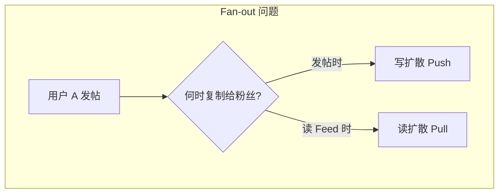
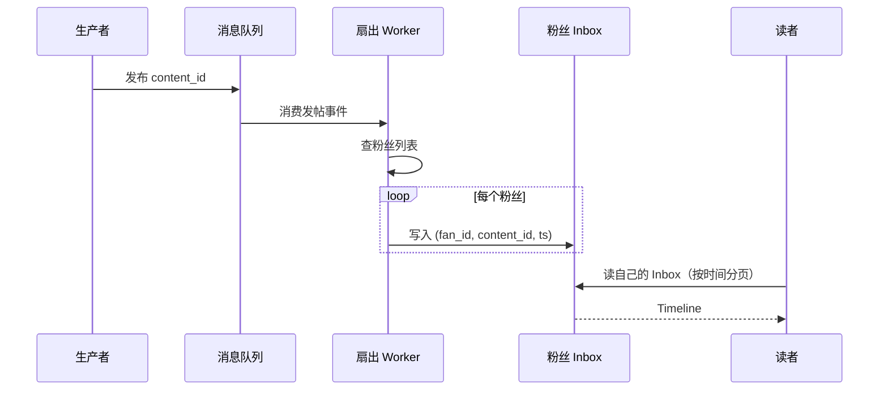
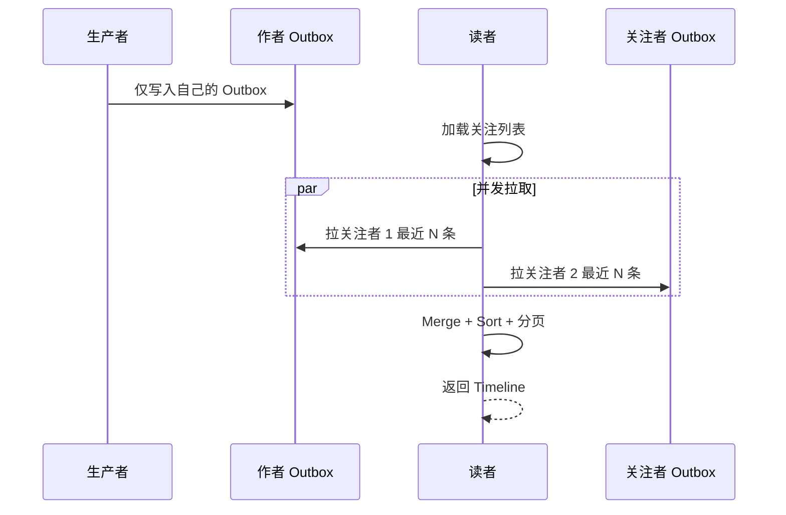
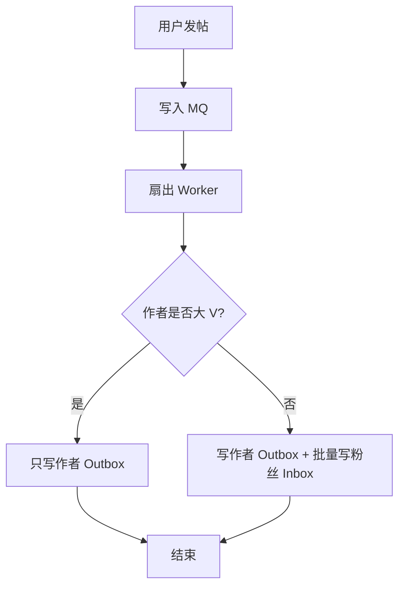
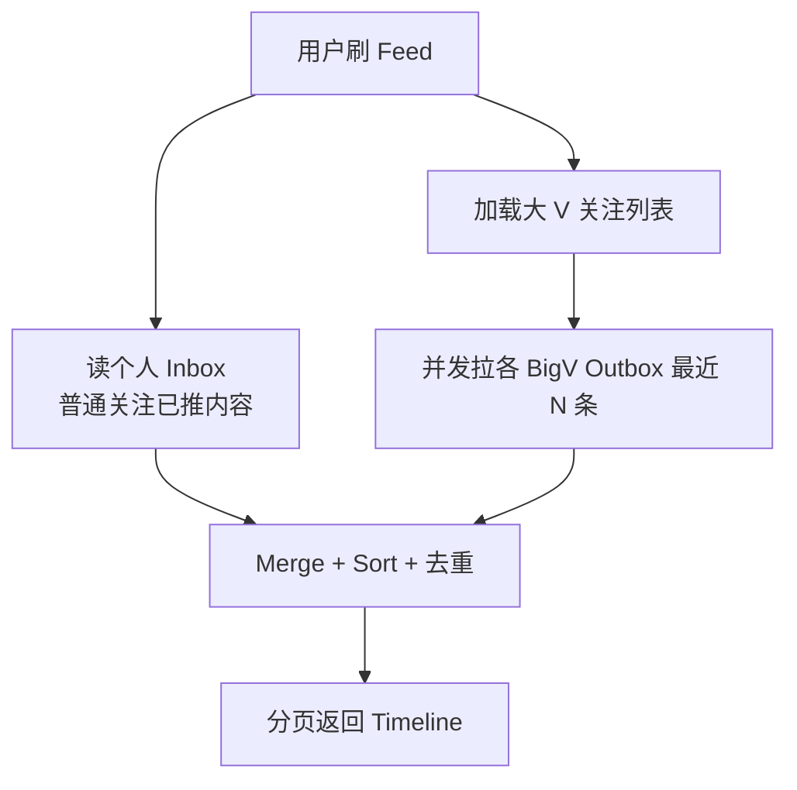
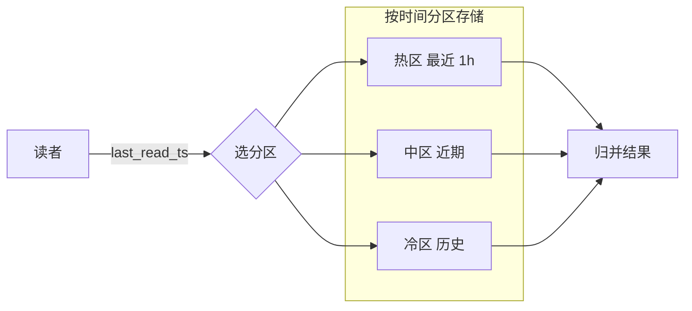
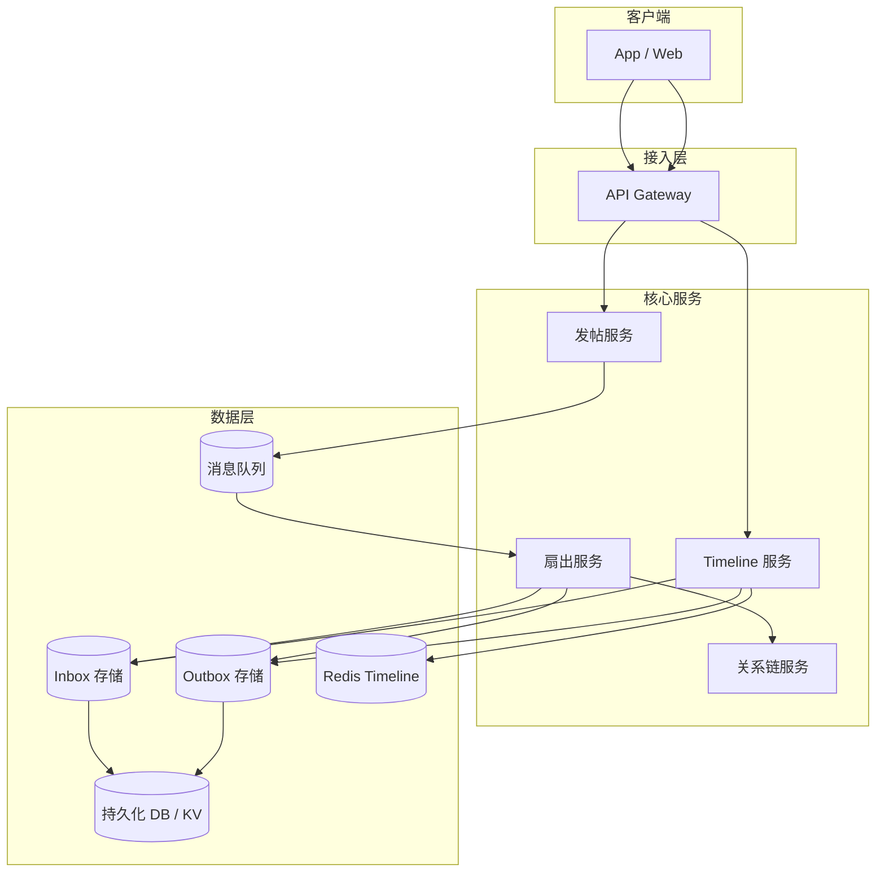
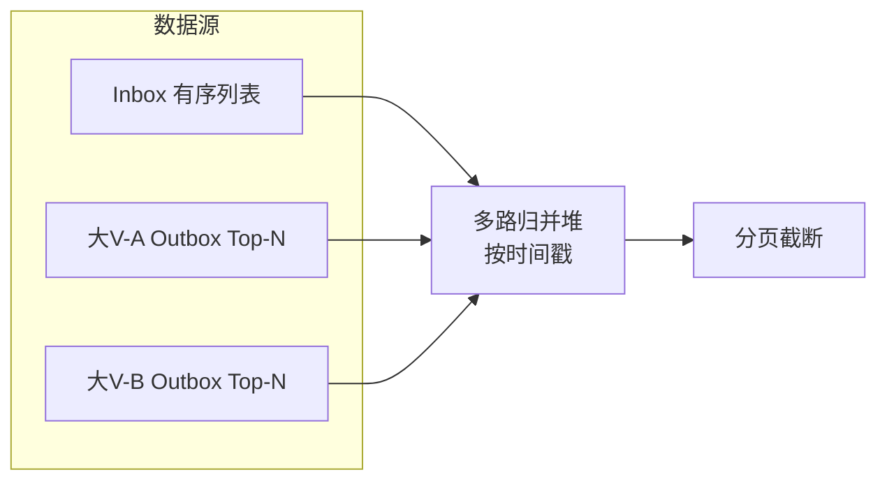

# Feed 流推拉模式与系统设计

> **版本** 2026-05 · 适用于架构设计、技术评审与实现参考

> 社交/内容 Feed 的 Fan-out（扇出）问题：推模式（写扩散）、拉模式（读扩散）、推拉混合与时间分区拉，及 Inbox/Outbox、缓存与分片等工程实践。

---

## 如何使用本文档

| 你的目标 | 建议阅读 |
| -------- | -------- |
| 5 分钟建立心智模型 | 一、问题与 Fan-out |
| 选型推 / 拉 / 混合 | 二、三种模式 + 三、快速选型 |
| 画架构图 / 评审 | 四、流程图与数据流 |
| 上线前 checklist | 五、生产实践 |

**核心原则**：Feed 系统是 **读多写少** 下的扇出权衡——没有银弹，生产环境几乎总是 **按粉丝规模分流** 的混合方案。

---

## 一、问题与 Fan-out

### 1.1 定义

**Feed 流**（时间线 / Timeline）把用户关注的人（或话题）产生的内容，按时间或算法排序后展示。用户 A 发布一条内容，要触达所有粉丝 B、C、D…，这个过程叫 **Fan-out（扇出）**。

典型产品：微博时间线、Twitter/X Home、Instagram Feed、朋友圈。

### 1.2 核心矛盾

| 维度 | 说明 |
| ---- | ---- |
| 读写比 | 刷 Feed 的 QPS 远高于发帖（业界常举 Twitter 量级：读 ~30 万 QPS vs 写 ~6 千 QPS，因产品而异） |
| 扇出成本 | 一条内容要「复制」给 N 个粉丝，N 从几十到数千万 |
| 大 V | 少数账号集中了绝大部分粉丝，写放大与读热点都从这里来 |

### 1.3 两种基础思路



ASCII：`发帖 → 写时扇出（推） OR 读时扇出（拉）`

---

## 二、三种模式

### 2.1 推模式（Push / Fan-out on Write / 写扩散）

#### 定义

发帖时，把内容 ID（或摘要）**写入每个粉丝的收件箱（Inbox）**；读 Feed 时只读自己的 Inbox。

#### 流程



ASCII 阶梯：

```
发帖 → MQ → Worker 批量写 N 个 Inbox → 读者只读自己的 Inbox
```

#### 读写要点

| 操作 | 要点 |
| ---- | ---- |
| 写 | 成本 ∝ 粉丝数；需 MQ 异步扇出、批量写、限流 |
| 读 | O(1) 或扫一小段有序结构（如 Redis ZSET，score=时间戳） |
| 删改 | 需更新或补偿删除 N 份 Inbox 索引 |

#### 优缺点

| 优点 | 缺点 |
| ---- | ---- |
| 读路径极快，适合读多写少 | 写放大严重，大 V 一发帖拖垮写入 |
| 读者体验稳定 | 存储冗余（同一条内容 N 份索引） |

#### 典型业务

普通用户（粉丝量在阈值以下，常见 **5K～10K**）的时间线预计算。

---

### 2.2 拉模式（Pull / Fan-out on Read / 读扩散）

#### 定义

发帖 **只写作者自己的发件箱（Outbox）** 一份；读者刷 Feed 时拉取所有关注者的 Outbox，做 **K 路归并 + 按时间排序**。

#### 流程



ASCII：`发帖 → 只写 Outbox`；`读 Feed → 拉 K 个 Outbox → 归并排序`

#### 读写要点

| 操作 | 要点 |
| ---- | ---- |
| 写 | 与粉丝数无关，成本低 |
| 读 | 成本 ∝ 关注数；需并发拉取、每路限 N 条、缓存热 Outbox |
| 删改 | 只改一份 Outbox，简单 |

#### 优缺点

| 优点 | 缺点 |
| ---- | ---- |
| 存储省，写路径轻 | 读路径重，关注多时延迟高 |
| 适合大 V | 大 V 被全民拉取时形成读热点 |

#### 典型业务

粉丝量超过阈值的大 V；或用户关注数极少的场景。

---

### 2.3 推拉混合（生产主流）

#### 定义

**普通用户推、大 V 拉**：发帖时仅对「非大 V」粉丝写 Inbox；大 V 只维护 Outbox。读时 **Inbox ∪ 大 V Outbox**，合并去重排序。

#### 发布流程



#### 读取流程



ASCII 合并读：

```
Timeline = Merge( Inbox(已推) , Pull(大V_1..k Outbox 各 N 条) )
```

#### 读写要点

| 操作 | 要点 |
| ---- | ---- |
| 阈值 | 粉丝数 > 5K～10K 标记为大 V（可配置、可动态调整） |
| 写 | 大 V 发帖 O(1)；普通用户仍 O(粉丝数) 但规模可控 |
| 读 | 多一路合并，但大 V 数量相对全体关注者少 |

#### 优缺点

| 优点 | 缺点 |
| ---- | ---- |
| 兼顾读性能与写放大 | 实现与运维复杂度高于纯推/纯拉 |
| 行业验证（Twitter、微博、朋友圈类） | 删改、已读、推荐排序需统一建模 |

#### 典型业务

微博 / Twitter 类时间线；朋友圈（好友数有限时偏推，大群广播偏拉）。

---

### 2.4 时间分区拉模式（拉模式的优化）

#### 定义

在 **拉模式** 下，按 **时间** 将 Feed 存为多档分区（如最近 1 小时、近期、历史）。读时根据用户 **上次刷新时间戳** 选择分区，活跃用户大多落在「热分区」小表。

#### 流程



#### 读写要点

- 常在线用户：查询落在热区，比全量扫关注者 Outbox 快数量级。
- 长期未登录：首次可能扫冷区，之后再次回到热区。
- 常与 **推拉混合** 叠加：大 V 用分区 Outbox，普通用户仍推 Inbox。

#### 优缺点

| 优点 | 缺点 |
| ---- | ---- |
| 降低拉模式对 DB 的全表压力 | 分区策略与归档任务增加运维 |
| 适合拉为主、活跃用户多的产品 | 跨分区合并逻辑要测边界 |

---

## 三、快速选型

| 模式 | 写成本 | 读成本 | 存储 | 适用 |
| ---- | ------ | ------ | ---- | ---- |
| **推** | 高（∝ 粉丝数） | 低 | 冗余大 | 普通用户、读极多 |
| **拉** | 低 | 高（∝ 关注数） | 省 | 大 V、关注极少 |
| **推拉混合** | 中 | 低～中 | 可控 | 社交网络时间线（推荐） |
| **时间分区拉** | 低 | 中（热用户更优） | 中 | 拉为主且需降压 DB |

**行业参考**：Twitter/X、Instagram、Facebook 等对普通账号采用 **Fan-out on Write**，对粉丝超过约 **1 万** 的账号改为 **Fan-out on Read** 或混合，避免单条内容产生百万级 Redis 写。

---

## 四、系统组件与数据流

### 4.1 逻辑架构



ASCII：`Client → 发帖 → MQ → 扇出 → Inbox/Outbox`；`Client → Timeline → Inbox + 拉大V Outbox → Cache`

### 4.2 Inbox / Outbox 模型

| 存储 | 键 / 维度 | 内容 |
| ---- | --------- | ---- |
| **Inbox** | `user_id` + 时间 | 已扇出到该用户的 `content_id` 列表（推模式产物） |
| **Outbox** | `author_id` + 时间 | 该用户发出的 `content_id` 列表（拉模式数据源） |

一条内容实体（正文、媒体）通常 **只存一份**；Inbox/Outbox 存的是 **索引 / 指针**。

### 4.3 读路径 K 路归并（示意）



实现上可用 **最小堆** 按 `timestamp` 归并，每路预取一页；注意 **去重**（同一 `content_id` 只出现一次）。

---

## 五、生产实践

### 5.1 大 V 与热点

| 风险 | 应对 |
| ---- | ---- |
| 大 V 发帖写放大 | 超过阈值不扇出，只写 Outbox |
| 大 V 被全民关注后读热点 | 专用缓存、限流、降级（只展示摘要） |
| 突发热点内容 | 热点推文独立缓存层；必要时熔断拉取 |

### 5.2 分片与 locality

- 按 `user_id` Hash 分片，使同一用户的 Inbox/Outbox 落在固定分片，利于批量写与本地读。
- **热点用户** 可能打满单分片：单独路由、复制只读副本、或内存 Timeline 服务。

### 5.3 删改与一致性

- **推模式删帖**：对粉丝 Inbox 发 **补偿消息** 或异步扫描删除索引（成本高，可接受最终一致）。
- **拉模式删帖**：删 Outbox 一条即可。
- **混合**：作者 Outbox 必删；若曾扇出则还要处理 Inbox 副本。

### 5.4 与推荐 Feed 的关系

现代产品的时间线常不仅是「关注的人按时间排序」，还有 **召回 → 粗排 → 精排**。Fan-out 仍负责 **候选集构建**（谁能看到哪些内容），排序层在 Timeline 服务之后叠加特征与模型。Twitter 后期演进亦从纯手工扇出走向更统一的推荐管线（具体实现随版本变化）。

### 5.5 上线 checklist

- [ ] 大 V 阈值与标记来源（粉丝数定时任务 / 实时计数）
- [ ] 扇出 Worker 批量大小、重试、死信
- [ ] Timeline 读：Inbox 与大 V Outbox 超时、降级策略
- [ ] Redis ZSET / 有序结构容量与淘汰
- [ ] 删帖、封号、取关后的 Inbox 清理策略
- [ ] 压测：普通用户发帖、千万粉大 V 发帖、热点读

---

## 六、附录

### 6.1 术语

| 术语 | 说明 |
| ---- | ---- |
| Fan-out | 一条内容分发给多个接收者 |
| Fan-out on Write | 写时扇出，即推模式 |
| Fan-out on Read | 读时扇出，即拉模式 |
| Inbox / Outbox | 收件箱 / 发件箱，存内容索引 |
| 写扩散 / 读扩散 | 推 / 拉的另一种说法 |

### 6.2 相关笔记

- [cache-strategies.md](./cache-strategies.md) — Timeline 热数据、Cache-Aside 与失效策略
- [push-global-timezone-delivery.md](./push-global-timezone-delivery.md) — 全球化 Push 概念（Fan-out 同类问题）
- [messaging/README.md](./messaging/README.md) — 扇出投递用 MQ；与 Redis / RabbitMQ 选型
- [rabbitmq/core-concepts.md](./rabbitmq/core-concepts.md) — 异步扇出 Worker 的典型 Broker 模型

### 6.3 延伸阅读

- [Write-Time vs Read-Time Fan-Out](https://www.abstractalgorithms.dev/write-time-vs-read-time-fan-out)（英文，对比清晰）
- [微博 feed 推拉与时间分区拉模式](https://cloud.tencent.com/developer/article/1526690)
- [阿里云 Tablestore：Feed 流高级架构](https://help.aliyun.com/zh/tablestore/use-cases/solution-enhancement)
- [Twitter real-time tweet delivery 架构](https://blog.mi.hdm-stuttgart.de/index.php/2021/03/10/how-to-scale-real-time-tweet-delivery-architecture-at-twitter/)
