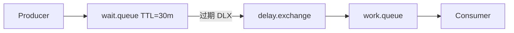

# RabbitMQ 延迟消息与优先级队列

> **版本** 2026-05 · TTL、DLX 延迟拓扑、优先级、插件

> 在 RabbitMQ 上实现「到时再投递」、消息优先级，以及与 Redis ZSET / 专业延迟组件的选型。

---

## 如何使用本文档

| 你的目标 | 建议阅读 |
| -------- | -------- |
| 选型延迟方案 | 二、快速选型 |
| 经典 DLX 延迟队列 | 三、TTL + DLX 延迟 |
| 优先级 | 四、优先级队列 |
| 与 Redis 延迟队列对比 | 五、方案对比 |

---

## 一、背景

### 1.1 什么是延迟投递

消息在 **T 秒或 T 时刻之后** 才对消费者可见。场景：订单超时关单、重试退避、定时提醒。

### 1.2 RabbitMQ 原生能力

| 能力 | 说明 |
| ---- | ---- |
| per-queue TTL | 队列中消息统一存活时间 |
| per-message TTL | 单条消息 `expiration` 属性 |
| `delayed-message` 插件 | 官方插件，Exchange 级延迟（需安装） |
| 无内置「任意时刻调度」 | 精确到任意 future timestamp 需应用层或插件 |

---

## 二、快速选型

| 场景 | 推荐 |
| ---- | ---- |
| 固定延迟（如 30min 关单） | TTL + DLX 回主队列，或 delayed 插件 |
| 多级退避（1s/5s/30s） | 多条 TTL 队列 + DLX，或应用定时重发 |
| 大量不同延迟点 | 评估 Redis ZSET、[redis/redis-zset-delay-queue.md](../redis/redis-zset-delay-queue.md) |
| 严格优先级 | `x-max-priority` 队列（有限档数） |
| 已用 Rabbit 生态 | delayed 插件（运维允许时） |

---

## 三、TTL + DLX 延迟拓扑

### 3.1 定义

利用 **死信**：消息在「等待队列」中因 **TTL 过期** 变为死信，经 DLX 路由到「工作队列」供消费。

### 3.2 流程

ASCII：`publish → wait.queue（无消费者，TTL=30m）→ 过期 → DLX → work.queue → Consumer`

### 3.3 读写要点

| 项 | 说明 |
| ---- | ---- |
| wait 队列 | `x-message-ttl` 或消息 `expiration`；**不要** consumer |
| DLX | `x-dead-letter-exchange` + routing key 指向工作 Exchange |
| 坑：队头阻塞 | 同一队列混合不同 TTL 时，长 TTL 消息可能挡住短 TTL（见 3.4） |
| 多条 wait 队列 | 按延迟档位分队列可避免队头阻塞 |

### 3.4 队头阻塞（Head-of-Line Blocking）

RabbitMQ **按队列 FIFO** 检查过期；若前一条 TTL 很长，后一条已到期也可能等待。

| 缓解 | 做法 |
| ---- | ---- |
| 分档队列 | `delay.1m`、`delay.5m`、`delay.30m` |
| 插件 | `rabbitmq_delayed_message_exchange` |
| 外部调度 | Redis ZSET / 定时任务 |

### 3.5 优缺点

| 优点 | 缺点 |
| ---- | ---- |
| 无需额外中间件 | 精度受扫描与队列结构影响 |
| 与 DLQ 模型统一 | 大量延迟档位拓扑复杂 |

**典型业务**：订单 30 分钟未支付：消息进 `order.close.wait`，过期后进 `order.close.work`。

---

## 四、delayed-message 插件

### 4.1 定义

Exchange 类型 `x-delayed-message`，发布时带 header `x-delay`（毫秒），到期后按底层路由（常为 direct）投递。

### 4.2 优缺点

| 优点 | 缺点 |
| ---- | ---- |
| 单 Exchange 任意延迟 | 需集群安装插件、升级兼容 |
| 无多 wait 队列 | 运维政策可能禁插件 |

---

## 五、优先级队列

### 5.1 定义

队列声明 `x-max-priority: 10`（1–255），消息 `priority` 0–10。Broker **尽量** 先投递高优先级（非严格实时抢占）。

### 5.2 要点

| 项 | 说明 |
| ---- | ---- |
| 档数有限 | 仅适合粗粒度 VIP |
| 持久化 | 优先级随消息存储 |
| 不要滥用 | 全设高优先级等于无优先级 |

**典型业务**：告警队列中 P0 故障先于 P2 日志。

---

## 六、方案对比

| 维度 | TTL+DLX | delayed 插件 | Redis ZSET |
| ---- | --------- | ------------ | ---------- |
| 依赖 | 原生 | 插件 | Redis |
| 任意延迟点 | 差（队头阻塞） | 较好 | 好 |
| 与 MQ 事务一体 | 是 | 是 | 否（需双写） |
| 运维 | 中 | 中+插件 | 低（已有 Redis） |

---

## 七、生产实践

### 7.1 checklist

- [ ] wait 队列无 consumer
- [ ] DLX 路由经过集成测试
- [ ] 监控 wait 队列深度（堆积表示消费慢或 TTL 过长）
- [ ] 延迟 + 重试：总尝试次数上限，最终进 DLQ
- [ ] 消息体含 `scheduled_at`、`retry_count`

### 7.2 与消费篇联动

失败重试：`work` → nack → DLX → `retry.wait`（短 TTL）→ 回 `work`，超过 N 次进 `*.dlq`。

---

## 八、附录

- Redis 实现：[redis/redis-zset-delay-queue.md](../redis/redis-zset-delay-queue.md)
- DLX 基础：[consumer-semantics.md](./consumer-semantics.md)
- 选型总览：[messaging/README.md](../messaging/README.md)
- [RabbitMQ — TTL](https://www.rabbitmq.com/docs/ttl)
- [Delayed Message Plugin](https://github.com/rabbitmq/rabbitmq-delayed-message-exchange)
