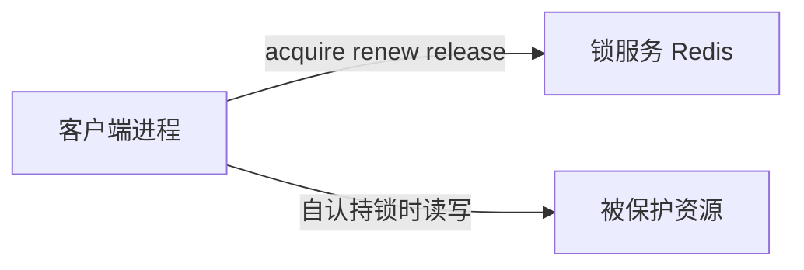
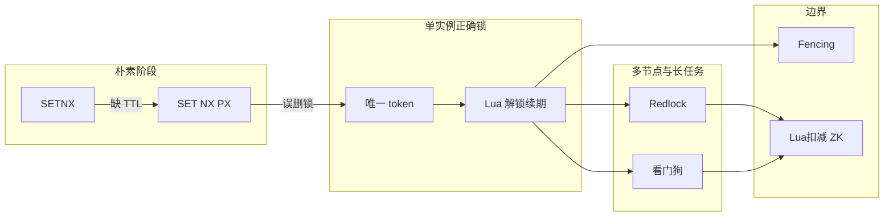
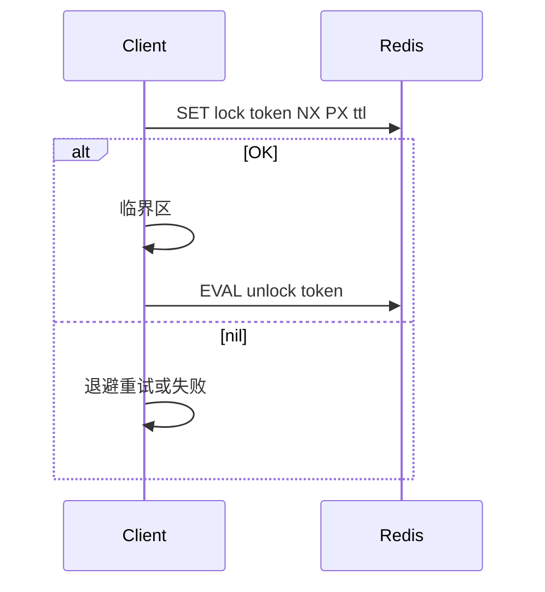

# Redis 分布式锁：从 SETNX 到 Redlock 与看门狗

> **文档类型：** 技术指南 · **适用：** 后端 / 架构 · **最后更新：** 2026-06  
> **阅读建议：** 先建立心智模型（§1），再按演进路线理解 Redis 实现（§3–§8）

---

## 目录

1. [基本概念与心智模型](#1-基本概念与心智模型)
2. [问题边界与典型场景](#2-问题边界与典型场景)
3. [演进路线图](#3-演进路线图)
4. [SETNX 与分步 EXPIRE 的问题](#4-setnx-与分步-expire-的问题)
5. [单实例正确实现](#5-单实例正确实现)
6. [TTL、主从复制与 Fencing Token](#6-ttl主从复制与-fencing-token)
7. [Redlock（红锁）与争议](#7-redlock红锁与争议)
8. [看门狗（Watchdog）与租约 Watchdog 对比](#8-看门狗watchdog与租约-watchdog-对比)
9. [选型与反模式](#9-选型与反模式)
10. [检查清单、相关笔记与参考资料](#10-检查清单相关笔记与参考资料)

---

## 1. 基本概念与心智模型

### 1.1 厕所钥匙板类比

| 概念 | 类比 | Redis 对应 |
| ---- | ---- | ---------- |
| **资源 Resource** | 单间厕所 | 库存行、订单状态机、定时任务 leader |
| **临界区** | 人在厕所里办事的时间段 | `acquire` 成功 → `release`（或 TTL 失效）之间的代码 |
| **加锁** | 从墙上取走唯一钥匙 | `SET lock_key token NX PX ttl` |
| **解锁** | 挂回钥匙，且必须是自己的那把 | Lua：`GET == token` 才 `DEL` |
| **TTL** | 钥匙自带闹钟，超时自动回墙 | 防持锁进程 crash 后永占 |
| **看门狗 Watchdog** | 人还在厕所、闹钟快响，同伴帮拨闹钟 | 后台线程周期性 `pexpire`（续期） |
| **误删他人锁** | A 超时后钥匙已归 B，A 仍强行摘牌 | 裸 `DEL`、不校验 token 的经典 bug |

### 1.2 三方模型

锁协调的是 **客户端 ↔ 锁服务（Redis）↔ 被保护资源（DB / 业务存储）**，不是 Redis 里的业务数据本身。



**危险 gap：** 客户端以为仍持锁（GC 停顿、网络延迟、锁已过期），锁服务侧锁已释放，客户端仍写 Resource → 需要 Resource 侧 **fencing token（栅栏令牌）** 或版本号兜底（§6）。

### 1.3 与相近概念对照

| 概念 | 协调对象 | 典型手段 | 与分布式锁的区别 |
| ---- | -------- | -------- | ---------------- |
| **本地互斥锁** | 单进程线程 | `synchronized` / `Mutex` | 多实例部署无效 |
| **数据库悲观锁** | 行/表 | `SELECT ... FOR UPDATE` | 锁绑事务连接；强一致短事务 |
| **乐观锁** | 行版本 | `version` / CAS | 无占坑；高争用需重试 |
| **分布式锁** | 跨节点临界区 | Redis / ZK / etcd | 独立协调层；要 TTL + token + 原子释放 |
| **租约 Lease** | 使用权有时限 | ZSET score + 心跳续期 | 强调到期失效；见 [redis-zset-running-recovery.md](./redis-zset-running-recovery.md) |
| **幂等 / SETNX 去重** | 请求是否已处理 | `SETNX idempotency_key` | 防重复执行，非整段临界区互斥 |
| **Lua 原子扣减** | 单 key 复合逻辑 | 判断 + `DECR` 脚本 | 数据层原子，常替代锁 |

### 1.4 Safety 与 Liveness（Redis 官方表述）

Redis 分布式锁文档用三条最小保证描述设计目标（与下表工程检查点合并理解）：

| 性质 | 含义 | 工程检查点 |
| ---- | ---- | ---------- |
| **Safety · 互斥** | 任意时刻最多一个客户端持锁 | `SET ... NX`；释放校验 token |
| **Liveness A · 无死锁** | 持锁者 crash 后，他人最终能加锁 | 必须有过期（TTL / 租约）；禁止无 TTL 的 SETNX |
| **Liveness B · 容错** | 多数 Redis 节点存活时可加锁释放 | Redlock 语境；单实例则依赖实例可用性 |

**可选性质：** 公平性、可重入 — 裸 `SET NX` **不保证**；Redisson `RLock` / ZK 顺序节点可提供。

**不保证什么（护栏）**

- 不保证持锁期间进程一定活着（仅 TTL 到期后他人有机会获取）。
- 不保证「持锁期间写 Resource 一定合法」（Resource 需幂等 / 版本 / fencing）。
- 不保证主从 failover 瞬间的严格互斥（异步复制窗口，§6）。

### 1.5 临界区与锁粒度

- **临界区** = 从加锁成功到释放（或 TTL 失效）之间访问共享资源的代码。
- **粒度：** 锁「不变式会被破坏的最小操作」，不要锁整条 HTTP 链（含多次 RPC）。
  - 反例：锁整个 `createOrder` → TTL 易爆、看门狗压力大。
  - 正例：仅锁 `deductStock(skuId)`，或改用单 key Lua（见 [cache-strategies.md](../cache-strategies.md)）。

### 1.6 最小抽象 Checklist

| 要素 | 问题 | 典型答案 |
| ---- | ---- | -------- |
| **Lock key** | 锁什么？ | `lock:order:{orderId}`，避免全局大锁 |
| **Lock value / token** | 谁持有？ | UUID；禁止常量 `"1"` |
| **TTL** | 多久自动释放？ | 大于 P99 临界区；更长则续期 |
| **Acquire** | 怎么占坑？ | `SET key token NX PX ttl` |
| **Release** | 怎么还钥匙？ | Lua：`get == token` 才 `del` |
| **Renew** | 临界区超长？ | Lua `pexpire` 或看门狗 |

后文 SETNX → Redlock → 看门狗，本质是逐项把本表从「缺行/错行」补到「可上线」。

### 1.7 常见误解

1. **「拿到锁 = 数据一定不会错」** — 错；Resource 侧仍要幂等 / 版本 / fencing。
2. **「Redis 单线程 = 分布式锁绝对安全」** — 错；风险在客户端、时钟、主从、过期，不在命令原子性 alone。
3. **「解锁直接 `DEL`」** — 错；经典误删他人锁。
4. **「锁可当存储真相」** — 错；锁是协调，库存真相在 DB 或 Lua 后的 key。
5. **「SETNX 幂等键 = 分布式锁」** — 错；前者防重复请求，后者管互斥临界区。

---

## 2. 问题边界与典型场景

| 维度 | 说明 |
| ---- | ---- |
| **要解决的问题** | 多进程/多机对**同一资源**互斥：库存扣减、订单状态迁移、定时任务单实例、配置热更新串行化等 |
| **本文范围** | 基于 Redis 的实现演进、Redlock 争议、Redisson 看门狗；不含 ZK/etcd 源码 |
| **本文不覆盖** | Redisson 全量 API；各语言客户端逐行源码 |

| 场景 | 是否适合 Redis 锁 | 备注 |
| ---- | ----------------- | ---- |
| 定时任务只允许一个实例跑 | 适合 | 效率锁；失败可接受短暂双跑 + 幂等 |
| 秒杀扣减 | 优先考虑 Lua 原子扣减 | 见 cache-strategies |
| 金融账本强一致 | 慎用 Redis 锁 alone | DB 事务 + fencing 或 ZK |
| MQ 消费去重 | 用幂等 key，非互斥锁 | 见 consumer-semantics |

---

## 3. 演进路线图



| 阶段 | 实现要点 | Checklist 补全项 |
| ---- | -------- | ---------------- |
| SETNX | `SETNX` 或 `SETNX` + `EXPIRE` | 仅 Acquire 占坑；缺 TTL、原子释放 |
| SET NX PX | `SET key token NX PX ttl` | + TTL |
| + token + Lua | 释放/续期脚本 | + Release、Renew |
| Redlock | N 个独立 Master、多数派 | + Liveness B（多节点容错） |
| 看门狗 | 周期性续期 | Renew 自动化（长临界区） |
| Fencing | 单调序号写入 Resource | Resource 侧防过期写 |

---

## 4. SETNX 与分步 EXPIRE 的问题

### 4.1 SETNX 占坑

```text
SETNX lock:resource  <value>   -- 仅当 key 不存在时设置
```

**优点：** 极简，理解「占坑」。

**问题（对照 §1.6）：**

1. **无 TTL** → 客户端 crash 后锁永不释放（违反 Liveness A）。
2. **`SETNX` + `EXPIRE` 非原子** → 中间 crash 可能留下无过期 key。
3. **裸 `DEL` 解锁** → 不校验 token，误删他人锁。

### 4.2 误删他人锁时序（ASCII）

```text
T0  线程 A  SETNX 成功，开始执行业务（很慢）
T1  锁过期（若无 TTL 则永不释放；若有 TTL 则到期）
T2  线程 B  SETNX 成功
T3  线程 A  业务结束，DEL lock   -- 删掉的是 B 的锁
T4  线程 C  SETNX 成功           -- 互斥被破坏
```

Redis 官方 SET/SETNX 文档已说明：应用应使用 **`SET ... NX` + 带 token 校验的 Lua 释放**，而非历史 SETNX + DEL 模式。

### 4.3 演进：原子 SET NX PX

Redis 2.6.12+：

```text
SET lock:resource <unique_token> NX PX 30000
```

一步完成占坑 + 毫秒过期，解决「无 TTL」与「SETNX+EXPIRE 非原子」。

**仍缺：** 释放与续期必须 **校验 token 且原子**（§5）。

---

## 5. 单实例正确实现

### 5.1 加锁

```text
SET lock:resource <unique_token> NX PX <ttl_ms>
-- 返回 OK 表示成功；nil 表示已被占用
```

- `unique_token`：UUID 或 `实例Id:线程Id`；禁止所有客户端写 `"1"`。
- `ttl_ms`：建议 ≥ P99(临界区) × 安全系数；不可预估时用看门狗（§8）。

### 5.2 解锁（Lua，禁止裸 DEL）

```lua
-- KEYS[1] = lock key, ARGV[1] = token
if redis.call("get", KEYS[1]) == ARGV[1] then
  return redis.call("del", KEYS[1])
else
  return 0
end
```

```text
EVAL <script_sha> 1 lock:resource <token>
```

### 5.3 续期（看门狗同类逻辑）

```lua
if redis.call("get", KEYS[1]) == ARGV[1] then
  return redis.call("pexpire", KEYS[1], ARGV[2])
else
  return 0
end
```

Redis 6.2+ 可用 `SET key token XX GET` 等组合做读改写，生产上 **Lua 续期** 仍最直观。

### 5.4 标准流程



**节点顺序：** SET NX PX → 业务 → EVAL 校验 token 后 DEL。

### 5.5 可重入（简述）

裸 `SET NX` **不可重入**。Redisson `RLock` 用 Hash 结构记录 `token → 重入次数`，同一 JVM 线程可多次 `lock()`。

---

## 6. TTL、主从复制与 Fencing Token

### 6.1 为何必须 TTL

分布式锁若**无自动释放**，持锁进程 crash 后等价于死锁。TTL 是 Liveness A 的工程实现；代价是临界区必须能在 TTL 内完成，或由续期/看门狗延长。

### 6.2 主从 failover 与异步复制

单 Master + 异步复制的经典 race（Redis 官方）：

1. Client A 在 **Master** 上加锁成功。
2. Master 宕机，锁 key **尚未复制**到 Replica。
3. Replica 提升为新 Master。
4. Client B 在同一资源上加锁成功 → **Safety 违反**（短暂双持）。

因此：**主从故障转移不能等价于「锁仍安全」**。多数团队接受该窗口，或用 Redlock / ZK；强一致场景用共识组件。

### 6.3 Fencing Token（栅栏令牌）

Martin Kleppmann 指出：即使锁算法完美，**GC 停顿、网络延迟** 仍可能导致「客户端以为持锁、实际已过期」后写入 Resource。

**做法：** 锁服务（或 ZK）提供 **单调递增** 的 fencing token；每次写 Resource 携带当前 token；存储层 **拒绝小于当前最大 token 的写**。

Redis 随机 UUID **不是** fencing token。正确性关键的写路径应：

- 锁 + DB 乐观版本 / 唯一约束，或
- ZK/etcd 顺序节点 + 递增序号。

### 6.4 时钟

- 单实例锁依赖 Redis **过期机制**（相对时钟 + 内部计时），非绝对墙钟。
- Redlock 计算 `validity = TTL - elapsed - drift` 时，**多机墙钟漂移** 会直接影响有效性（§7）。

---

## 7. Redlock（红锁）与争议

### 7.1 动机

单 Redis 实例（或主从）在节点故障时存在互斥缺口。Redlock 在 **N 个独立 Redis Master**（通常 5 个、无实例间复制）上投票，**多数派（N/2+1）** 成功且耗时 < TTL 视为加锁成功。

### 7.2 流程（ASCII）

```text
T1 = now()
对每个实例 i: SET lock NX PX TTL  (带相同 random token)
T2 = now()
elapsed = T2 - T1
若成功数 >= N/2+1 且 elapsed < TTL:
  validity = TTL - elapsed - clock_drift
  持锁，在 validity 内完成临界区
否则:
  向所有已成功的实例执行 Lua 释放
```

### 7.3 效率锁 vs 正确性锁

| 类型 | 目标 | 偶发双持后果 | 典型手段 |
| ---- | ---- | ------------ | -------- |
| **效率锁 Efficiency** | 减少重复工作 | 多跑一遍任务、多通知一次 | 单 Redis + token + Lua；可接受 Redlock |
| **正确性锁 Correctness** | 保护不变式 | 双扣款、双写坏数据 | ZK/Curator + **fencing**；DB 事务 |

Kleppmann 结论：Redlock **「两头不靠」** — 对效率锁过重，对正确性锁不够安全（无时钟/有界延迟假设、fencing 缺失）。

### 7.4 争议双栏摘要

| Kleppmann 批评 | Antirez / Redis 社区回应 |
| -------------- | ------------------------ |
| 依赖有界网络延迟、有界 GC、时钟行为 | 应用单调时钟 API；加锁后二次时间检查 |
| 不产生单调 fencing token | 与 Resource 间延迟问题类似，Resource 侧应 fencing |
| 主从复制窗口（单实例方案） | Redlock 目标之一是替代「单实例+不可靠 failover」 |
| 正确性场景应用 ZK，不用 Redlock | 许多场景 Redlock 比裸单实例更安全；非 Paxos 但实用 |

**实践建议（与 JavaGuide、腾讯云等中文综述一致）：**

- 默认：**单 Redis / Sentinel + `SET NX PX` + Lua + Redisson**，文档化主从窗口风险。
- Redlock：**知识扩展 / 多独立实例容错**，运维成本高，勿因「听过红锁」默认上。
- 正确性 / 金融核心：**ZK、etcd 或 DB 锁 + fencing**，勿仅依赖 Redlock。

Redisson 仍提供 `RedissonRedLock` / `MultiLock`，社区普遍建议默认 `RLock` 即可。

---

## 8. 看门狗（Watchdog）与租约 Watchdog 对比

### 8.1 解决什么问题

业务耗时 **不可预估** 或 **> TTL** 时，锁会在临界区完成前过期，他人可抢占 → 需 **自动续期**。

### 8.2 Redisson 看门狗机制

| 项 | 说明 |
| -- | ---- |
| 触发条件 | `lock()` / `tryLock()` **未指定** `leaseTime` 时启用 |
| 默认租约 | `lockWatchdogTimeout` = 30000 ms |
| 续期间隔 | 约每 `lockWatchdogTimeout / 3`（默认约 10s）执行 Lua 续期 |
| 停止条件 | `unlock()`；或 Redisson 实例 crash（锁靠 TTL 最终释放） |
| 指定 leaseTime | `lock(10, SECONDS)` **不启用**看门狗，到期强制释放 |

**注意：**

- `unlock()` 放 `finally`，避免异常导致锁泄漏（实例活着则看门狗一直续）。
- JVM **长 STW** 期间续期线程也停 → 与 Kleppmann「停顿后仍写」同族，Resource 仍需幂等/fencing。
- 仅持有线程可 `unlock()`（Java `Lock` 语义）。

### 8.3 与本仓「Lease Watchdog」对比

| 维度 | Redisson 锁看门狗 | [redis-zset-running-recovery.md](./redis-zset-running-recovery.md) 任务 Watchdog |
| ---- | ----------------- | -------------------------------------------------------------------------------- |
| 目的 | 互斥锁不过期 | 回收 processing 租约过期的卡死任务 |
| 续什么 | `lock:*` 的 TTL | ZSET `processing` 的 score（租约到期时间） |
| 失败后果 | 锁过期 → 并发进入临界区 | 任务重投 ready，可能重复执行 |
| 共同思想 | 租约 + 周期性续期 + 过期接管 | 同左 |

---

## 9. 选型与反模式

### 9.1 快速选型

| 需求 | 推荐 |
| ---- | ---- |
| 单 Redis、临界区 < 数百 ms、可接受主从窗口 | `SET NX PX` + token + Lua |
| 临界区长、Java 技术栈 | Redisson `RLock`（看门狗） |
| 多独立 Redis、愿承担运维与争议 | Redlock（文档化假设） |
| Resource 必须防「过期锁写」 | 锁 + **fencing** / DB 版本 |
| 仅需原子扣减/计数 | **单 key Lua**，优于锁 |
| 强一致 leader / 互斥 | ZooKeeper / etcd |
| 消息重复消费 | 幂等 token，非分布式锁 |

### 9.2 反模式

| 反模式 | 后果 |
| ------ | ---- |
| 全局锁 `lock:global` | 吞吐骤降 |
| 固定 token `"1"` | 无法区分持有者 |
| 裸 `DEL` 解锁 | 误删他人锁 |
| 锁整个 HTTP 请求 | TTL/看门狗压力大 |
| 把 Redis 锁当库存真相 | 与 DB 不一致 |
| 正确性场景仅 Redlock、无 fencing | 停顿/过期后双写风险 |

---

## 10. 检查清单、相关笔记与参考资料

### 10.1 实现检查清单

- [ ] 使用 `SET key token NX PX ttl`，禁止 `SETNX` + 单独 `EXPIRE`
- [ ] token 全局唯一（UUID 等）
- [ ] 释放与续期用 Lua 校验 token
- [ ] TTL 覆盖 P99 临界区，或启用看门狗 / 续期
- [ ] `unlock` 在 `finally`（Redisson 同理）
- [ ] 主从 failover 风险已评估并文档化
- [ ] 正确性写路径有 fencing / 版本号 / 唯一约束
- [ ] 能改用 Lua 原子逻辑时优先不用锁

### 10.2 相关笔记

- [redis-zset-delay-queue.md](./redis-zset-delay-queue.md) — ZSET 延迟队列（Redisson DelayedQueue 点名）
- [redis-zset-running-recovery.md](./redis-zset-running-recovery.md) — Lease 与任务 Watchdog（对比 §8.3）
- [cache-strategies.md](../cache-strategies.md) — 秒杀场景 Lua / 分布式锁
- [rabbitmq/consumer-semantics.md](../rabbitmq/consumer-semantics.md) — SETNX 幂等 vs 互斥锁
- [messaging/README.md](../messaging/README.md) — 消息与 Redis 选型总览

### 10.3 参考资料

#### 规范与官方

- Redis 官方：Distributed Locks with Redis — https://redis.io/docs/latest/develop/clients/patterns/distributed-locks/
- Redis Patterns：Distributed Locking — https://redis.antirez.com/fundamental/distributed-locking.html
- Redis Patterns：Redlock — https://redis.antirez.com/fundamental/redlock.html
- Redis 命令 SET — https://redis.io/docs/latest/commands/set/
- Redis 命令 SETNX — https://redis.io/docs/latest/commands/setnx/

#### 争议与理论

- Martin Kleppmann, How to do distributed locking (2016) — https://martin.kleppmann.com/2016/02/08/how-to-do-distributed-locking.html
- Salvatore Sanfilippo (antirez), Is Redlock safe? (2016) — https://antirez.com/news/101
- Sujeet Jaiswal, Distributed Locking — https://sujeet.pro/articles/distributed-locking

#### 客户端与中文导读

- Redisson：Locks and synchronizers — https://redisson.pro/docs/data-and-services/locks-and-synchronizers/
- JavaGuide：分布式锁常见实现方案总结 — https://javaguide.cn/distributed-system/distributed-lock-implementations.html
- Cal's Blog：Redisson Watchdog — https://caltong.com/2022/04/26/redisson-distributed-lock-watch-dog-mechanism.html

---

*本文档由个人技术库维护；实现细节以所用 Redis / Redisson 版本官方文档为准。*
