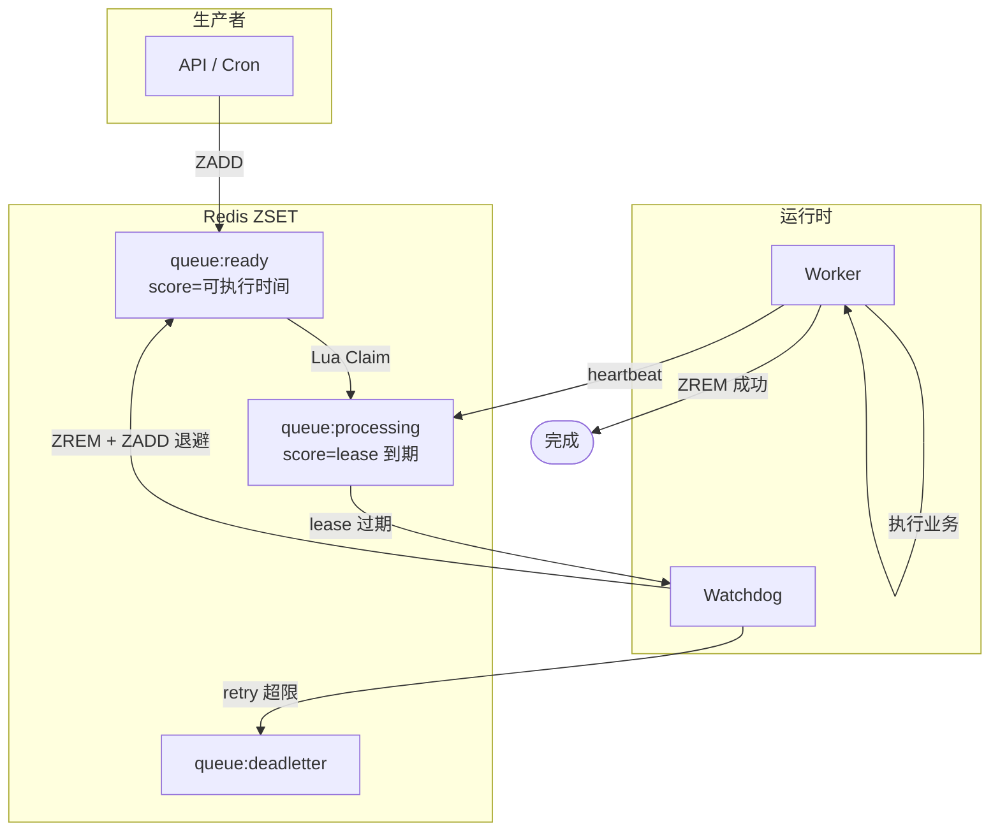
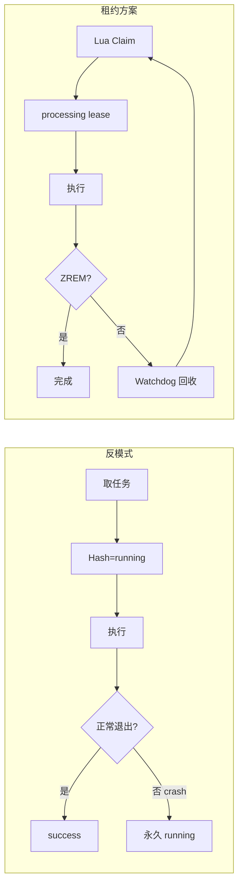
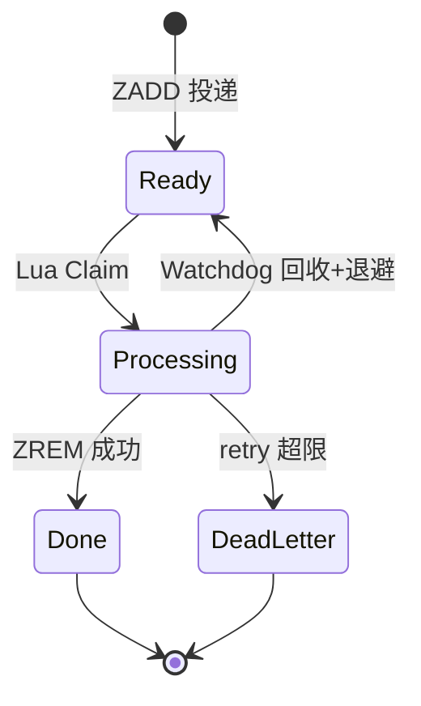
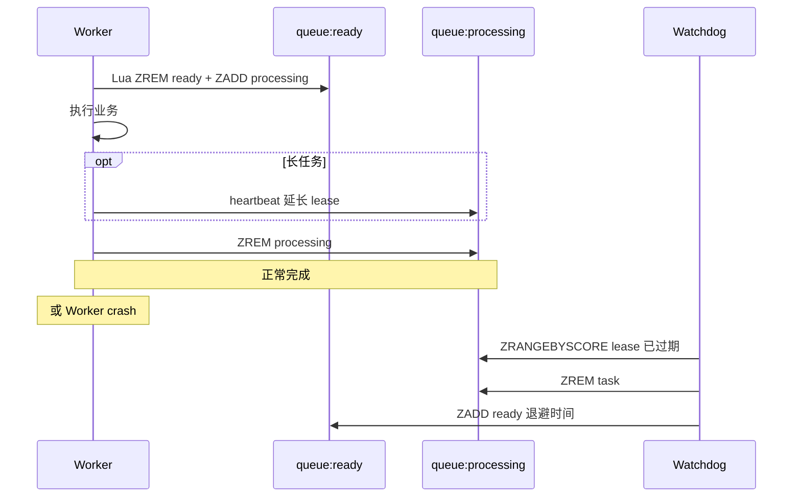
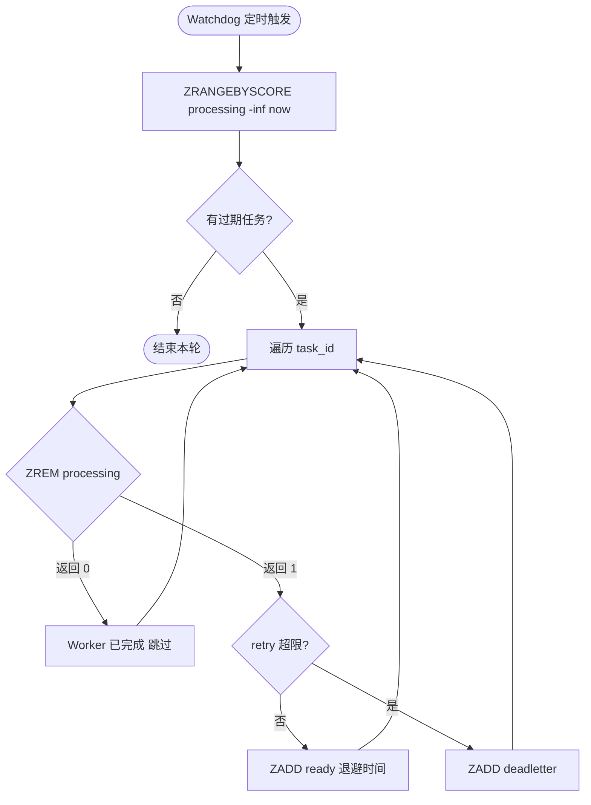
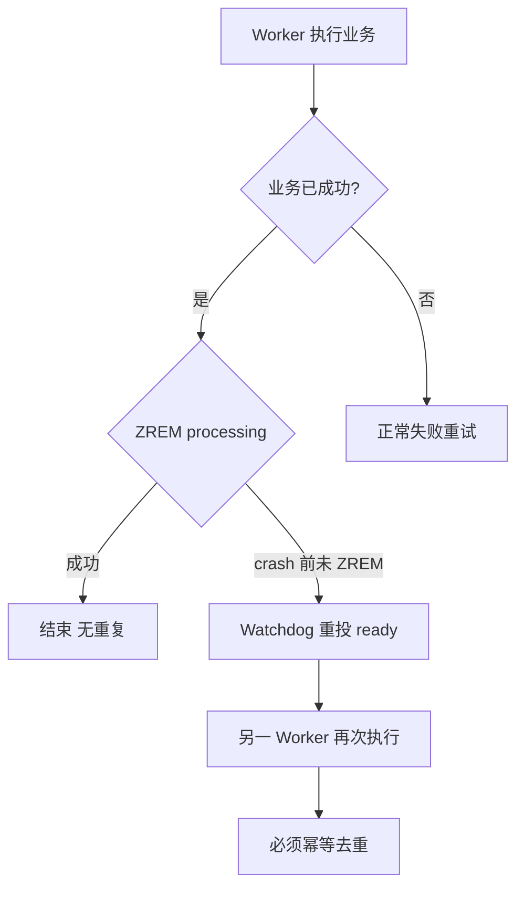
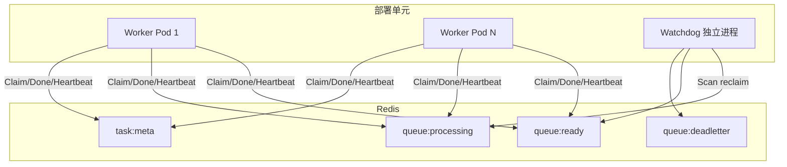

# Redis ZSET 消费队列：如何最简化解决 Running 卡死


## 摘要

很多团队用 Redis ZSET 自建延迟队列、定时任务和异步消费。上线后常遇到经典问题：**任务进入 running 后，worker 异常退出，任务永久卡死**。

最简且成熟的解法是 **ZSET + Lease + Watchdog**：用 `queue:processing` 的 score 表示租约到期时间，不依赖 worker 正常回写；超时由 Watchdog 自动回收到 `queue:ready`。

你必须接受 **至少一次投递**，业务必须 **幂等**。不适合强 exactly-once、无幂等的长事务、复杂 DAG 编排（应使用 Temporal、Airflow 等工作流引擎）。

---

## 适用场景


| 适合                         | 不适合                |
| -------------------------- | ------------------ |
| 中小规模异步任务、延迟/定时、可重试         | 强 exactly-once、无法幂等 |
| 团队希望 Lua 透明、运维简单           | 复杂 DAG、长编排、强审计工作流 |
| 可接受重复执行 + 幂等设计            | 超大吞吐且不愿自建监控        |


---

## 流程图总览

下图展示 **ready / processing / deadletter** 三队列与 Worker、Watchdog 的关系（详见各章节画板）。



---

## 一、问题：消费者已死，系统不知道

典型消费流程（**无租约、无回收**）：

这是所有分布式任务系统的共性问题，Celery、Airflow、Kafka Consumer、SQS、RocketMQ、Temporal 等本质相同：**消费者已经死亡，但系统不知道**。

---

## 二、最容易踩的错误设计

常见结构：

```
queue:zset          # 待执行
task_status:hash    # task_id -> running/success/fail
```

消费流程：

```
1. ZPOP / ZRANGEBYSCORE 取任务
2. HSET status=running
3. 执行业务
4. HSET status=success
```

问题在于：**running 状态没有自动恢复机制**。worker 在执行期间 crash 后，`task.status = running` 永久存在，导致僵尸任务、无法重试、吞吐下降。

### 反模式 vs 租约方案


| 维度          | 反模式（ready ZSET + status Hash） | 推荐（ready + processing lease）       |
| ----------- | ----------------------------- | --------------------------------- |
| Running 含义  | Hash 字段，无 TTL                 | processing 的 score = lease 到期时间   |
| Worker crash 后 | 永久 running                    | Watchdog 按 score 回收               |
| 领取原子性       | 多步易丢/重复                       | Lua 一次 ready → processing         |
| 是否依赖正常退出    | 是                             | 否                                 |




---

## 三、最简化方案：ZSET + Lease + Watchdog

不必一开始就上复杂状态机、分布式事务或工作流引擎。对大部分业务：

**两个 ZSET + 租约 + 超时回收** 就足够稳定。这是工业界经典做法之一。

### 推荐数据结构

```
queue:ready         # 待消费，score = 可执行时间戳，member = task_id
queue:processing    # 执行中，score = lease_expire_time，member = task_id
queue:deadletter    # 可选，超过重试阈值
task:meta:{id}      # 可选 Hash，存 payload、retry_count 等
```

示例：

```
ZADD queue:ready 1710000000 task_123
ZADD queue:processing 1710000030 task_123
```

### 任务状态机



### 流程概览（时序）



---

## 四、完整消费流程

### Step 1：领取任务（必须原子）

```lua
-- KEYS[1]=queue:ready  KEYS[2]=queue:processing
-- ARGV[1]=now  ARGV[2]=lease_expire_time

local tasks = redis.call(
  'ZRANGEBYSCORE', KEYS[1], '-inf', ARGV[1], 'LIMIT', 0, 1
)
if #tasks == 0 then
  return nil
end

local task = tasks[1]
redis.call('ZREM', KEYS[1], task)
redis.call('ZADD', KEYS[2], ARGV[2], task)
return task
```

含义：`ready → processing` 必须在同一段 Lua 内完成，否则可能丢任务或重复领取。

### Step 2：执行业务

Worker 处理真实逻辑。任务元数据（payload、retry）建议放 `task:meta:{id}` Hash，不要塞进 ZSET member。

### Step 3：Heartbeat（长任务可选）

执行时间可能超过 lease 时，周期性续约：

```
ZADD queue:processing <new_lease_expire> <task_id>
```

建议：**lease ≈ 3 × heartbeat_interval**。例如 heartbeat 每 10s，lease 30s。短任务（秒级）可省略 heartbeat。

### Step 4：任务完成

```
ZREM queue:processing <task_id>
```

成功即结束；失败可走重试逻辑（见第七节）。

### Step 5：Watchdog 回收（核心）



```lua
-- KEYS[1]=queue:processing  KEYS[2]=queue:ready
-- ARGV[1]=now  ARGV[2]=retry_at（含退避后的可执行时间）
-- ARGV[3]=batch_limit

local expired = redis.call(
  'ZRANGEBYSCORE', KEYS[1], '-inf', ARGV[1], 'LIMIT', 0, tonumber(ARGV[3])
)
local reclaimed = {}
for _, task in ipairs(expired) do
  if redis.call('ZREM', KEYS[1], task) == 1 then
    redis.call('ZADD', KEYS[2], ARGV[2], task)
    table.insert(reclaimed, task)
  end
end
return reclaimed
```

**为何先 ZREM 再 ZADD**：若 worker 刚好在完成并 `ZREM processing`，Watchdog 的 `ZREM` 返回 0，不会重复入队。

---

## 五、为什么有效

**processing ZSET 本质是租约表（lease table）**：score = lease_expire_time；不续约则到期回收。与 Kafka session timeout、SQS Visibility Timeout、Temporal Activity Heartbeat 同类。

---

## 六、必须接受「至少一次投递」



典型重复场景：


| 场景                                     | 结果                              |
| -------------------------------------- | ------------------------------- |
| 业务已成功，`ZREM processing` 前 crash       | Watchdog 重投，可能再执行一次              |
| 网络抖动导致 heartbeat 失败                    | 可能被误判回收（调大 lease 或加强 heartbeat） |
| 两个 Watchdog 实例                         | 靠 `ZREM` 返回值去重，仍可能边界重复          |


因此业务必须幂等，例如：


| 手段                                       | 说明                                       |
| ---------------------------------------- | ---------------------------------------- |
| 数据库唯一键                                   | `UNIQUE(task_id)` 保证只写一次                 |
| 状态机 CAS                                  | `UPDATE ... WHERE status='pending'`      |
| `INSERT ... ON CONFLICT DO NOTHING`      | 天然去重                                     |
| 幂等 token 表                               | 先查后做，或 Redis SETNX                       |


否则会出现重复扣款、重复发消息、重复创建资源。

---

## 七、生产化增强

### 1. retry_count 与死信

在 `task:meta:{id}` 维护 `retry`。每次回收时 `INCR`，超过阈值：

```
ZREM queue:processing task_id
ZADD queue:deadletter <now> task_id
```

### 2. 指数退避

不要立即重试，避免失败风暴：

```
delay = min(cap, base * 2^retry)
retry_at = now + delay
# 例：1s → 5s → 30s → 5min
```

### 3. 参数建议


| 任务类型           | lease | heartbeat | Watchdog 周期 |
| -------------- | ----- | --------- | ----------- |
| 短任务（<10s）      | 30s   | 不需要       | 5～10s       |
| 长任务（分钟级）       | 60s   | 每 15s     | 5～10s       |


### 4. 观测指标

- `processing` 集合大小（积压的执行中任务）
- `lease_expired_reclaim_total`（回收次数）
- ready 队列延迟（`now - min_score`）
- deadletter 增速
- 业务侧重复执行率（幂等命中率）

---

## 八、最小生产架构



```
Redis Keys:
  queue:ready / queue:processing / queue:deadletter / task:meta:{id}

Worker:  claim → heartbeat → ZREM
Watchdog: 扫描 lease 过期 → reclaim 或 deadletter
```

---

## 九、为何很多团队仍用 ZSET 而非 Streams

Redis Streams 已内建 pending list、`XPENDING`、`XCLAIM`、`XAUTOCLAIM`，语义类似 visibility timeout。

许多团队仍选 ZSET，因为学习成本低、Lua 透明、延迟队列与租约表可统一模型。Streams 更适合 Consumer Group 与消息审计场景。

---

## 十、上线检查清单

- [ ] Claim 使用 Lua，ready→processing 原子
- [ ] 成功路径 `ZREM processing`
- [ ] Watchdog 独立部署，周期 ≤ lease/3
- [ ] 长任务配置 heartbeat，lease ≥ 3×heartbeat
- [ ] 业务幂等（唯一键 / CAS / 幂等表）
- [ ] retry_count + 指数退避 + deadletter
- [ ] 监控 processing 大小与 reclaim 速率
- [ ] 压测：kill -9 worker 后任务可恢复

---

## 十一、总结

若 Redis ZSET 队列已出现 **running 永久卡死**，正确做法是 **processing lease + timeout reclaim**。

### 延伸阅读（同类机制）

- **Kafka**：`session.timeout.ms` / `max.poll.interval.ms`
- **AWS SQS**：Visibility Timeout
- **Temporal**：Activity Heartbeat

### 相关笔记

- [redis-distributed-lock.md](./redis-distributed-lock.md) — 分布式锁与 Redisson 看门狗（对比本文任务 Lease Watchdog）
- [redis-zset-delay-queue.md](./redis-zset-delay-queue.md) — ZSET 延迟队列全貌
- [messaging/README.md](../messaging/README.md) — 租约语义与 MQ 可见性超时对照

---

## 附：与 List 队列的对比（参考）

部分项目使用 **Redis List + BRPOP**（无 running 状态）：取到即消费，不存在「Hash 里 running 卡死」问题，但也缺少延迟调度、租约可见性。若从 List 演进到 ZSET 延迟/重试队列，可直接采用本文的 **ready + processing + Watchdog** 架构。
